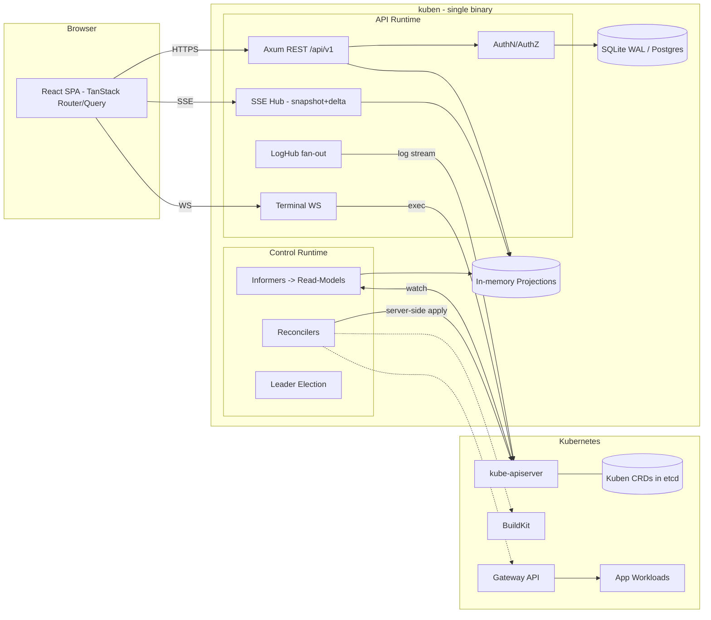
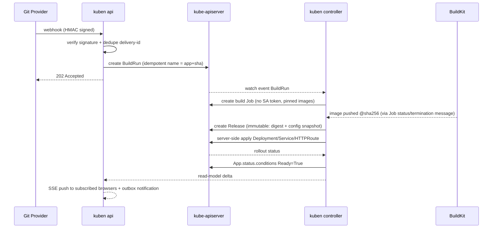

# 🏆 Kuben Golden Architecture Document

> A redesign of the incumbent PaaS into an ultra-light, Kubernetes-native, single-binary PaaS built in Rust — a deep, realistic and pragmatic review

| | |
|---|---|
| **Document version** | 1.0 |
| **Date** | 2026-09-10 |
| **Basis** | A direct reading of the incumbent's code (NestJS server, Vue client, templates, build jobs) plus your proposed architecture |
| **Audience** | Kuben's technical team (architect, Rust backend, frontend, DevOps) |
| **Critique and corrections** | This version has been critiqued in [KUBEN-ARCHITECTURE-CRITIQUE.md](./KUBEN-ARCHITECTURE-CRITIQUE.md); where they conflict, that document's v1.1 decisions (sections 0 and 5) take precedence |

---

## Contents

- [0. Executive summary (TL;DR)](#0-executive-summary-tldr)
- [1. Dissecting the incumbent PaaS — evidence from its code](#1-dissecting-the-incumbent-paas--evidence-from-its-code)
- [2. Competitive position and an honest definition of "lightest"](#2-competitive-position-and-an-honest-definition-of-lightest)
- [3. Kuben's architecture tenets](#3-kubens-architecture-tenets)
- [4. High-level architecture](#4-high-level-architecture)
- [5. Question 1: controller and API in one process](#5-question-1-controller-and-api-in-one-process)
- [6. Question 2: database and ORM](#6-question-2-database-and-orm)
- [7. Question 3: frontend stack](#7-question-3-frontend-stack)
- [8. Question 4: production-readiness checklist](#8-question-4-production-readiness-checklist)
- [9. "Attractive but dangerous" decisions and their alternatives](#9-attractive-but-dangerous-decisions-and-their-alternatives)
- [10. Golden proposals: how Kuben becomes the best](#10-golden-proposals-how-kuben-becomes-the-best)
- [11. Final toolchain (Rust crates and frontend packages)](#11-final-toolchain-rust-crates-and-frontend-packages)
- [12. Monorepo structure and build pipeline](#12-monorepo-structure-and-build-pipeline)
- [13. Performance budgets and SLOs](#13-performance-budgets-and-slos)
- [14. Execution roadmap](#14-execution-roadmap)
- [15. Migration path from the incumbent PaaS](#15-migration-path-from-the-incumbent-paas)
- [16. Risks and proposed ADRs](#16-risks-and-proposed-adrs)
- [17. Final summary](#17-final-summary)

---

## 0. Executive summary (TL;DR)

**Overall verdict:** about 80% of your design is right, and its main pillars — Rust/Axum/kube-rs, a single binary, embedded SQLite, a React SPA, rust-embed and a minimal image — are the correct choices. **But the remaining 20% is exactly where PaaS platforms fail in production:** the session and token model, supporting two databases at once with sqlx, the memory footprint of the reflectors, isolating failure domains inside a single process, backpressure in logs, networking (Ingress versus Gateway API), the build system, and the real cost of Kubernetes on small VPSes.

### Twelve golden decisions

1. **Kubernetes is the source of truth for desired state** (CRDs: `App`, `Environment`, `Release`, `BuildRun` and so on). SQL is used only for identity, RBAC, audit and history. This was the incumbent's own original idea, which was later lost once SQLite, the incumbent's instance CR and `config.yaml` were added.
2. **A modular monolith with roles:** one binary and several roles (`api`, `controller`, …). In self-hosted mode everything runs in a single pod, and in enterprise mode the same binary is deployed with separate roles.
3. **An in-process bulkhead:** two separate Tokio runtimes (API and control plane) + a supervisor for each subsystem.
4. **A read-model (projection) instead of caching raw K8s objects.** Without this, a target of under 30 MB of RAM is effectively unreachable.
5. **Realtime = snapshot + delta over SSE with a sequence number.** The terminal runs over a binary WebSocket with flow control.
6. **Log fan-out:** one upstream per container, a `broadcast` ring buffer, *drop-with-marker* behaviour for logs and *real backpressure* for the terminal.
7. **Auth:** an `HttpOnly` cookie session holding an opaque ID for the browser, opaque API tokens hashed with SHA-256, Argon2id for passwords only (paired with a semaphore), and support for OIDC and passkeys.
8. **DB:** a combination of `sqlx` + `sea-query` behind a repository trait, matrix testing on SQLite and Postgres, and embedded migrations.
9. **Type safety:** an OpenAPI-first approach with `utoipa` → `openapi-typescript` + `openapi-fetch`, instead of relying on ts-rs alone.
10. **Gateway API** instead of Ingress-NGINX (which has been retired), cert-manager, BuildKit + Railpack/CNB, digest-based deployment and immutable releases.
11. **Validation with CEL** inside the CRD instead of an admission webhook, to reach true zero-ops.
12. **Build:** a Cargo workspace + pnpm + `just`, with Turborepo optional. Final image: musl + mimalloc + `distroless/static:nonroot`.

### Report card on the proposed design

| Your decision | Verdict | Reason in brief |
|---|---|---|
| pnpm + Turborepo for the whole monorepo (including Rust) | ⚠️ Revise | Turbo does not understand Cargo's dependency graph and its cache is ineffective for `target/`. Cargo is itself a build graph. |
| Axum + Tokio + Tower | ✅ Confirmed | The best choice in the ecosystem today |
| kube-rs `Controller` + `reflector` | ✅ Conditional | With projections, label selectors, dropping `managedFields` and `metadata_watcher` |
| API and controller in one process | ✅ Conditional | Role flags + bulkhead runtimes + leader election |
| sqlx + SQLite WAL + Postgres | ⚠️ Revise | The `query!` macro does not work for two databases at once. The fix: SeaQuery, a single-writer pool and a `Recreate` strategy |
| WebSocket for the terminal and SSE for logs | ✅ Confirmed | Together with HTTP/2, multiplexing, `Last-Event-ID` and an origin check |
| "SPDY PTY streaming" | ⚠️ Revise | kube-rs uses WebSocket, and SPDY is on its way out of Kubernetes |
| Argon2id | ✅ For passwords only | Not for API tokens; cap memory use with a semaphore |
| PASETO/JWT for sessions | ❌ Rejected for the browser | It cannot be revoked and is exposed to theft via XSS. A cookie session replaces it |
| ts-rs | ⚠️ Revise | It only generates types; it does not cover the endpoint contract |
| Vite + React 19 + TanStack Router/Query | ✅ Confirmed | + React Compiler |
| Tailwind + shadcn/ui | ✅ Confirmed | Tailwind v4 + logical properties for RTL support |
| Rejecting Astro for the dashboard | ✅ Confirmed | But Astro is excellent for the docs and marketing site |
| rust-embed | ✅ Confirmed | + pre-compressed Brotli + `Cache-Control: immutable` |
| `distroless/cc` or `scratch` | ⚠️ Revise | A static musl build → `distroless/static:nonroot`. `scratch` is not recommended |
| Idle RAM under 25 MB | ⚠️ Conditional | Only possible with projections and bounded buffers, and it must be measured as an SLO in CI |
| An API in the microsecond range | ⚠️ Revise the expectation | That number is handler time only; end-to-end time will be in the millisecond range |

---

## 1. Dissecting the incumbent PaaS — evidence from its code

> The goal of this section is not to belittle the incumbent; it has good product ideas (pipelines, review apps, a template catalog, simplicity). The goal is for Kuben to make this **class** of problem **structurally impossible**, rather than merely writing code "more carefully".
>
> Every reference below points into the incumbent's own source tree.

### 1.1 Security

| # | Problem | Evidence in the code | Impact | Structural fix in Kuben |
|---|---|---|---|---|
| **S1** 🔴 | **Eavesdropping on and hijacking terminals and logs between users.** Any user can `join` any room they like, and the terminal handler writes input into `execStreams[data.room]` without checking authorization. Room names are entirely guessable: `pipeline-phase-app-pod-container-terminal` | The incumbent's WebSocket events gateway (its join and terminal handlers) and the exec path in its apps service | Starting a console requires `app:write` (checked in the incumbent's apps controller), but **joining a room and injecting keystrokes only requires a valid JWT**. As a result a read-only user from another tenant can watch shell output and run commands in someone else's open shell | A random 128-bit session ID bound to the user; an authorization check for every subscription; no shell sharing between users; an origin check |
| **S2** 🔴 | **A default JWT secret sits in the source code** | The incumbent's auth service, its JWT strategy and its auth module | If `JWT_SECRET` is not set, anyone who has read the repo can forge a token | An Ed25519 key is generated on first boot and stored in a K8s Secret. Without a key the service does not start (fail-closed). Key rotation via `kid` |
| **S3** 🟠 | **The JWT is stored in a JS-readable cookie and in `localStorage`**, is valid for 10 hours and cannot be revoked, and meanwhile CSP is off as well | The incumbent's login prompt component, its client plugin bootstrap and its server entrypoint | Any XSS equals complete session theft | An `HttpOnly; Secure; SameSite=Lax` cookie holding an opaque session ID, plus a strict CSP |
| **S4** 🟠 | A legacy password path using HMAC-SHA256 and a non-constant-time comparison with `===`, alongside bcrypt | The incumbent's auth service | A permanent hash downgrade and a possible timing leak | Argon2id + rehash-on-login + constant-time comparison (`subtle`) |
| **S5** 🟠 | CORS with `origin: '*'` on WebSocket, `cors: true` on HTTP, and CSP and HSTS off | The incumbent's events gateway and its server entrypoint | CSWSH (cross-site WebSocket hijacking) becomes possible, and XSS meets no defence at all | Same-origin by default, a strict CSP (an SPA with no inline script), and an origin check on the WS upgrade |
| **S6** 🟠 | **PromQL injection:** the `pipeline` and `phase` values are placed straight into the query | The incumbent's metrics service, at two call sites | Reading the metrics of other namespaces | Validate the names against the standard DNS-1123 regex and build the label matcher from the projection, not from a raw string |
| **S7** 🔴 | **The build pod runs user code and at the same time holds a service account token:** `automountServiceAccountToken: true` + `bitnami/kubectl:latest` with `imagePullPolicy: Always`, which itself patches the incumbent's app CRs | The incumbent's buildpacks build template | The user's build code can read the token and modify CRs. On top of that, a floating tag is a supply-chain risk (the public Bitnami catalog changed in 2025) | **The build pod never has access to the K8s API.** The controller watches for `BuildRun` completion and creates the `Release` itself. Every image is pinned by digest |
| **S8** 🟠 | A global broadcast of notifications with `server.emit` to every socket. NestJS guards run only on `@SubscribeMessage` and do not run on the handshake | The incumbent's events gateway and its notifications service | Even unauthenticated sockets probably receive the events | Authentication at handshake/upgrade + authorized topics |
| **S9** 🟡 | The user's terminal output is piped into the server's own `process.stdout` | The incumbent's Kubernetes service | The contents of users' shells (including secrets) end up in the incumbent's logs | Terminal content is never logged. Only metadata such as session start/end and the user is recorded in the audit log |
| **S10** 🟡 | Templates with a fixed password (for example `password: wordpress`) | The incumbent's WordPress service template | Every installation has identical credentials | A template parameter schema + automatically generated secrets |

### 1.2 Concurrency and correctness

| # | Problem | Evidence | Fix in Kuben |
|---|---|---|---|
| **C1** 🔴 | **Shared, mutable context in a singleton:** `setCurrentContext` is called on the Kubernetes service at 28 points in the code. In multi-cluster mode two concurrent requests race with each other, and request B may end up running against request A's cluster | The incumbent's logs service and several call sites in its apps service | An immutable `ClusterRegistry { ClusterId → kube::Client }`. Context is never global, and every operation explicitly carries its own cluster |
| **C2** 🔴 | **Log stream leaks:** the `podLogStreams` array only ever grows; `follow` streams are not closed even when nobody is watching; deduplication is done per pod rather than per container (so the second container is never streamed); a chunk is not necessarily a single line; a UUID is generated for every chunk; there is no backpressure at all; and there is a hacky 300ms sleep in the code | The incumbent's logs service | A `LogHub` with reference counting, a bounded `broadcast` and capped line framing (section 5.8) |
| **C3** 🟠 | One shared shell per pod/container across all users, together with a hacky 3-second sleep | The incumbent's apps service, in its exec path | One session per tab and per user, with an idle timeout |
| **C4** 🟠 | There is no informer or cache at all: every list goes straight to the API server, and a cron lists every app in the whole cluster every 15 seconds | The incumbent's status service | Informer + projection; counter metrics are computed directly from the read-model |
| **C5** 🟡 | Patches are sent fire-and-forget and their errors are swallowed, while the normal path is logged at `error` level | The incumbent's Kubernetes service | Server-side apply + status conditions + explicit error types |
| **C6** 🟡 | Graceful shutdown is disabled | The incumbent's server entrypoint (`//app.enableShutdownHooks();`) | A complete shutdown ordering (section 8.1) |
| **C7** 🟡 | Migrations run at boot via `execSync('npx prisma migrate deploy')`, together with `PRAGMA foreign_keys=OFF` | The incumbent's database service | That approach needs `npx` and `node_modules` in the production image, blocks the event loop, and races when there are multiple replicas. In Kuben: embedded `sqlx::migrate!` with a lock |

### 1.3 Architecture and operations

- **A1 — A split source of truth:** the README claims *"All data is stored on your Kubernetes etcd without an extra database"*, but today the data is spread across SQLite (users, audit, runpacks, pod sizes, notifications), the incumbent's instance CR and `config.yaml`.
- **A2 — A Helm-based operator (Operator SDK):** reconciliation is in practice just rendering the chart. Status and conditions are weak, adding logic such as finalizers, promotion or rollback is hard, and the CRD is still at `v1alpha1`.
- **A3 — Heterogeneous addons:** part of it depends on OLM operators (which are rarely installed outside OpenShift) and part on third-party charts.
- **A4 — Build:** a Job is created for every build with a one-year TTL (`ttlSecondsAfterFinished: 31536000`, in the buildpacks build template), with no queue and no concurrency limit. Deployment is by tag, not by digest.
- **A5 — Footprint:** an image based on `node:22-alpine` carrying the whole of `node_modules`, plus a separate operator, plus Prometheus for metrics (in the metrics service).
- **A6 — Code quality:** about 20,000 lines of TypeScript on the server, scattered `console.log`s, commented-out code and `any` types.

### 1.4 Lessons → Kuben's design invariants

These rules must be enforced as **non-negotiable** in code review and lint:

1. **There is no global mutable state for "context".** Every request explicitly carries its own cluster.
2. **Every subscription (log, terminal, event) = one authorization check + one bounded resource + one explicit owner.**
3. **Every buffer is bounded; every stream is cancellable; every task is supervised.**
4. **No secret lives in the source or in logs; the default behaviour is fail-closed.**
5. **The build pod never has access to the Kubernetes API.**
6. **Deployment is by digest; everything is idempotent and level-triggered.**

---

## 2. Competitive position and an honest definition of "lightest"

| Project | K8s-native | Open source | Git → build → deploy | UI / logs / metrics | Multi-cluster | Extensibility | Control-plane footprint | Simplicity |
|---|---|---|---|---|---|---|---|---|
| Coolify | ❌ (Docker + SSH) | ✅ | ✅ | ⭐⭐⭐⭐ | ❌ (multi-server) | ⭐⭐⭐ | Moderate (PHP + PG + Redis + realtime) | ⭐⭐⭐⭐⭐ |
| Dokploy | ❌ (Docker Swarm) | ✅ | ✅ | ⭐⭐⭐⭐ | ❌ | ⭐⭐⭐ | Moderate (Node + PG + Redis) | ⭐⭐⭐⭐⭐ |
| The incumbent | ✅ | ✅ GPLv3 | ✅ | ⭐⭐⭐ | ⭐⭐⭐ | ⭐⭐ | Heavy for what it actually does | ⭐⭐⭐⭐ |
| Devtron | ✅ deep | ✅ core | ✅ | ⭐⭐⭐⭐⭐ | ⭐⭐⭐⭐⭐ | ⭐⭐⭐⭐⭐ | Heavy (many components) | ⭐⭐⭐ |
| KubeVela | ✅ deep | ✅ Apache-2.0 | ⚠️ needs architecture work | ⭐⭐⭐ | ⭐⭐⭐⭐⭐ | ⭐⭐⭐⭐⭐ | Moderate | ⭐⭐ |
| Porter / Northflank / Qovery | ✅ | ❌ commercial | ✅ | ⭐⭐⭐⭐⭐ | ⭐⭐⭐⭐ | ⭐⭐⭐ | Managed | ⭐⭐⭐⭐⭐ |
| **🎯 Kuben's target** | ✅ | ✅ | ✅ very simple | ⭐⭐⭐⭐⭐ | ⭐⭐⭐⭐ | ⭐⭐⭐⭐ (through CRDs) | **About 20 to 30 MB, a single pod** | ⭐⭐⭐⭐⭐ |

### ⚠️ An uncomfortable truth to accept from day one

**Kuben can be the lightest *control plane* on Kubernetes, but Kubernetes itself (even k3s) usually carries a few hundred megabytes of baseline overhead.** On a 1 GB VPS, Coolify and Dokploy (which run on plain Docker) will still be lighter. Insisting on an "absolutely lowest footprint" claim is a marketing trap that users run into very quickly.

**The right strategy:**

1. **Product message:** *"The lightest Kubernetes-native PaaS; from a single VPS to a hundred nodes with no migration."* Kuben's competitive advantage is scalability, real HA and standard APIs — not RAM on a 1 GB VPS.
2. **A one-line installer** that installs k3s with minimal settings (disabling the unused components) and installs Kuben too, so that onboarding is on a par with Coolify.
3. **Official minimum hardware:** 2 GB of RAM and 2 vCPU. That number is honest and defensible.
4. **Kuben must also install on any existing cluster** (EKS, GKE, AKS, k3s, Talos, RKE2) with a single Helm chart or manifest. This is precisely where Coolify and Dokploy cannot compete at all.

---

## 3. Kuben's architecture tenets

1. **Kubernetes is the desired-state database.** Anything that "must run" is a CRD. As a result GitOps (ArgoCD/Flux) and `kubectl apply` work for free.
2. **A control plane being down does not mean the apps are down.** The data plane (pods, gateway, databases) works entirely independently of Kuben.
3. **Everything is bounded:** channels, buffers, concurrency, body size, the number of streams and line lengths.
4. **Level-triggered and idempotent:** after every restart a full reconciliation runs, and no critical state is held in memory alone.
5. **Secure by default and fail-closed.**
6. **One binary, several roles.**
7. **Zero-ops defaults, with an escape hatch for professionals:** raw YAML overrides and patches for workloads are available.
8. **Budgets are measured in CI:** binary size, RSS, latency and bundle size.
9. **Standard APIs take precedence over proprietary ones:** Gateway API, OCI, OIDC, OpenAPI, CNB and OpenTelemetry.
10. **Progressive disclosure:** the UI is as simple as Heroku, but the depth of Kubernetes is available whenever it is needed.

---

## 4. High-level architecture

### 4.1 Overview



### 4.2 CRD model (replacing the incumbent's app and instance CRs)

| CRD | Scope | Role |
|---|---|---|
| `KubenConfig` | Cluster (singleton) | Platform settings; replaces the incumbent's instance CR and `config.yaml` |
| `Project` | Cluster | Groups environments; owns namespaces |
| `Environment` | Cluster | One isolated namespace (quota, NetworkPolicy, PSA); includes the promotion order |
| `App` | Namespaced | The application spec: source, processes, env, domains, scaling |
| `BuildRun` | Namespaced (`kuben-builds`) | The build queue and its status; **a durable queue with no extra infrastructure** |
| `Release` | Namespaced (immutable) | Image digest + a snapshot of the configuration; the basis for one-click rollback |
| `Service` (addon) | Namespaced | Postgres, Valkey, MariaDB and so on; together with binding to an app |
| `Domain` | Namespaced | Host + TLS + ownership verification (TXT) |
| `BackupPolicy` / `Backup` | Namespaced | Backup scheduling and restore |

**An `App` example (validation is done with CEL, not a webhook):**

```yaml
apiVersion: kuben.dev/v1alpha1
kind: App
metadata:
  name: api
  namespace: kx-shop-prod
spec:
  source:
    git: { repo: https://github.com/acme/shop, branch: main, path: services/api }
    build: { strategy: auto }            # auto | dockerfile | railpack | buildpacks | image
  runtime:
    processes:
      web:    { command: ["./server"], port: 8080, size: small, replicas: { min: 2, max: 6 } }
      worker: { command: ["./worker"], size: small, replicas: { min: 1, max: 1 } }
    healthCheck: { path: /healthz }
  env:
    - { name: LOG_LEVEL, value: info }
    - { name: DATABASE_URL, fromService: { name: shop-db, key: uri } }
  domains:
    - { host: api.acme.com, tls: auto }
status:
  observedGeneration: 7
  currentRelease: r-000042
  url: https://api.acme.com
  conditions:
    - { type: Ready, status: "True", reason: RolloutComplete }
```

```yaml
# Part of the OpenAPI schema generated for the CRD (from schemars + kube-derive)
x-kubernetes-validations:
  - rule: "self.replicas.min <= self.replicas.max"
    message: "replicas.min must be <= replicas.max"
```

### 4.3 Where each kind of data lives

| Data | Stored in | Why |
|---|---|---|
| App, Environment, Domain, Service and Release (the last N) | **etcd (CRD)** | Desired state; compatibility with GitOps; level-triggered reconciliation |
| Active BuildRun | **etcd (CRD)** | A durable queue for free; it resumes after a restart |
| Users, orgs, memberships, role bindings | **SQL** | Relational and private data; it does not belong in etcd |
| Sessions and API tokens (hashed) | **SQL** (+ an in-memory cache with moka) | Immediate revocation |
| Audit log | **SQL** (append-only, hash-chained) + exportable | Compliance |
| The history of releases and builds (older than N) | **SQL** (summarized) | etcd is not built for unbounded history |
| Build logs | **zstd in SQL or object storage** (with a size cap) | Build pods are deleted after a while |
| Git provider and registry credentials | **K8s Secret** (+ envelope encryption if they are kept in SQL) | Least privilege |
| Short-term metrics (the last hour) | **An in-memory ring buffer** | Sparklines without needing Prometheus |

### 4.4 Roles (modular monolith)

```bash
kuben serve --roles=all                  # Self-host: everything in one pod (default)
kuben serve --roles=api                  # Enterprise: N replicas behind a load balancer
kuben serve --roles=controller           # Enterprise: 2 replicas with leader election
kuben migrate | backup | restore | reset-admin | export
```

| Role | Responsibility | Replica count |
|---|---|---|
| `api` | REST, SSE, WS, LogHub, exec, read-model informers | 1 to N (stateless; needs Postgres for more than 1) |
| `controller` | Reconcilers, webhook processing, schedulers (backup, cleanup) | 1 to 2 (only the leader is active) |
| `all` | Both roles | 1 (SQLite mode) |

### 4.5 Deploy flow (git push to production)



---

## 5. Question 1: controller and API in one process

### 5.1 Can the reconciler starve HTTP?

**Yes, but almost never because of I/O; it is always because of CPU work or blocking inside async code.** Tokio is a cooperative scheduler; a task that stays on the CPU without an `.await` occupies a worker thread. The real sources of starvation in this project:

| Source | Why it is dangerous | Solution |
|---|---|---|
| Deserializing a large initial LIST (thousands of pods) | Tens of milliseconds of continuous CPU | `page_size` in `watcher::Config`, a label selector, and streaming lists in newer K8s versions (WatchList) |
| Argon2id at login | Roughly 10 to 50ms of CPU + roughly 19 to 46MiB of memory per hash | `spawn_blocking` + `Semaphore(2)` |
| Rendering and diffing large manifests, YAML parsing and template rendering | CPU-bound | `spawn_blocking` for large inputs; typed builders instead of string templating |
| Dynamic Brotli compression at high quality | Very heavy CPU | Quality 4 for dynamic responses; pre-compress assets |
| `Store::state()` over large lists on every request | An O(n) clone of `Arc`s | A projection with an index (section 5.4) |
| A synchronous mutex held across an `.await` | Deadlock or stall | The Clippy lint `await_holding_lock` + use `parking_lot` only for short critical sections |
| The default blocking pool (512 threads) | Thread and RSS explosion | `max_blocking_threads(16)` |

### 5.2 The original proposal: a bulkhead with two runtimes in one process

Instead of one shared runtime, run **two Tokio runtimes on separate thread pools**. The cost is negligible (just a few extra threads) and it gives you real CPU and scheduling isolation:

- **Control runtime** (1 to 2 workers): informers, reconcilers, leader election and schedulers.
- **API runtime** (2 to 4 workers): HTTP, SSE, WebSocket and LogHub/Exec (that is, user-driven load).

As a result, a flood of users watching logs does not slow reconciliation down, and one heavy reconcile does not freeze the UI. Read-models (`Arc<...>` with short sync locks, or lock-free) are shared between the two runtimes.

> ⚠️ **Gotcha:** build a separate `kube::Client` for each runtime. Hyper's connection tasks are spawned on the runtime that issued the request; sharing one client across runtimes creates hidden lifecycle dependencies. A client is cheap. That same separation lets you have **separate rate limits and connection pools** for "user requests" and for "reconcile".

```rust
// crates/kuben-server/src/main.rs — sketch, not final code
#[global_allocator]
static GLOBAL: mimalloc::MiMalloc = mimalloc::MiMalloc;

fn main() -> anyhow::Result<()> {
    let cfg = kuben_core::Config::load()?;          // figment: file + env + flags
    kuben_telemetry::init(&cfg)?;                   // tracing JSON + (feature "otel") OTLP
    let shutdown = tokio_util::sync::CancellationToken::new();

    let ctrl_rt = tokio::runtime::Builder::new_multi_thread()
        .worker_threads(cfg.runtime.controller_threads)   // default 2
        .max_blocking_threads(4)
        .thread_name("kx-ctrl")
        .enable_all()
        .build()?;

    let api_rt = tokio::runtime::Builder::new_multi_thread()
        .worker_threads(cfg.runtime.api_threads)          // default 2..4
        .max_blocking_threads(16)
        .thread_name("kx-api")
        .enable_all()
        .build()?;

    // Shared state: DB pools, ClusterRegistry, read-models, health
    let shared = api_rt.block_on(kuben_server::Shared::init(&cfg))?;

    let ctrl = {
        let (shared, token) = (shared.clone(), shutdown.child_token());
        std::thread::Builder::new().name("kx-ctrl-main".into()).spawn(move || {
            ctrl_rt.block_on(kuben_controller::run_supervised(shared, token));
            ctrl_rt.shutdown_timeout(std::time::Duration::from_secs(10));
        })?
    };

    let result = api_rt.block_on(async {
        tokio::spawn(kuben_server::signals::forward(shutdown.clone())); // SIGTERM/SIGINT
        kuben_api::serve(shared, shutdown.clone()).await
    });

    shutdown.cancel();
    let _ = ctrl.join();
    result
}
```

### 5.3 Managing watch streams

1. **Every watcher must have backoff** (`.default_backoff()`). Without it, an error turns into a hot loop against the API server. This is the most common bug in Rust controllers.
2. **There must be exactly one shared watch per kind per cluster**, not one watch per user or per request.
3. **A label selector on everything:** `app.kubernetes.io/managed-by=kuben`. Kuben must not watch every pod in the cluster.
4. **Strip `managedFields`** (and bulky annotations such as `last-applied-configuration`) before storing, using `.modify(...)`. This alone usually removes a significant fraction of each object's size.
5. **Use `metadata_watcher` for kinds** where you only need labels and owner references (for example owned Deployments/ReplicaSets, which are needed only to trigger a reconcile).
6. **Readiness = caches synced:** `store.wait_until_ready()` or the `InitDone` event (the equivalent of `WaitForCacheSync` in controller-runtime). Until that moment `/readyz` must return false.
7. **410 Gone / desync:** the watcher in kube-rs re-lists on its own and emits `Init` → `InitApply`… → `InitDone`. Your projection must be **swapped atomically** at `InitDone` so that no empty time window appears, and a `resync` event must be sent to SSE clients.
8. **RBAC scope:** the default mode is a single cluster-wide watch with a label selector (one connection). Also plan for a namespace-scoped mode for environments with restricted RBAC.

```rust
// Informer → projection (not a raw reflector)
let pods = Api::<Pod>::all(client.clone());
let cfg = watcher::Config::default()
    .labels("app.kubernetes.io/managed-by=kuben")
    .page_size(500);

watcher(pods, cfg)
    .default_backoff()
    .try_for_each(|ev| {
        let rm = rm.clone();
        async move {
            match ev {
                watcher::Event::Init => rm.pods.begin_resync(),
                watcher::Event::InitApply(p) => rm.pods.stage(PodView::from(&p)),
                watcher::Event::InitDone => rm.pods.commit_resync(), // atomic swap + epoch++ → SSE "resync"
                watcher::Event::Apply(p) => rm.pods.upsert(PodView::from(&p)), // delta → broadcast
                watcher::Event::Delete(p) => rm.pods.remove(&p),
            }
            Ok(())
        }
    })
    .await?;
```

### 5.4 Local cache design: projections instead of a raw reflector

**This is the single most important decision for hitting the RAM target.** A raw pod in memory (even after `managedFields` is stripped) is usually several kilobytes to more than ten kilobytes. What the UI actually needs, by contrast, is about 200 bytes:

```rust
pub struct PodView {
    pub name: CompactString,
    pub app: AppKey,            // (cluster, namespace, app)
    pub process: CompactString, // web | worker | cron
    pub phase: PodPhase,
    pub ready: bool,
    pub restarts: u32,
    pub reason: Option<CompactString>, // CrashLoopBackOff, OOMKilled, ...
    pub image_digest: Option<CompactString>,
    pub node: Option<CompactString>,
    pub started_at: Option<i64>,
}
```

**Read-model structure:**

- **Primary map:** `papaya::HashMap<Key, Arc<View>>` or `DashMap`, for microsecond-scale lookups.
- **Secondary index:** `AppKey → SmallVec<PodKey>` so that "the pods of this app" is answered without a scan.
- **A global sequence:** an `AtomicU64` incremented on every change, used both for the **ETag** and for the **SSE event ID**.
- **Delta bus:** `tokio::sync::broadcast::Sender<Arc<Delta>>` (bounded). SSE subscribers filter it according to their permissions.
- **A composite AppView:** built from the App CR + Deployment + pods + release (for example `replicas 2/3 ready`, the URL, the last deploy). **The UI never receives a raw K8s object**, except in the "YAML" tab, which is fetched on demand directly from the API server.

**Memory estimate:** for 50 apps, 200 pods, 50 deployments and 50 CRs, the projections in total will probably stay under one megabyte. A raw reflector for the same volume might consume several megabytes to tens of megabytes.

> ⚠️ **Careful:** `kube::runtime::Controller` keeps its own reflector of complete objects for the main kind (and for `owns()`). For owned kinds, use a metadata stream (the stream-control APIs in kube-runtime may sit behind the `unstable-runtime` features; check the current release when you implement this).

### 5.5 Behaviour on restart or a dropped watch

| Event | Correct behaviour |
|---|---|
| Full process restart | Readiness is false until the cache is synced → a full reconcile of every CR (level-triggered). All operations use server-side apply with `fieldManager: kuben` and are idempotent |
| Dropped watch (network, API server restart) | The watcher resumes with backoff from the last `resourceVersion`. On a 410 it re-lists and swaps atomically |
| SSE clients during a resync | Send a `resync` event → the client re-fetches the snapshot. If `Last-Event-ID` is older than the ring buffer, a full snapshot is sent |
| Git webhooks missed during downtime | After startup, for each app with `autodeploy` the branch's latest SHA is compared using `gix` (the equivalent of `ls-remote`) → automatic catch-up |
| Loss of leadership | Immediate cancellation of the reconcilers (`CancellationToken`). A brief overlap is harmless because all operations are idempotent and use SSA |
| Unreachable cluster (multi-cluster) | That cluster's state → `Degraded`. A circuit breaker stops hammering the API server and the UI shows stale data labelled "Last synced at" |

### 5.6 Isolating failure domains inside one process

1. **Supervisor tree:** every subsystem (each cluster's informers, each controller, the build dispatcher, the scheduler, the LogHub) runs with restart and backoff.
2. **Use `panic = "unwind"` (not `abort`).** A panic in a reconciler must not take the API down: `JoinError::is_panic()` → record a metric → restart that subsystem. (With `abort` the whole binary goes down.)
3. **Layered health:**
   - `/livez`: goes false only if the API runtime is locked up. A watchdog task on the API runtime updates an atomic timestamp every second, and if that value becomes more than 10 seconds old, liveness fails.
   - `/readyz`: caches synced + the DB reachable.
   - `/healthz/details` (auth required): the state of each subsystem, including `degraded` and `last_error`.
   - **A broken controller must not make readiness false for the API**; in that case the API keeps serving and only an alert is raised.
4. **Real memory isolation inside a single process is impossible**, so the only way is to **bound everything**:
   - Semaphores: a maximum on upstream log streams (say 32), terminals (16), concurrent logins (2), concurrent builds per org.
   - Per-user limits: a maximum number of SSE connections and terminals.
   - `RequestBodyLimitLayer`, and `max_message_size` for WebSocket.
   - Allocator metrics (mimalloc/jemalloc stats) + an alert on RSS.
5. **Client isolation:** separate clients with `tower` rate limits for reconciliation and for users.

```rust
// Supervisor — sketch
pub async fn supervise<F, Fut>(name: &'static str, token: CancellationToken, health: Health, mut make: F)
where
    F: FnMut(CancellationToken) -> Fut,
    Fut: Future<Output = anyhow::Result<()>> + Send + 'static,
{
    let mut attempt = 0u32;
    loop {
        let handle = tokio::spawn(make(token.child_token()));
        let outcome = handle.await;
        if token.is_cancelled() { return; }
        match outcome {
            Ok(Ok(())) => return,
            Ok(Err(e)) => { health.degraded(name, &e.to_string()); tracing::error!(subsystem = name, error = ?e); }
            Err(j) if j.is_panic() => { health.degraded(name, "panic"); metrics::counter!("kuben_subsystem_panics_total", "subsystem" => name).increment(1); }
            Err(_) => return,
        }
        attempt = attempt.saturating_add(1);
        let delay = backoff_with_jitter(attempt, Duration::from_millis(500), Duration::from_secs(60));
        tokio::select! { _ = token.cancelled() => return, _ = tokio::time::sleep(delay) => {} }
    }
}
```

### 5.7 Controller: concurrency, error policy, finalizers

```rust
Controller::new(Api::<App>::all(client.clone()), watcher::Config::default())
    .owns(Api::<Deployment>::all(client.clone()), watcher::Config::default().labels(MANAGED))
    .owns(Api::<Service>::all(client.clone()), watcher::Config::default().labels(MANAGED))
    .with_config(controller::Config::default().concurrency(8).debounce(Duration::from_millis(300)))
    .graceful_shutdown_on(token.clone().cancelled_owned())
    .run(reconcile_app, error_policy, ctx)
    .for_each(|r| async move { if let Err(e) = r { tracing::warn!(error = ?e, "reconcile") } })
    .await;

fn error_policy(app: Arc<App>, err: &Error, ctx: Arc<Ctx>) -> Action {
    if err.is_permanent() {
        // Invalid spec: the condition is already set; wait for the user to change it, requeueing is pointless
        return Action::await_change();
    }
    let n = ctx.failures.bump(ObjectRef::from_obj(&*app)); // reset on a successful reconcile
    Action::requeue(backoff_with_jitter(n, Duration::from_secs(1), Duration::from_secs(300)))
}
```

- **Per-object backoff:** kube-rs does not track a per-object failure count by default, so keep your own map from `ObjectRef` to attempt count.
- **Periodic resync:** to detect drift, issue an `Action::requeue` every 5 to 10 minutes with jitter.
- **Finalizers** (via the `kube::runtime::finalizer` helper) for cleaning up external resources: DNS records, registry images, backups and addon databases. They **must** have a timeout, and the `kuben uninstall` command must release the finalizers; otherwise, after Kuben is removed, namespaces get stuck in `Terminating`.
- **Kubernetes events** should be recorded with `kube::runtime::events::Recorder` so that `kubectl describe app api` is meaningful for a power user.
- **Status conditions** in the kstatus style (`Ready`, `Progressing`, `Degraded`) along with `observedGeneration`.

### 5.8 Log streaming: backpressure, buffering and flow control

**The key principle:** logs are a **shared** resource (there may be N viewers); therefore **the producer must never block because of one slow consumer.** The standard solution is: **a bounded ring buffer + dropping old data for a slow consumer + an explicit notification about the drop.**

```
kubelet ──(1 upstream per pod/container)──► pump task
                                             │  line framing capped at 16KiB (longer lines are truncated)
                                             │  batching: every 50ms or 8KiB
                                             ▼
                               tokio::sync::broadcast (capacity = 128 batch)
                                  │              │              │
                              SSE client A   SSE client B   SSE client C (slow)
                                                             └─ RecvError::Lagged(n) → event "dropped: n"
```

**The memory ceiling is computable:** `128 batch × 8KiB × 32 upstream ≈ 32MiB` in the worst case. In normal operation this number is far lower, and all three parameters are tunable.

```rust
pub struct LogHub {
    streams: DashMap<LogKey, Weak<LogStream>>,
    client: kube::Client,          // client dedicated to the API runtime
    upstream_limit: Arc<Semaphore>, // max concurrent upstreams
}

pub struct LogStream { tx: broadcast::Sender<Arc<LogBatch>>, cancel: CancellationToken }
impl Drop for LogStream { fn drop(&mut self) { self.cancel.cancel(); } } // last viewer left → close the upstream

impl LogHub {
    pub fn subscribe(&self, key: LogKey) -> Result<(Arc<LogStream>, broadcast::Receiver<Arc<LogBatch>>), Error> {
        // use the entry API so there is no race between get and insert
        let mut slot = self.streams.entry(key.clone()).or_insert_with(Weak::new);
        if let Some(s) = slot.upgrade() { let rx = s.tx.subscribe(); return Ok((s, rx)); }
        let permit = self.upstream_limit.clone().try_acquire_owned().map_err(|_| Error::TooManyStreams)?;
        let (tx, rx) = broadcast::channel(128);
        let s = Arc::new(LogStream { tx: tx.clone(), cancel: CancellationToken::new() });
        *slot = Arc::downgrade(&s);
        tokio::spawn(pump(self.client.clone(), key, tx, s.cancel.clone(), permit));
        Ok((s, rx))
    }
}
```

```rust
// SSE handler — a slow consumer never blocks the producer
async fn app_logs(State(s): State<ApiState>, authz: Authz, Path(p): Path<LogPath>)
    -> Result<Sse<impl Stream<Item = Result<Event, Infallible>>>, ApiError>
{
    authz.require(Perm::AppLogsRead, &p.app)?;               // permission check per subscription
    let (guard, mut rx) = s.logs.subscribe(p.into())?;
    let stream = async_stream::stream! {
        let _guard = guard;                                  // the upstream stays alive while the client is connected
        loop {
            match rx.recv().await {
                Ok(b) => yield Ok(Event::default().event("logs").data(b.json())),
                Err(RecvError::Lagged(n)) => yield Ok(Event::default().event("dropped").data(n.to_string())),
                Err(RecvError::Closed) => { yield Ok(Event::default().event("eof").data("")); break; }
            }
        }
    };
    Ok(Sse::new(stream).keep_alive(KeepAlive::new().interval(Duration::from_secs(15))))
}
```

**Details that are usually forgotten:**

- ⚠️ **An unterminated line = OOM.** The `.lines()` method has no ceiling on line length; a container that prints a one-gigabyte line with no `\n` takes the server down. Use `tokio_util::codec::LinesCodec::new_with_max_length(16 * 1024)` (with `compat()` to convert a `futures::AsyncRead`) or a codec that truncates the line.
- **Grace period:** when the last viewer disconnects, drop the `Arc` 10 seconds later (`tokio::spawn(async move { sleep(10s).await; drop(guard) })`) so that a page refresh or a tab switch does not tear the upstream down and bring it back up.
- **Initial tail:** `tail_lines: 200` + `timestamps: true` + `since_seconds` for reconnects, and dedupe by timestamp on the client side.
- **Container exit:** an `eof` event → the UI shows a "Previous container logs" button (`previous: true`).
- **Rate guard:** if the log production rate exceeds a threshold (say 20 thousand lines per second), sample and show a notice about it.
- **History and search are out of scope for the core:** kubelet keeps only the current and previous container's logs. For search and retention, offer an optional addon with **VictoriaLogs** (lightweight) or **Loki**.
- **Build logs:** at the end of each build, compress the log with zstd and store it with a size cap (say 5 megabytes).

### 5.9 Terminal over WebSocket: PTY, resize and flow control

> **Correction to the design:** kube-rs uses **WebSocket** for exec (the channel protocol in Kubernetes), not SPDY. Kubernetes itself is also migrating from SPDY to WebSocket (KEP-4006). So "SPDY PTY" in your design must become "K8s exec over WebSocket".

**The key principle:** unlike logs, **the terminal must never drop any data**; dropped bytes corrupt escape sequences and break the terminal. A terminal is a **one-to-one** connection, so **backpressure must propagate all the way to the PTY**: when the browser is slow, we stop reading from stdout → the kernel buffer fills → the process inside the container blocks on `write`. This is exactly the correct Unix behaviour for a TTY.

**Frame protocol (binary WebSocket):**

| First byte (channel) | Direction | Content |
|---|---|---|
| `0` STDIN | Browser → Server | input bytes |
| `1` STDOUT | Server → Browser | output bytes (in TTY mode stderr is merged into stdout) |
| `3` RESIZE | Browser → Server | JSON: `{"cols":120,"rows":40}` |
| `4` PAUSE / `5` RESUME | Browser → Server | watermark-based flow control |
| `9` CONTROL | Bidirectional | ping, `exit code`, errors |

```rust
// Server: bidirectional pump with real backpressure
let mut stdin = proc.stdin().expect("stdin");
let mut stdout = proc.stdout().expect("stdout");
let mut resize = proc.terminal_size().expect("tty");     // Sender<TerminalSize>
let (mut tx, mut rx) = socket.split();
let mut buf = vec![0u8; 16 * 1024];
let mut paused = false;

loop {
    tokio::select! {
        // we read only while not paused → backpressure reaches the PTY
        n = stdout.read(&mut buf), if !paused => {
            let n = n?; if n == 0 { break; }
            let mut f = Vec::with_capacity(n + 1); f.push(CH_STDOUT); f.extend_from_slice(&buf[..n]);
            // send().await waits on the socket itself; the timeout is for a dead client
            if timeout(Duration::from_secs(30), tx.send(Message::Binary(f.into()))).await.is_err() { break; }
        }
        msg = rx.next() => match msg {
            Some(Ok(Message::Binary(b))) if !b.is_empty() => match b[0] {
                CH_STDIN  => stdin.write_all(&b[1..]).await?,
                CH_RESIZE => { let s: Size = serde_json::from_slice(&b[1..])?;
                               let _ = resize.send(TerminalSize { width: s.cols, height: s.rows }).await; }
                CH_PAUSE  => paused = true,
                CH_RESUME => paused = false,
                _ => {}
            },
            Some(Ok(Message::Close(_))) | None => break,
            _ => {}
        },
        _ = idle.tick() => if last_input.elapsed() > IDLE_TIMEOUT { break; },
    }
}
```

```ts
// Client: watermark-based flow control (the pattern recommended in the xterm.js docs)
const HIGH = 512 * 1024, LOW = 64 * 1024;
let pending = 0, paused = false;
ws.binaryType = 'arraybuffer';
ws.onmessage = (ev) => {
  const bytes = new Uint8Array(ev.data);
  if (bytes[0] !== CH.STDOUT) return handleControl(bytes);
  const payload = bytes.subarray(1);
  pending += payload.length;
  term.write(payload, () => {
    pending -= payload.length;
    if (paused && pending < LOW) { paused = false; send(CH.RESUME); }
  });
  if (!paused && pending > HIGH) { paused = true; send(CH.PAUSE); }
};
// Resize: FitAddon + ResizeObserver with a debounce of about 100ms; send the first size before the first output
```

**Terminal security and UX:**

- A separate permission named **`app:exec`** (not `app:write`), checked **at the moment of the upgrade**, plus an **origin check** (to prevent CSWSH).
- One session per tab, with a random 128-bit ID; a maximum number of sessions per user; an idle timeout (15 minutes) and a max duration.
- **Audit:** session start and end, the user, the pod and the duration. In the Enterprise edition, **session recording** in asciicast format, stored in object storage.
- **Shell fallback:** run `bash`, and `sh` if it is missing, and if neither exists →
- 🌟 **Ephemeral debug container:** for distroless images that have no shell (where the incumbent's console does not work), a temporary container is created with `busybox`/`netshoot` and `targetContainerName` to share the process namespace. This is a genuine competitive advantage.

### 5.10 SSE details in production

- **The 6-connection limit in HTTP/1.1:** on HTTP/1.1 a browser opens at most 6 connections per origin. With several tabs and several SSE streams, the browser effectively locks up. The solutions: (1) HTTP/2 at the edge (a gateway/ingress with TLS), and (2) **one multiplexed SSE stream per tab** for cluster events (topics are chosen through a query/subscribe API) + a separate SSE stream only for open log viewers.
- **Proxy buffering:** disable buffering at the gateway, the `X-Accel-Buffering: no` header, a keep-alive comment every 15 seconds, and appropriate timeouts.
- **An `id:` on every event** (the global sequence) → on reconnect `EventSource` automatically sends `Last-Event-ID` → the server delivers deltas from the ring buffer or sends a `resync`.
- **Auth:** `EventSource` cannot send custom headers, so a **cookie session** is required. This is one more argument against bearer JWTs in the browser.
- **Compression:** disable compression on SSE, because it breaks flushing.

---

## 6. Question 2: database and ORM

### 6.1 First: what is actually in the database?

With the "K8s = desired state" decision (section 4.3), the DB is **small, low-traffic and relational**: users, orgs, memberships, role bindings, sessions, tokens, audit and history. **Write QPS is low and most reads are served from the in-memory cache.** So the main criterion for choosing an ORM is not "raw speed" but **portability between SQLite and Postgres, SQL transparency, embedded migrations and testability**.

### 6.2 Comparison

| Criterion | **sqlx** (raw) | **SeaORM** | **SeaQuery + sqlx** | **Diesel 2** |
|---|---|---|---|---|
| Philosophy closest to Drizzle | ⭐⭐⭐ (raw SQL) | ⭐⭐ (ActiveRecord-ish) | ⭐⭐⭐⭐ (typed query builder) | ⭐⭐⭐⭐⭐ (schema-as-code + SQL-like DSL) |
| Compile-time safety | ⭐⭐⭐⭐⭐ with `query!`, **but only for a single backend** | ⭐⭐⭐ (types yes, SQL at runtime) | ⭐⭐⭐⭐ (typed identifiers via `Iden`; SQL at runtime) | ⭐⭐⭐⭐⭐ (checked against the schema) |
| SQLite + Postgres at the same time | ❌ for `query!` / ✅ with `query_as` at runtime and shared SQL | ✅ | ✅ (generates dialect-specific SQL) | ✅ with `MultiConnection` |
| Dynamic queries (filter, sort, pagination) | ⭐⭐ (manual, ugly QueryBuilder) | ⭐⭐⭐⭐ | ⭐⭐⭐⭐⭐ | ⭐⭐⭐⭐ (boxed queries) |
| Async | ✅ Native | ✅ | ✅ | ⚠️ Sync (or `diesel-async`) |
| Runtime overhead | very low | medium | low | very low |
| Embedded migrations | ✅ `sqlx::migrate!` | ✅ | ✅ (from sqlx) | ✅ `embed_migrations!` |
| Compile time and error readability | good | medium | good | ⚠️ heavy, with complex errors |
| Relations | manual | ✅ | manual (with typed joins) | ✅ (`belongs_to`, joins) |

### 6.3 Verdict

**Primary recommendation: `sqlx` + `sea-query` (+ `sea-query-binder`) in a crate called `kuben-store`, behind a repository trait.**

- Fixed queries are written with shared SQL (a portable subset) and `sqlx::query_as`; dynamic queries (searching the audit log, filtering lists) use SeaQuery.
- **Replacement for compile-time checking:** (1) table and column identifiers as `enum`s with `#[derive(Iden)]`, which catches typos at compile time; (2) **running the full repository test suite against both backends in CI** (matrix: SQLite in-memory + Postgres via testcontainers).
- **Do not pick SeaORM:** the ActiveModel abstraction, less SQL transparency, a heavier binary and slower compiles — and at this data volume it buys nothing.
- **If "Drizzle-level compile-time safety" is a hard requirement for you:** use **Diesel 2 + `MultiConnection`** (with `deadpool-diesel` or `spawn_blocking`). The price is a sync model and slower compiles. This is a legitimate choice, but for Kuben the benefit does not justify the cost.
- **If you decide to support only one backend** (say SQLite forever, or Postgres only), then `sqlx::query!` with offline mode (`.sqlx/`) is the best option. **Two backends and `query!` do not go together.** This is the most important gotcha in your design.

### 6.4 Production configuration for SQLite

```rust
let base = SqliteConnectOptions::from_str(&cfg.database_url)?
    .create_if_missing(true)
    .journal_mode(SqliteJournalMode::Wal)
    .synchronous(SqliteSynchronous::Normal) // safe under WAL (no corruption); use Full for strict audit
    .busy_timeout(Duration::from_secs(5))
    .foreign_keys(true)                     // unlike the incumbent, which turns this OFF
    .pragma("temp_store", "memory")
    .pragma("cache_size", "-2000");         // about 2MiB per connection → mind the RAM budget

// Single-writer: one connection for writes → SQLITE_BUSY from a transaction upgrade never happens
let writer = SqlitePoolOptions::new().max_connections(1).connect_with(base.clone()).await?;
let reader = SqlitePoolOptions::new().max_connections(4).connect_with(base.read_only(true)).await?;
sqlx::migrate!("./migrations/sqlite").run(&writer).await?;
```

**SQLite gotchas on Kubernetes:**

- ❌ **Never put SQLite on NFS or RWX (Longhorn RWX, EFS and the like).** Locks and the WAL are not reliable on a network filesystem, and the result is corruption. Use **RWO PVCs** or **local-path** only.
- ⚠️ **In SQLite mode use `strategy: Recreate`** (not RollingUpdate). With RWO, a new pod on another node cannot mount the volume until the old pod is gone, and two writers are forbidden anyway. Control-plane downtime is roughly 1 to 3 seconds (Rust boots fast), **but the apps have no downtime at all** (tenet number 2).
- **`last_used_at` for tokens:** do not write it on every request (with single-writer SQLite it causes serious write amplification). Accumulate the values in memory and write them in a batch every 60 seconds.
- **On shutdown:** run `PRAGMA wal_checkpoint(TRUNCATE)`.

### 6.5 Logical schema (multi-tenant + RBAC)

```sql
-- Dialect: SQLite. Postgres differences: BLOB→BYTEA, INTEGER PRIMARY KEY→BIGINT GENERATED ALWAYS AS IDENTITY
-- IDs: UUIDv7 (time-ordered → better index locality in both DBs). Time: BIGINT unix-ms.
CREATE TABLE organizations (id TEXT PRIMARY KEY, slug TEXT NOT NULL UNIQUE, name TEXT NOT NULL, created_at BIGINT NOT NULL);
CREATE TABLE users (id TEXT PRIMARY KEY, email TEXT NOT NULL UNIQUE, display_name TEXT,
  password_hash TEXT,                       -- NULL for SSO-only users; PHC format (argon2id)
  is_active BOOLEAN NOT NULL DEFAULT TRUE, created_at BIGINT NOT NULL);
CREATE TABLE identities (id TEXT PRIMARY KEY, user_id TEXT NOT NULL REFERENCES users(id) ON DELETE CASCADE,
  provider TEXT NOT NULL, subject TEXT NOT NULL, UNIQUE (provider, subject));          -- OIDC/GitHub
CREATE TABLE webauthn_credentials (id BLOB PRIMARY KEY, user_id TEXT NOT NULL REFERENCES users(id) ON DELETE CASCADE,
  passkey TEXT NOT NULL, name TEXT, created_at BIGINT NOT NULL, last_used_at BIGINT);
CREATE TABLE memberships (org_id TEXT NOT NULL REFERENCES organizations(id) ON DELETE CASCADE,
  user_id TEXT NOT NULL REFERENCES users(id) ON DELETE CASCADE, PRIMARY KEY (org_id, user_id));
CREATE TABLE role_bindings (id TEXT PRIMARY KEY, org_id TEXT NOT NULL REFERENCES organizations(id) ON DELETE CASCADE,
  subject_kind TEXT NOT NULL,               -- user | team | token
  subject_id TEXT NOT NULL, role TEXT NOT NULL,   -- owner | admin | developer | viewer | custom:*
  scope_kind TEXT NOT NULL,                 -- org | project | environment
  scope_id TEXT, created_at BIGINT NOT NULL);
CREATE INDEX rb_subject ON role_bindings (subject_kind, subject_id);
CREATE TABLE sessions (id_hash BLOB PRIMARY KEY,  -- sha256(session_id); the ID itself lives only in the cookie
  user_id TEXT NOT NULL REFERENCES users(id) ON DELETE CASCADE, created_at BIGINT NOT NULL,
  expires_at BIGINT NOT NULL, last_seen_at BIGINT, ip TEXT, user_agent TEXT, mfa_at BIGINT);
CREATE TABLE api_tokens (id TEXT PRIMARY KEY, org_id TEXT NOT NULL, owner_user_id TEXT, name TEXT NOT NULL,
  prefix TEXT NOT NULL,                     -- e.g. kbx_pat_7f3a (shown in the UI and used for secret scanning)
  secret_hash BLOB NOT NULL UNIQUE,         -- sha256; Argon2 is unnecessary for a high-entropy token
  scopes TEXT NOT NULL, expires_at BIGINT, last_used_at BIGINT, revoked_at BIGINT, created_at BIGINT NOT NULL);
CREATE TABLE audit_events (seq INTEGER PRIMARY KEY, id TEXT NOT NULL UNIQUE, org_id TEXT,
  actor_kind TEXT NOT NULL, actor_id TEXT, action TEXT NOT NULL, target_kind TEXT, target_ref TEXT,
  outcome TEXT NOT NULL, ip TEXT, request_id TEXT, data TEXT, created_at BIGINT NOT NULL,
  prev_hash BLOB, hash BLOB NOT NULL);      -- hash-chain: tamper-evident
CREATE INDEX audit_org_time ON audit_events (org_id, created_at);
CREATE TABLE idempotency_keys (key TEXT PRIMARY KEY, user_id TEXT, request_hash BLOB, response TEXT, created_at BIGINT);
CREATE TABLE outbox (id TEXT PRIMARY KEY, topic TEXT NOT NULL, payload TEXT NOT NULL, attempts INTEGER NOT NULL DEFAULT 0,
  next_attempt_at BIGINT NOT NULL, created_at BIGINT NOT NULL);   -- notifications with at-least-once delivery
```

**RBAC engine:** permissions are strings such as `app:deploy`, `app:exec`, `app:logs:read` and `secret:read`, and the built-in roles map onto those permissions. Evaluation happens entirely in memory (a `moka` cache invalidated by a version counter), on the order of microseconds. The engine sits behind a trait called `PolicyEngine`, so that in Enterprise it can be swapped for **Cedar** (a policy engine written in Rust — fast and analyzable) to support ABAC.

### 6.6 Migrations, backups and HA modes

| Mode | DB | Replicas | Backup |
|---|---|---|---|
| **Solo** (default) | SQLite on an RWO PVC | 1 (`Recreate`) | scheduled `VACUUM INTO` → S3/MinIO (via `object_store`) + a `kuben restore` command |
| **HA** | Postgres (CloudNativePG or managed) | API: N, controller: 2 (leader) | CNPG's own backup + PITR |

- **Migrations:** two directories, `migrations/sqlite` and `migrations/postgres`. CI checks that the schemas are equivalent (a test that compares column metadata).
- **Expand/contract** for zero-downtime in Postgres mode: every migration must be compatible with versions N and N+1; columns are never dropped in the same release.
- **Migration lock:** on Postgres, sqlx takes an advisory lock itself. On SQLite, single-writer is enough.
- **Importer from the incumbent PaaS:** import users from its Prisma SQLite database. bcrypt hashes are rehashed to Argon2id on the first successful login. Users with legacy SHA-256 hashes are forced through a password reset.

---

## 7. Question 3: frontend stack

### 7.1 SPA versus Astro

**Fully agreed.** A PaaS dashboard is a long-lived, stateful, realtime application; Astro's islands model and heavy use of `client:only` are an anti-pattern here. **But do not write Astro off:** for the **docs and marketing site** (with Starlight, say) it is the best choice. Build the `apps/docs` application with Astro.

**SPA trade-offs and how to compensate for them:**

| Cost of an SPA | Solution |
|---|---|
| Initial load time | per-route code splitting, a small shell (a 200KB budget after Brotli), `modulepreload` |
| JS dependency | not an issue for a dashboard |
| SEO | irrelevant for a dashboard; the docs are built with Astro |
| Auth handling | cookie session + a route guard in the router's `beforeLoad` |

### 7.2 React 19 versus Svelte 5

| Criterion | React 19 (+ React Compiler) | Svelte 5 (runes) |
|---|---|---|
| Baseline bundle | larger (React + ReactDOM, tens of KB after gzip) | very small (minimal, compiled runtime) |
| Runtime overhead and memory | virtual DOM + reconciliation; with the compiler, re-renders are optimized | fine-grained signals; minimal overhead |
| Reactivity model | top-down re-render (automatic memoization via the compiler) | signals (`$state`, `$derived`) |
| Developer experience | good, but hooks have their quirks | excellent and low-ceremony |
| Ecosystem Kuben needs | ⭐⭐⭐⭐⭐: shadcn, TanStack (Router, Query, Table, Virtual), React Flow, dnd-kit, Pragmatic DnD, CodeMirror and more | ⭐⭐⭐: shadcn-svelte and bits-ui are good, but the specialized libraries are fewer |
| Component library | shadcn/ui (the reference implementation) | shadcn-svelte (a port) |
| Hiring and enterprise | ⭐⭐⭐⭐⭐ | ⭐⭐⭐ |
| Long-term maintenance | very stable | good (though Svelte 5 was itself a large breaking change from Svelte 4) |
| Performance in a realtime UI | **depends on the architecture, not the framework** | slightly better in microbenchmarks |

**Verdict: React 19 + React Compiler.** The reason is that **the real bottleneck in a PaaS dashboard is not the framework, it is how you get a high-rate data stream into the UI.** If every log line is a `setState`, Svelte will be slow too; if logs are written straight into xterm or a virtualized list backed by a ring buffer, React holds 60fps without trouble. The ecosystem advantage (TanStack, shadcn, React Flow) and hiring are worth far more than a few dozen KB of bundle savings. (If fine-grained reactivity ever really becomes necessary, SolidJS is the next option, not Svelte.)

### 7.3 Realtime UI patterns (more important than the framework choice)

1. **Logs never enter React state.** For live tail, use xterm in read-only mode + `@xterm/addon-webgl` (a GPU-based renderer that scrolls tens of thousands of lines smoothly). For searchable history, use TanStack Virtual + a ring buffer (the last 10,000 lines, say).
2. **SSE events are patched in with `setQueryData` and batched with `requestAnimationFrame`**, not with `invalidateQueries`, which triggers a refetch storm:

```ts
useEffect(() => {
  const es = new EventSource(`/api/v1/projects/${projectId}/stream`, { withCredentials: true });
  let queue: AppDelta[] = [], scheduled = false;
  es.addEventListener('app', (e) => {
    queue.push(JSON.parse((e as MessageEvent).data));
    if (scheduled) return;
    scheduled = true;
    requestAnimationFrame(() => {
      scheduled = false;
      const batch = queue; queue = [];
      qc.setQueryData(appsKey(projectId), (old?: AppView[]) => applyDeltas(old, batch));
    });
  });
  es.addEventListener('resync', () => qc.invalidateQueries({ queryKey: appsKey(projectId) }));
  return () => es.close();
}, [projectId, qc]);
```

3. **Render metrics with uPlot** (a very light, very fast time-series library), not Recharts or Chart.js, which are too heavy for realtime data.
4. **Optimistic updates** for scale and restart, plus rollback on error.
5. **Prefetch with `defaultPreload: 'intent'`** in TanStack Router, together with a `loader` that calls `queryClient.ensureQueryData`.
6. **Optimistic concurrency on edits:** when saving the app form, send an `If-Match` header with the `resourceVersion` or ETag so that no lost update occurs.

### 7.4 End-to-end type safety: OpenAPI-first

**Why ts-rs is not enough:** ts-rs only exports types. **The endpoint contract** (path, params, status codes and error shape) is not covered, and fetchers are written by hand, which creates drift. On top of that, **Kuben's public API is a product** (for the CLI, a Terraform provider, a GitHub Action and third-party tooling) and **needs OpenAPI regardless.**

```
Rust handlers + #[utoipa::path] + #[derive(ToSchema)]
        │  cargo run -p kuben-api --bin openapi > packages/api-client/openapi.json
        ▼
openapi-typescript  →  packages/api-client/src/schema.d.ts
openapi-fetch       →  typed client (paths, params, responses)
openapi-react-query →  typed hooks for TanStack Query
        │
CI: git diff --exit-code on the generated files (drift = build failure)
```

- SSE and WebSocket payloads are also defined as component schemas in the same OpenAPI document (a single source). If you prefer ts-rs for the event enums, that is fine; just make **one** generator responsible for each type.
- Errors come back in **RFC 9457 (`application/problem+json`)** format with a fixed enum of `code`s.

### 7.5 Embedding and serving

- **In `build.rs`:** if `apps/web/dist` does not exist (in a release build), fail the build with a clear error. In debug mode, read the files from disk and let the Vite dev server proxy to Rust.
- **Embed only the `.br` and `.gz` variants of each asset** (pre-compressed at the highest quality) and serve them directly with the appropriate `Content-Encoding`. The raw variant is only needed for old clients. This keeps the binary smaller and the CPU freer. (The `memory-serve` library does exactly this at compile time and is a good replacement for rust-embed.)
- Hashed assets get `Cache-Control: public, max-age=31536000, immutable`; `index.html` gets `no-cache` and an ETag.
- **SPA fallback:** any unknown path that does not start with `/api` returns `index.html`; but an unknown `/api/*` must return a JSON 404 (not `index.html`!).
- **Strict CSP:** `default-src 'self'; script-src 'self'; connect-src 'self'; frame-ancestors 'none'; object-src 'none'`. Vite does not emit inline scripts by default. **Fonts must be self-hosted** (Inter, and Vazirmatn for Persian), not the Google Fonts CDN (because of air-gap, privacy and CSP).

---

## 8. Question 4: production-readiness checklist

> The "Phase" column: **D1** means it must be in the architecture from day one (even if the implementation is simple), and **D2** means it comes later but room must be left for it.

### 8.1 Lifecycle and resilience

| Pattern | Implementation in Kuben | Phase |
|---|---|---|
| **Graceful shutdown** | on SIGTERM, in order: `/readyz` goes false → wait about 5 seconds (to drop out of the endpoints; or use `preStop`) → stop accepting → drain HTTP (`with_graceful_shutdown`) → send a `reconnect` event for SSE and close WebSockets with code **1012** → release the leadership lease → flush the outbox and audit log → `wal_checkpoint` → exit. All of these steps must fit inside `terminationGracePeriodSeconds` | D1 |
| **Leader election** | the Lease API (`coordination.k8s.io`) with a crate like `kube-lease-manager`, or roughly 150 lines of our own. 15-second lease, renewed every 10 seconds. On losing the lease, cancel immediately | D1 (interface) / D2 (enabling HA) |
| **Health checks** | `/livez` (watchdog), `/readyz` (cache + DB), `/healthz/details` | D1 |
| **Request timeouts** | `tower_http::timeout` on REST (30 seconds, say); **streams are excluded** and have their own idle timeout | D1 |
| **Body and connection limits** | `RequestBodyLimitLayer` (1 MB by default, more for uploads), `ConcurrencyLimitLayer` + `load_shed`, and per-stream semaphores | D1 |
| **Rate limiting** | `tower_governor`: per IP and per token; login with exponential backoff per account | D1 |
| **Retry policies** | the `backon` library with jitter, **only for idempotent operations**; never retry a non-idempotent POST | D1 |
| **Circuit breaker** | per external host (git providers, registry, notification webhooks, Prometheus) and per cluster | D1 (cluster) / D2 |
| **Idempotency** | an `Idempotency-Key` header for `POST /deploy`, `/releases` and `/apps` (kept for 24 hours); the BuildRun name is derived deterministically from `app+sha` | D1 |
| **Backpressure** | sections 5.8 and 5.9 | D1 |
| **Resource limits** | set memory request/limit explicitly in the Helm chart; set `worker_threads` and `max_blocking_threads` explicitly; avoid tight CPU limits (CFS throttling causes high tail latency) | D1 |

### 8.2 Controller

| Pattern | Implementation | Phase |
|---|---|---|
| **Server-side apply** | `PatchParams::apply("kuben").force()`; field ownership is explicit, and a user's `kubectl edit` on fields Kuben does not manage is preserved | D1 |
| **OwnerReferences** | automatic garbage collection of child resources | D1 |
| **Finalizers** | only for **external** resources, with a timeout and an uninstall path | D1 |
| **Per-object error policy + backoff** | section 5.7; separating permanent errors from transient ones | D1 |
| **Status conditions + `observedGeneration`** | the kstatus standard; the UI derives color and state directly from it | D1 |
| **Validation** | **CEL in the CRD** (`x-kubernetes-validations`) + **ValidatingAdmissionPolicy** (GA since K8s 1.30). **Avoid admission webhooks**, because they require TLS and cert-manager, and when Kuben is down a webhook with `failurePolicy: Fail` blocks writes. That is in direct conflict with zero-ops | D1 |
| **CRD versioning** | start at `v1alpha1`, keep changes additive only, and define a conversion for `v1beta1`. Add a conversion webhook only when it is genuinely needed | D1 (policy) |
| **Kubernetes events** | a `Recorder` for the significant events | D1 |
| **Drift detection** | periodic requeue with jitter | D1 |

### 8.3 Security

| Pattern | Implementation | Phase |
|---|---|---|
| **Password** | Argon2id (OWASP's recommended parameters: m=19MiB, t=2, p=1) + `spawn_blocking` + a `Semaphore` | D1 |
| **Browser session** | a random 256-bit session ID in the `__Host-kuben_session; HttpOnly; Secure; SameSite=Lax; Path=/` cookie. Only its `sha256` is stored in the DB. Cached with moka (one-minute TTL). Immediate revocation. Rotation after login or a privilege escalation | D1 |
| **API token** | format `kbx_pat_<prefix>_<secret>`, stored as `sha256`, with scopes and an expiry. The prefix can be registered with GitHub secret scanning | D1 |
| **JWT/PASETO** | **only** for internal stateless cases, such as short-lived callback tokens or signed download links (Ed25519 with a `kid`) | D2 |
| **OIDC / SSO** | `openidconnect` (authorization code + PKCE), group mapping to roles, just-in-time provisioning | D1 (GitHub + generic OIDC) |
| **MFA** | TOTP (`totp-rs`) + **passkeys/WebAuthn** (`webauthn-rs`) | D1 (TOTP) / D2 (passkeys) |
| **CSRF** | SameSite=Lax + a **fetch metadata** check (`Sec-Fetch-Site: same-origin`) + requiring a custom header (`X-Kuben-Client`) on mutating requests. On WebSockets, **check the Origin** | D1 |
| **CORS** | closed by default (same-origin); explicit allowlist | D1 |
| **CSP and security headers** | strict CSP, HSTS, `X-Content-Type-Options`, `Referrer-Policy`, `frame-ancestors 'none'` | D1 |
| **Secret management** | app secrets are K8s Secrets (with optional integration with External Secrets Operator or SOPS). Git and registry credentials use **envelope encryption** (XChaCha20-Poly1305) with the master key in a K8s Secret or KMS, plus a `kid` for rotation | D1 |
| **Secrets in memory** | `secrecy` + `zeroize`; redacted in `Debug` and in logs | D1 |
| **Audit logging** | append-only with a hash chain, including request ID, actor, target and outcome; export to SIEM (webhook or OTLP logs); a retention policy | D1 |
| **Supply chain** | `cargo-deny` and `cargo-audit`, `pnpm audit`, SBOM (via syft), image signing (cosign), SLSA provenance, pinning every helper image by digest, and Renovate | D1 |
| **Git webhooks** | constant-time HMAC verification + dedupe by delivery ID + async processing (creating the BuildRun) | D1 |

### 8.4 Multi-tenancy and workload isolation

| Pattern | Implementation | Phase |
|---|---|---|
| **Hierarchy** | Org → Project → Environment → App. Each environment gets a namespace: `kx-<project>-<env>` (respecting the 63-character limit and using a short ID when necessary) | D1 |
| **Pod Security Admission** | the `pod-security.kubernetes.io/enforce: restricted` label on tenant namespaces | D1 |
| **NetworkPolicy** | default-deny for ingress between tenants; allow traffic from the gateway and from within the same namespace; configurable egress | D1 |
| **ResourceQuota / LimitRange** | per environment, based on plan or size | D1 |
| **ServiceAccount** | `automountServiceAccountToken: false` for every app pod (unless explicitly requested) | D1 |
| **Build isolation** | a separate namespace called `kuben-builds`, no SA token, a NetworkPolicy whose egress is limited to git and the registry, and preferably a separate node pool. ⚠️ Rootless BuildKit usually needs seccomp/AppArmor in unconfined mode, so always run builds on an isolated node or namespace | D1 |
| **Kuben's own RBAC** | a ClusterRole with least privilege; and in Enterprise, **Kubernetes impersonation** so that K8s's own audit log shows the real user | D1 / D2 |
| **Hard multi-tenancy** | for untrusted tenants: a RuntimeClass with gVisor or Kata, or vCluster. Say honestly in the documentation that a namespace is only soft isolation | D2 |

### 8.5 Data, backup and disaster recovery

| Pattern | Implementation | Phase |
|---|---|---|
| **Connection pooling** | sqlx pools (on SQLite, writer=1 and reader=4; on Postgres, between 10 and 20) | D1 |
| **Migrations** | embedded, with a lock, following the expand/contract pattern | D1 |
| **Platform backup** | `kuben backup` covering the DB + exporting every CRD to YAML → S3; restore with a single command | D1 |
| **User service backup** | CNPG with Barman Cloud for PITR on Postgres; scheduled snapshots for everything else | D2 |
| **DR** | apps are CRDs → Velero or a full export/import; a documented runbook; **restore testing in CI** (a backup whose restore is untested is not a backup) | D2 |
| **Encryption at rest** | envelope encryption for sensitive DB fields; recommend enabling etcd encryption in the documentation | D1 |

### 8.6 Observability

| Pattern | Implementation | Phase |
|---|---|---|
| **Structured logging** | `tracing` + `tracing-subscriber` with JSON formatting; `request_id` and `trace_id` on every line; redaction | D1 |
| **Tracing** | OpenTelemetry (OTLP) **behind the `otel` cargo feature** so the default binary stays light; trace propagation into K8s calls | D1 (feature) |
| **Metrics** | `metrics` + `metrics-exporter-prometheus` on a separate port: HTTP RED metrics, reconcile (duration, errors, queue depth), watch restarts, active streams, broadcast lag, Tokio runtime metrics and RSS | D1 |
| **User metrics (without Prometheus)** | poll metrics-server every 15 seconds (one call for the whole cluster) → a one-hour in-memory ring buffer per pod (roughly 240 samples × 2 metrics × 4 bytes ≈ 2KB per pod) → sparklines and charts with no Prometheus needed. Prometheus or VictoriaMetrics optionally, for long-term history | D1 |
| **Dev profiling** | `tokio-console` in development builds only, and `pprof`/`dhat` for finding leaks | D1 |

### 8.7 API and delivery

| Pattern | Implementation | Phase |
|---|---|---|
| **API versioning** | the `/api/v1` path; a deprecation policy with the `Sunset` header; the CRD version is independent of the REST version | D1 |
| **Pagination and caching** | cursor-based pagination, ETag or `If-None-Match` based on a sequence ← a 304 response is nearly free | D1 |
| **Zero-downtime upgrade** | **Apps:** rolling update + readiness + PDB. **Control plane in solo mode:** a few seconds of downtime during `Recreate`, documented transparently. **Control plane in HA mode:** rolling + expand/contract | D1 |
| **Self-upgrade from the UI** | an upgrade button (like Coolify's) that patches the image to a signed digest, with pre-flight checks and an automatic backup before the upgrade | D2 |

### 8.8 Critical items missing from the original list

1. **Networking with the Gateway API:** **the ingress-nginx project has been retired** (best-effort maintenance ran until March 2026). The incumbent PaaS depends on Ingress. Kuben must be built **on the Gateway API from the start** (`HTTPRoute`); the default implementation should be Traefik or Envoy Gateway (with Cilium and NGINX Gateway Fabric also supported), and Ingress should remain only as a fallback.
2. **Automatic TLS:** cert-manager with ACME (HTTP-01, and DNS-01 for wildcards); preview domains of the form `*.apps.example.com`; custom-domain ownership verification via a TXT record.
3. **Release model:** immutable releases (digest + a snapshot of the configuration), **build once, promote everywhere** (the same digest moves from staging to production), one-click rollback, and a protection rule for production (approval).
4. **A modern build system:** **BuildKit** (with cache in the registry); **Railpack** instead of Nixpacks (Nixpacks is in maintenance mode and Railway replaced it with Railpack); **Cloud Native Buildpacks**; and Dockerfile. **Do not use Kaniko** (its main repo was archived in 2025). A queue with a per-org concurrency limit, and a per-build timeout.
5. **An optional internal registry:** **Zot** (lightweight, OCI-native, a single binary) for solo installs, with garbage collection for old images.
6. **Health checks and autoscaling for applications:** smart default probes, HPA, **KEDA** optionally, and scale-to-zero (the same "sleep" capability the incumbent has) via the KEDA HTTP add-on.
7. **First-class data services:** **CloudNativePG** (the de facto standard for Postgres on K8s, with backup and PITR), **Valkey** (instead of Redis; a BSD-licensed fork), and MariaDB Operator. Connection strings injected via a secret reference (inspired by Service Binding).
8. **Air-gapped operation and registry mirroring:** every platform and build image is pulled through a configurable registry (no hardcoded `docker.io` anywhere), the template catalog works offline, and fonts and assets are self-hosted. This is essential for enterprise and for networks with limited access to public registries.
9. **The outbox pattern for notifications** (Slack, Discord, Telegram, email via `lettre`, ntfy, and HMAC-signed webhooks), with at-least-once delivery.
10. **Missed-webhook catch-up** (section 5.5) and a **polling fallback** for git providers without webhooks.
11. **i18n and RTL:** full support for right-to-left languages such as Persian, using logical properties in Tailwind (`ms-*`, `pe-*`) and a dynamic `dir`.
12. **License:** the incumbent PaaS is under **GPL-3.0**. If you copy its code or templates, GPL's obligations carry over to Kuben as well. A clean-room rewrite in Rust can carry whatever license you want: **Apache-2.0** for the widest enterprise adoption, or **AGPL-3.0** if you want to prevent SaaS use without contribution. Keep the template catalog in a separate repo with an explicit license. (This is not legal advice; check with a specialist before releasing.)

---

## 9. "Attractive but dangerous" decisions and their alternatives

| # | The seemingly attractive decision | Why it hurts in production | Alternative |
|---|---|---|---|
| 1 | "An API in the microsecond range" | End-to-end time includes TLS, the gateway, auth and serialization. Microseconds are only the handler's time over the cache | SLO: p50 under 1ms and p99 under 5ms for cached reads (server side); measured in CI |
| 2 | Caching every Pod and CRD with a raw reflector | As the cluster grows, RAM climbs into the tens and hundreds of megabytes | Projection + label selector + dropping `managedFields` + `metadata_watcher` |
| 3 | PASETO/JWT for browser sessions | No revocation, XSS equals token theft, and it does not fit `EventSource` | An opaque `HttpOnly` cookie + the session in the DB and cache |
| 4 | Argon2id for API tokens | Every request burns tens of milliseconds of CPU and tens of megabytes of RAM; the latency goal is gone | SHA-256 for high-entropy tokens (256 bits); Argon2 only for passwords |
| 5 | `sqlx::query!` with simultaneous support for SQLite and Postgres | These macros are checked against a single backend, and the `Any` driver does not support them | SeaQuery + `query_as` + matrix testing (or Diesel MultiConnection) |
| 6 | SQLite with several replicas, or on RWX/NFS | Corruption, `SQLITE_BUSY` and split-brain | In solo mode, one replica with `Recreate` and RWO; in HA mode, Postgres |
| 7 | Turborepo to orchestrate Cargo | Turbo does not understand the crate graph, and its cache is ineffective for `target/` (which runs to several gigabytes) | Cargo workspace + `sccache`/`rust-cache` + `cargo-chef`; `just` as the entry point |
| 8 | An image based on `scratch` | It has no CA certificates, no tzdata and no nonroot user; it produces mysterious TLS and timezone errors | `gcr.io/distroless/static-debian12:nonroot` (only about 2MB more) |
| 9 | musl with the default allocator | musl's default allocator is slow under multi-threaded load | `mimalloc` (or jemalloc) as the `#[global_allocator]` |
| 10 | An admission webhook in the same binary | A circular dependency, a need for TLS and cert-manager, and writes blocked while Kuben is down | CEL in the CRD + ValidatingAdmissionPolicy |
| 11 | A reconciler that renders Helm charts (the incumbent's current operator model) | Weak diffs and status, hard debugging, and limited logic | Typed builders in Rust + SSA + snapshot tests with `insta` over the output manifests |
| 12 | ts-rs on its own | The endpoint contracts are not covered, and the public API is left without a spec | OpenAPI-first with utoipa |
| 13 | Everything in one runtime, with no limits | A single CPU-bound path freezes the whole UI | Two runtimes (a bulkhead) + semaphores + `spawn_blocking` |
| 14 | One log stream per viewer | Pressure on the kubelet and the API server, and linear memory use | A LogHub with fan-out and ref-counting |
| 15 | Keeping logs in React state | A re-render on every line, and the browser falls over | xterm with WebGL, or a virtualized list + ring buffer |
| 16 | `panic = "abort"` to shrink the binary | One panic in the reconciler takes the whole API down | `unwind` + a supervisor |
| 17 | Ingress with ingress-nginx annotations | The project is retired and the annotations are not portable | Gateway API |
| 18 | Deploying by tag (such as `:latest` or a SHA tag) | Tags are mutable; rollback and audit become unreliable | Deploying by digest (`@sha256:`) |
| 19 | Claiming to be the "lowest-footprint self-hosted" option outright | The base overhead of K8s refutes that claim on a small VPS | "The lightest Kubernetes-native control plane" + an optimized k3s installer |
| 20 | Dynamic Brotli compression at quality 11 | It burns a lot of CPU and ruins latency | Pre-compress the assets; for dynamic responses use zstd or br at quality 4, and no compression on SSE |
| 21 | `serde_yaml` | This crate is no longer maintained (deprecated) | A maintained fork (such as `serde_yaml_ng`; check its current state when you choose), or work in JSON on every path and keep YAML at the edge only |

---

## 10. Golden proposals: how Kuben becomes the best

### 10.1 The product's position in one sentence

> **"The simplicity of Heroku, the power of Kubernetes, in a twenty-megabyte binary — fully open source and self-hosted."**
> Against Coolify and Dokploy: scale, HA, multi-node and standard APIs. Against Devtron and KubeVela: simplicity and a smaller footprint. Against Porter, Northflank and Qovery: no vendor lock-in, and fully self-hosted.

### 10.2 The features that set Kuben apart

| # | Feature | Why it wins | Phase |
|---|---|---|---|
| 1 | **One-line install** (`curl -sfL get.kuben.dev \| sh`) that installs k3s with minimal settings, plus Kuben | Onboarding on par with Coolify, but on Kubernetes | P2 |
| 2 | **Realtime everywhere** (snapshot + delta), no polling | A live UI like Linear and Vercel | P1 |
| 3 | **An ephemeral debug shell** for distroless images | The incumbent's console — and that of many competitors — does not work on these images | P1 |
| 4 | **Build once, promote everywhere**, with immutable releases and one-click rollback | The 12-factor principle, for real | P1 |
| 5 | **Import from Docker Compose** | The biggest lever for migrating off Coolify and Dokploy | P3 |
| 6 | **An importer for the incumbent** (CRDs, users, and more than 160 templates) | Painless migration for the incumbent's users, and a ready-made catalog from day one | P2 |
| 7 | **Data services with backup and PITR** (CNPG, Valkey, MariaDB) + restore from the UI | Coolify's most popular capability, plus real HA | P2 |
| 8 | **Built-in Metrics Lite**, with no need for Prometheus | Zero-ops, for real | P1 |
| 9 | **Gateway API + automatic TLS + preview domains** | Future-ready, unlike a dependency on ingress-nginx | P1 |
| 10 | **Review apps with a TTL and a cost cap** | Stops abandoned environments from piling up | P2 |
| 11 | **Passkeys + OIDC + hash-chained audit** | Enterprise-grade security in the open source edition | P2–P3 |
| 12 | **Air-gapped mode and a registry mirror** | Works on restricted networks and in regulated environments | P3 |
| 13 | **CLI + Terraform provider + GitHub Action** (all generated from OpenAPI) | Platform engineering and IaC | P2–P3 |
| 14 | **A built-in MCP server** (with the `rmcp` crate) | Deploying, viewing logs and rolling back through AI agents; fast becoming an industry standard | P4 |
| 15 | **Bidirectional GitOps** (exporting and syncing CRDs to git) | Compatibility with ArgoCD and Flux, and a complete audit trail | P4 |
| 16 | **Extensibility through CRDs** (no in-process plugins) | Any third-party controller can watch `App`. `ServiceClass` defines addons as data. No heavy sandbox such as WASM inside the binary | P3 |
| 17 | **Session recording for the terminal** | Enterprise compliance | P3 |
| 18 | **Public performance budgets** (binary, RSS, latency) in the README and in CI | Trust built on numbers, not on claims | P0 |

### 10.3 Vercel-grade developer experience

- A command palette (`⌘K` with `cmdk`), keyboard shortcuts, and a deep link to every log, every release and every event.
- An app-creation wizard: automatic project-type detection (with Railpack), suggested port and health check, and a dry run that shows the final manifests.
- **An "Explain this failure" button:** it gathers K8s events, the exit code, OOMKilled and the last lines of the log into one comprehensible card. (In the future this could be combined with an optional LLM.)
- A diff viewer for every release: changes to env, image and scaling.

---

## 11. Final toolchain (Rust crates and frontend packages)

> Versions are deliberately omitted. Pin the latest stable version at scaffold time and turn on Renovate to keep them updated. Pin the `k8s-openapi` version to the **lowest supported Kubernetes version**.

### 11.1 Rust crates

| Area | Crate | Note |
|---|---|---|
| Runtime | `tokio`, `tokio-util` (CancellationToken, codec, compat), `tokio-stream`, `futures`, `async-stream` | |
| HTTP | `axum`, `axum-extra` (Cookie, TypedHeader), `tower`, `tower-http` (trace, cors, compression, timeout, limit, request-id, sensitive-headers, set-header) | |
| Rate limiting | `tower_governor` / `governor` | |
| Kubernetes | `kube` (the `runtime`, `derive`, `ws`, `rustls-tls` and `client` features), `k8s-openapi`, `schemars` | ⚠️ For cross-building against musl, choose the rustls crypto provider deliberately (`ring` may be simpler than `aws-lc-rs`) |
| Leader election | `kube-lease-manager` (or an in-house Lease implementation) | Check its maintenance status before choosing |
| DB | `sqlx` (sqlite, postgres, runtime-tokio, tls-rustls, migrate, uuid), `sea-query`, `sea-query-binder` | |
| Serialization | `serde`, `serde_json`, and a maintained fork of serde_yaml | |
| IDs and time | `uuid` (v7), `jiff` or `chrono` | Align with the time library that `k8s-openapi` uses, so the project does not carry two time libraries |
| Concurrency | `papaya` or `dashmap`, `arc-swap`, `parking_lot`, `moka` (a cache with TTL) | |
| Auth | `argon2`, `password-hash`, `openidconnect`, `oauth2`, `totp-rs`, `webauthn-rs`, `jsonwebtoken` (EdDSA) or `pasetors` | Internal use only |
| Crypto | `sha2`, `hmac`, `subtle`, `chacha20poly1305`, `rand`, `secrecy`, `zeroize` | |
| Policy | An in-house trait, and `cedar-policy` in the future | |
| OpenAPI | `utoipa`, `utoipa-axum`, `utoipa-scalar` or `utoipa-swagger-ui` | For air-gapped use, embed the docs UI assets |
| Validation | `garde` or `validator` | |
| Errors | `thiserror` (for library crates), `anyhow` (for the binary) | |
| Config and CLI | `figment`, `clap` | |
| Observability | `tracing`, `tracing-subscriber`, `tracing-opentelemetry`, `opentelemetry`, `opentelemetry-otlp` (behind a feature), `metrics`, `metrics-exporter-prometheus`, `tokio-metrics` | |
| Retry and backoff | `backon` | |
| Git | `octocrab` (GitHub), `reqwest` + typed structs for GitLab, Gitea and Bitbucket; `gix` for ls-remote | |
| Notifications | `lettre`, `reqwest` | |
| Storage | `object_store` (S3, GCS, Azure) for backups and logs | |
| Assets | `rust-embed` or `memory-serve`, `mime_guess` | |
| Allocator | `mimalloc` or `tikv-jemallocator` | |
| Docker Compose import | `docker-compose-types` (to be evaluated) | |
| MCP | `rmcp` (the official Rust SDK) | |
| Test | `cargo-nextest`, `insta`, `proptest`, `rstest`, `testcontainers`, `wiremock`, `divan` or `criterion` | |

### 11.2 Frontend packages

| Area | Package |
|---|---|
| Core | `react`, `react-dom`, `babel-plugin-react-compiler`, `vite`, `@vitejs/plugin-react`, `typescript` |
| Routing | `@tanstack/react-router`, `@tanstack/router-plugin` (file-based routes), `@tanstack/react-router-devtools` |
| Server state | `@tanstack/react-query` + devtools |
| API client | `openapi-typescript`, `openapi-fetch`, `openapi-react-query` |
| Styling and UI | `tailwindcss` v4 + `@tailwindcss/vite`, shadcn/ui (Radix primitives), `class-variance-authority`, `tailwind-merge`, `clsx`, `lucide-react`, `sonner`, `cmdk` |
| Tables and lists | `@tanstack/react-table`, `@tanstack/react-virtual` |
| Forms | `react-hook-form` + `zod` (or `@tanstack/react-form`) |
| Terminal and logs | `@xterm/xterm`, `@xterm/addon-fit`, `@xterm/addon-web-links`, `@xterm/addon-webgl`, `@xterm/addon-search`, `@xterm/addon-unicode11` |
| Charts | `uplot` |
| Drag and drop, and the pipeline graph | `@dnd-kit/core` or `@atlaskit/pragmatic-drag-and-drop`; `@xyflow/react` |
| Editor | CodeMirror 6 (`@uiw/react-codemirror` + `@codemirror/lang-yaml`). **Do not pick Monaco**, because it weighs several megabytes and bloats the binary |
| i18n | `@inlang/paraglide-js` (compile-time and type-safe) or Lingui; fonts via `@fontsource-variable/inter` and Vazirmatn (self-hosted) |
| Dates | `date-fns` |
| Tooling | `@biomejs/biome` (replacing ESLint and Prettier), `knip`, `size-limit`, `vitest`, `@testing-library/react`, `msw`, `@playwright/test` |

### 11.3 Dev and CI tooling

`just` · `bacon` · `cargo-nextest` · `cargo-llvm-cov` · `cargo-deny` · `cargo-audit` · `cargo-machete` · `cargo-chef` · `cargo-zigbuild` (multi-architecture builds for amd64 and arm64) · `sccache` / `Swatinem/rust-cache` · `cargo-dist` (CLI releases) · `kind` or `k3d` (E2E) · `oha` or `k6` (load testing) · `syft` + `cosign` · Renovate · `helm` + `chart-testing`

---

## 12. Monorepo structure and build pipeline

### 12.1 Proposed tree

```
kuben/
├── Cargo.toml                 # [workspace] — the source of truth for Rust
├── rust-toolchain.toml
├── deny.toml
├── justfile                   # the single entry point: just dev | build | test | ci | image
├── package.json               # pnpm workspace root
├── pnpm-workspace.yaml
├── crates/
│   ├── kuben-core/            # domain types, IDs, errors, config (no IO)
│   ├── kuben-crd/             # CRD structs (kube-derive + schemars) + bin: crdgen
│   ├── kuben-store/           # sqlx + sea-query, repositories, migrations/{sqlite,postgres}
│   ├── kuben-auth/            # sessions, tokens, argon2, OIDC, WebAuthn, PolicyEngine
│   ├── kuben-k8s/             # ClusterRegistry, clients, informers, read-models, LogHub, exec
│   ├── kuben-controller/      # reconcilers: App, Release, BuildRun, Domain, Service, Backup
│   ├── kuben-build/           # build strategies → BuildKit Job specs (auto/dockerfile/railpack/cnb)
│   ├── kuben-api/             # axum routers, OpenAPI (utoipa), SSE/WS, middleware + bin: openapi
│   ├── kuben-web/             # embed assets (build.rs checks that dist exists)
│   ├── kuben-telemetry/       # tracing/metrics/otel (feature-gated)
│   ├── kuben-server/          # bin "kuben": roles, runtimes, supervisor, signals
│   ├── kuben-cli/             # bin "kubenctl": the client generated from OpenAPI
│   └── kuben-testkit/         # fixtures, fake clusters, builders
├── apps/
│   ├── web/                   # Vite + React 19 SPA
│   └── docs/                  # Astro Starlight (Astro is the right choice here)
├── packages/
│   └── api-client/            # openapi.json + schema.d.ts + the generated client
├── charts/kuben/              # Helm chart (OCI)
├── deploy/
│   ├── install.sh             # k3s + kuben one-liner
│   └── manifests/             # kubectl apply -k
├── templates/                 # App catalog (or a separate repo under its own license)
└── docs/adr/                  # Architecture Decision Records
```

### 12.2 Build order

```make
# justfile (abridged)
gen:
    cargo run -q -p kuben-api --bin openapi > packages/api-client/openapi.json
    pnpm -F api-client generate
    cargo run -q -p kuben-crd --bin crdgen > charts/kuben/crds/kuben.yaml

web: gen
    pnpm -F web build          # → apps/web/dist (brotli/gzip precompressed)

build: web
    cargo build -p kuben-server --release --features embed-ui

dev:                           # two processes: vite (HMR) + bacon/cargo-watch; Vite proxies to :8080/api
    just -j2 dev-web dev-api

ci: gen
    git diff --exit-code packages/api-client charts/kuben/crds   # drift = fail
    cargo fmt --check && cargo clippy --all-targets -- -D warnings
    cargo nextest run --workspace && cargo deny check
    pnpm -r typecheck && pnpm -r lint && pnpm -r test
```

> **On Turborepo:** with only 2 or 3 JS packages, Turbo's benefit is negligible. If the JS packages multiply later, add Turbo **for the JS side only** (or evaluate moonrepo, which supports Rust and JS in a single graph). Real Rust caching comes from `sccache` in CI and `cargo-chef` in Docker.

### 12.3 Release profile

```toml
[profile.release]
opt-level = 3
lto = "fat"            # or "thin" for faster builds in CI
codegen-units = 1
strip = true
panic = "unwind"       # deliberate: the supervisor must catch panics
debug = "line-tables-only"  # meaningful stack traces without much size (and split-debuginfo for a symbol server)
```

### 12.4 Dockerfile

```dockerfile
# syntax=docker/dockerfile:1.7
FROM node:22-alpine AS web
RUN corepack enable
WORKDIR /src
COPY pnpm-lock.yaml pnpm-workspace.yaml package.json ./
COPY apps/web/package.json apps/web/
COPY packages/api-client/package.json packages/api-client/
RUN pnpm install --frozen-lockfile
COPY apps/web apps/web
COPY packages/api-client packages/api-client
RUN pnpm -F web build

FROM rust:1-bookworm AS chef
RUN cargo install cargo-chef cargo-zigbuild && pip3 install --break-system-packages ziglang \
 && rustup target add x86_64-unknown-linux-musl aarch64-unknown-linux-musl
WORKDIR /src

FROM chef AS plan
COPY . .
RUN cargo chef prepare --recipe-path recipe.json

FROM chef AS build
ARG TARGET=x86_64-unknown-linux-musl
COPY --from=plan /src/recipe.json .
RUN cargo chef cook --release --zigbuild --target $TARGET --recipe-path recipe.json
COPY . .
COPY --from=web /src/apps/web/dist apps/web/dist
RUN cargo zigbuild --release --target $TARGET -p kuben-server --features embed-ui \
 && cp target/$TARGET/release/kuben /kuben

FROM gcr.io/distroless/static-debian12:nonroot
COPY --from=build /kuben /kuben
USER nonroot:nonroot
EXPOSE 8080 9090
ENTRYPOINT ["/kuben"]
CMD ["serve", "--roles=all"]
```

---

## 13. Performance budgets and SLOs

> Every number below is a **gate in CI**. If a budget is broken, the PR does not merge. These are starting numbers, to be calibrated after the first real benchmark.

| Budget | Target | How it is measured |
|---|---|---|
| Binary size (stripped, with UI) | ≤ 25MB | `ls -l` in CI |
| Image size | ≤ 30MB | `docker image inspect` |
| RSS at idle (50 apps, 200 pods) | ≤ 30MB | kind + fixture + `/proc/<pid>/status` after 5 minutes |
| RSS under load (50 SSE, 10 log streams, 4 terminals) | ≤ 80MB | Load test with oha and k6 |
| Time to ready (small cluster) | ≤ 2 seconds | The timestamp between process start and `/readyz=200` |
| p99 for cached reads (server side) | ≤ 5ms | The `http_server_duration` histogram |
| Log fan-out | 10 thousand lines per second per stream, with no memory growth | A 30-minute soak test |
| Reconciling one app (no build) | p95 ≤ 500ms | Controller metrics |
| Initial JS (Brotli) | ≤ 200KB | `size-limit` |
| Build time in CI (warm) | ≤ 8 minutes | GitHub Actions |

**Being realistic about the 25MB number:** the binary of a Rust program with kube, axum, sqlx and rustls typically sits somewhere between a few megabytes and around ten megabytes of RSS at idle. The rest of the budget goes to projections, SQLite's page cache (controllable via `cache_size`), thread stacks and buffers. So a target of 25 to 30MB at idle **is entirely achievable for small and medium clusters**, provided sections 5.4 and 5.8 are respected and OpenTelemetry is off by default.

---

## 14. Execution roadmap

> The time estimates assume a team of 2 to 4 people with Rust experience. Every phase has an **exit criterion**, and the next phase does not start before it is met.

### Phase 0 — foundations (about four to six weeks)

- The monorepo, `just`, CI (fmt, clippy, nextest, deny, the budgets), and ADRs 1 through 12.
- The binary with roles, two runtimes, a supervisor, graceful shutdown and health.
- `kuben-store` (the SQLite + Postgres matrix), the auth core (password, session, token, basic RBAC) and audit.
- The `v1alpha1` CRDs (App, Environment, Project, Release, BuildRun) + CEL.
- The OpenAPI → TypeScript pipeline; the UI shell (login, layout, command palette, theme and RTL).
- **Exit:** `kuben serve` runs on kind; login works; cluster status is displayed; image under 30MB; idle RSS under 30MB; CI green.

### Phase 1 — the core deploy loop (about eight weeks)

- Creating an app from an image; informers + projection + SSE (snapshot and delta).
- The app controller (Deployment, Service, HTTPRoute via SSA), status conditions and events.
- Build: Dockerfile + Railpack with BuildKit; BuildRun as a queue; build logs.
- Immutable releases, rollback, env and secrets, domains + cert-manager.
- LogHub (section 5.8), the terminal (section 5.9) and ephemeral debug.
- Metrics Lite.
- **Exit:** the complete path from git push → a URL with TLS, plus rollback; an E2E test with Playwright on kind; a log soak test with no memory growth.

### Phase 2 — parity with the incumbent and beyond (about eight weeks)

- Projects and environments + promotion + protection rules; review apps with a TTL.
- Webhooks for GitHub, GitLab, Gitea, Bitbucket and Gogs + catch-up.
- Data services (CNPG, Valkey, MariaDB) + binding + backup.
- The template catalog + **an importer for the incumbent** (templates, CRDs and users).
- Notifications (outbox), CronJobs, basic auth (with Gateway filters), vulnerability scanning with Trivy.
- The CLI, the Helm chart and the one-line installer.
- **Exit:** migrating a real incumbent installation with no data loss; public beta.

### Phase 3 — enterprise (about eight to ten weeks)

- OIDC, group mapping, passkeys and scoped RBAC; audit export.
- HA mode (Postgres + leader election + several API replicas); zero-downtime upgrades.
- Multi-cluster (ClusterRegistry + circuit breaker), quotas, NetworkPolicy and PSA.
- Air-gapped mode, OTel, session recording and self-upgrade.
- **Exit:** chaos tests (the API server going down, 410 Gone, the leader being killed, the disk filling up) with no data loss; a tested restore.

### Phase 4 — differentiators (ongoing)

Import from Docker Compose, the MCP server, the Terraform provider, the GitHub Action, bidirectional GitOps, scale-to-zero, Cedar policies and ServiceClasses.

---

## 15. Migration path from the incumbent PaaS

1. **The import tool:** a `kuben import` command that takes the incumbent's kubeconfig and its SQLite database.
2. **CRDs:** the incumbent's app CR → `App` (`kuben.dev/v1alpha1`); its pipeline and phase → Project and Environment. Existing namespaces that follow the `pipeline-phase` pattern should be **adopted** (by adding a label), not recreated from scratch.
3. **Users:** the bcrypt hashes are imported and rehashed to Argon2id after the first login. Legacy hashes (HMAC-SHA256) cannot be carried over and require a reset. Tokens are reissued.
4. **Templates:** fixed passwords become generated parameters, and addons are mapped onto the new ServiceClasses (mind the licensing, section 8.8).
5. **Side-by-side:** Kuben and the incumbent can run alongside each other on one cluster for a while, because their CRD groups differ. Migration happens app by app, and rolling back is possible if needed.

---

## 16. Risks and proposed ADRs

### 16.1 Main risks

| Risk | Likelihood | Impact | Mitigation |
|---|---|---|---|
| **Scope creep** (the incumbent has a great many features) | High | High | Strict exit criteria for every phase; phase 4 features banned until after the beta |
| **The build system** (the biggest sink of engineering time) | High | High | Use BuildKit and Railpack instead of building a bespoke builder |
| The kube-rs and async Rust learning curve | Medium | Medium | `kuben-testkit`, snapshot tests, and pair review on the controllers |
| K8s overhead compared with Coolify and Dokploy on a small VPS | Certain | Medium | An honest message + an optimized k3s installer |
| The cost of testing against two databases | Medium | Low | A CI matrix from day one |
| Licensing (reusing GPL templates) | Medium | High | A separate catalog + legal review |
| The project depending on a single maintainer (bus factor) | Medium | High | ADRs, architecture documentation and good-first-issues |

### 16.2 ADRs to write before any code

| ADR | Title |
|---|---|
| 001 | Kubernetes as the source of truth for desired state; SQL for identity and audit |
| 002 | A single binary with roles (a modular monolith) |
| 003 | A bulkhead with two runtimes + a supervisor + `panic=unwind` |
| 004 | Projections instead of a raw reflector |
| 005 | Opaque cookie sessions + opaque tokens; JWT only for internal use |
| 006 | sqlx + SeaQuery with two backends and matrix testing |
| 007 | OpenAPI-first for type sharing |
| 008 | Gateway API as the primary networking layer |
| 009 | BuildKit + Railpack/CNB; deploying by digest; immutable releases |
| 010 | CEL and ValidatingAdmissionPolicy instead of an admission webhook |
| 011 | React 19 + TanStack + shadcn; Astro for the docs only |
| 012 | Licensing and the clean-room boundary |

---

## 17. Final summary

Your plan **points in the right direction**: Rust, a single binary, kube-rs, embedded SQLite and a React SPA are the right pillars for a light, modern PaaS. What turns this plan from "a faster rewrite of the incumbent" into **"the best self-hosted PaaS on Kubernetes"** is these seven changes:

1. **Make the data boundary absolute:** desired state in CRDs, identity and audit in SQL.
2. **Build failure domains inside the process:** two runtimes, a supervisor, and everything bounded.
3. **Turn the cache into a projection:** this is the key both to performance and to the RAM target.
4. **Engineer realtime properly:** fan-out with drop for logs, real backpressure for the terminal, and snapshot + delta for state.
5. **Make security structural:** cookie sessions, authorization for every subscription, builds with no API access, and deploying by digest.
6. **Build on the 2026 standards:** Gateway API, BuildKit/Railpack, CEL, OIDC/passkeys, OpenAPI and OTel.
7. **Be honest and measure:** budgets in CI, and the right message about the Kubernetes footprint.

If these seven principles are respected, Kuben will not merely be free of the incumbent's weaknesses (WebSocket security, a context shared between clusters, stream leaks, a split source of truth, and a Helm-based operator) — it will also have advantages that Coolify and Dokploy, because of their Docker-centric architecture, and Devtron and KubeVela, because of their complexity, will struggle to match.

---

*Appendix: the paths referenced in section 1 were checked against the incumbent's source tree at the time this document was written. Claims about the state of the ecosystem (such as the retirement of ingress-nginx, Kaniko being archived, Railpack replacing Nixpacks, and changes to the Bitnami catalog) rest on information available at the time of writing and must be verified against official sources before any final decision.*
