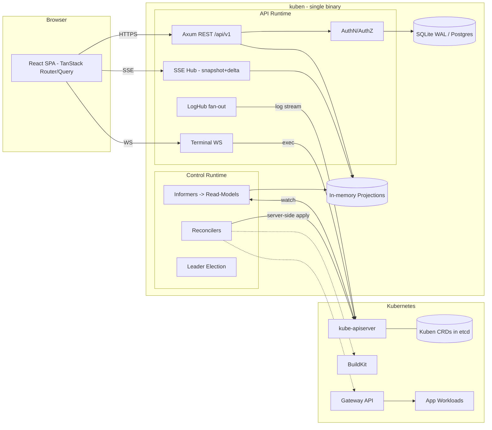
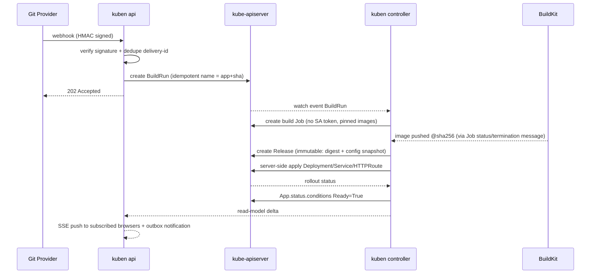

# 🏆 سند معماری طلایی Kuben

> بازطراحی Kubero به یک PaaS فوق‌سبک، Kubernetes-native و Single-Binary با Rust — بازبینی عمیق، واقع‌گرایانه و Pragmatic

| | |
|---|---|
| **نسخه سند** | 1.0 |
| **تاریخ** | 2026-09-10 |
| **وضعیت** | پیشنهاد نهایی برای بازبینی (Proposed) |
| **مبنا** | خواندن مستقیم کد `kubero-main` (سرور NestJS، کلاینت Vue، Templateها، Build Jobها) + طرح معماری پیشنهادی شما |
| **مخاطب** | تیم فنی Kuben (Architect، Backend Rust، Frontend، DevOps) |
| **نقد و اصلاحات** | این نسخه توسط [KUBEN-ARCHITECTURE-CRITIQUE.md](./KUBEN-ARCHITECTURE-CRITIQUE.md) نقد شده است؛ در تعارض، تصمیم‌های v1.1 آن سند (بخش ۰ و ۵) مقدم‌اند |

---

## فهرست

- [۰. خلاصه اجرایی (TL;DR)](#۰-خلاصه-اجرایی-tldr)
- [۱. کالبدشکافی Kubero فعلی — شواهد از کد](#۱-کالبدشکافی-kubero-فعلی--شواهد-از-کد)
- [۲. جایگاه رقابتی و تعریف صادقانه «سبک‌ترین»](#۲-جایگاه-رقابتی-و-تعریف-صادقانه-سبکترین)
- [۳. اصول معماری Kuben (Tenets)](#۳-اصول-معماری-kuben-tenets)
- [۴. معماری کلان](#۴-معماری-کلان)
- [۵. پاسخ سؤال ۱: Controller و API در یک Process](#۵-پاسخ-سؤال-۱-controller-و-api-در-یک-process)
- [۶. پاسخ سؤال ۲: Database و ORM](#۶-پاسخ-سؤال-۲-database-و-orm)
- [۷. پاسخ سؤال ۳: Frontend Stack](#۷-پاسخ-سؤال-۳-frontend-stack)
- [۸. پاسخ سؤال ۴: چک‌لیست Production-Ready](#۸-پاسخ-سؤال-۴-چکلیست-production-ready)
- [۹. تصمیم‌های «جذاب ولی خطرناک» و جایگزین‌ها](#۹-تصمیمهای-جذاب-ولی-خطرناک-و-جایگزینها)
- [۱۰. پیشنهادهای طلایی: چطور Kuben بهترین شود](#۱۰-پیشنهادهای-طلایی-چطور-kuben-بهترین-شود)
- [۱۱. Toolchain نهایی (Rust Crates و Frontend Packages)](#۱۱-toolchain-نهایی-rust-crates-و-frontend-packages)
- [۱۲. ساختار Monorepo و Build Pipeline](#۱۲-ساختار-monorepo-و-build-pipeline)
- [۱۳. بودجه‌های Performance و SLO](#۱۳-بودجههای-performance-و-slo)
- [۱۴. Roadmap اجرایی](#۱۴-roadmap-اجرایی)
- [۱۵. مسیر مهاجرت از Kubero](#۱۵-مسیر-مهاجرت-از-kubero)
- [۱۶. ریسک‌ها و ADRهای پیشنهادی](#۱۶-ریسکها-و-adrهای-پیشنهادی)
- [۱۷. جمع‌بندی نهایی](#۱۷-جمعبندی-نهایی)

---

## ۰. خلاصه اجرایی (TL;DR)

**حکم کلی:** حدود ۸۰٪ طرح شما درست است و ستون‌های اصلی آن — Rust/Axum/kube-rs، Single Binary، SQLite embedded، React SPA، rust-embed و Image مینیمال — انتخاب‌های درستی هستند. **اما ۲۰٪ باقیمانده دقیقاً همان جایی است که PaaSها در Production شکست می‌خورند:** مدل Session و Token، پشتیبانی هم‌زمان از دو Database با sqlx، حافظه‌ی Reflectorها، ایزوله‌سازی Failure Domain داخل یک Process، Backpressure در Logها، Networking (Ingress در برابر Gateway API)، Build System و هزینه‌ی واقعی Kubernetes روی VPSهای کوچک.

### ۱۲ تصمیم طلایی

1. **Kubernetes منبع حقیقت برای Desired State است** (CRDها: `App`، `Environment`، `Release`، `BuildRun` و …). SQL فقط برای Identity، RBAC، Audit و History استفاده می‌شود. این همان ایده‌ی اولیه‌ی Kubero بود که بعدها با اضافه‌شدن SQLite، `Kuberoes` CRD و `config.yaml` از بین رفت.
2. **Modular Monolith با Roleها:** یک Binary و چند Role (`api`، `controller`، …). در Self-host همه‌چیز در یک Pod اجرا می‌شود و در Enterprise همان Binary با Roleهای جدا Deploy می‌شود.
3. **Bulkhead درون‌Process:** دو Tokio Runtime جدا (API و Control Plane) + Supervisor برای هر Subsystem.
4. **Read-Model (Projection) به‌جای Cache کردن Objectهای خام K8s.** بدون این کار، هدف RAM زیر ۳۰ مگابایت عملاً دست‌نیافتنی است.
5. **Realtime = Snapshot + Delta روی SSE با Sequence Number.** Terminal روی WebSocket باینری با Flow Control اجرا می‌شود.
6. **Log Fan-out:** یک Upstream برای هر Container، `broadcast` Ring Buffer، رفتار *drop-with-marker* برای Logها و *Backpressure واقعی* برای Terminal.
7. **Auth:** Session کوکی `HttpOnly` از نوع Opaque برای مرورگر، API Token از نوع Opaque با SHA-256، Argon2id فقط برای Password (همراه Semaphore)، و پشتیبانی از OIDC و Passkeys.
8. **DB:** ترکیب `sqlx` + `sea-query` پشت یک Repository Trait، تست ماتریسی روی SQLite و Postgres، و Migrationهای Embedded.
9. **Type-Safety:** رویکرد OpenAPI-first با `utoipa` → `openapi-typescript` + `openapi-fetch`، به‌جای اتکای صرف به ts-rs.
10. **Gateway API** به‌جای Ingress-NGINX (که بازنشسته شده)، cert-manager، BuildKit + Railpack/CNB، Deploy بر اساس Digest و Releaseهای Immutable.
11. **Validation با CEL** داخل CRD به‌جای Admission Webhook، برای رسیدن به Zero-Ops واقعی.
12. **Build:** Cargo Workspace + pnpm + `just`، و Turborepo به‌صورت اختیاری. Image نهایی: musl + mimalloc + `distroless/static:nonroot`.

### کارنامه‌ی طرح پیشنهادی شما

| تصمیم شما | حکم | خلاصه‌ی دلیل |
|---|---|---|
| pnpm + Turborepo برای کل Monorepo (شامل Rust) | ⚠️ اصلاح | Turbo گراف وابستگی Cargo را نمی‌فهمد و Cache آن برای `target/` کارایی ندارد. Cargo خودش Build Graph است. |
| Axum + Tokio + Tower | ✅ تأیید | بهترین انتخاب فعلی اکوسیستم |
| kube-rs `Controller` + `reflector` | ✅ مشروط | با Projection، Label Selector، حذف `managedFields` و `metadata_watcher` |
| API و Controller در یک Process | ✅ مشروط | Role Flags + Bulkhead Runtimes + Leader Election |
| sqlx + SQLite WAL + Postgres | ⚠️ اصلاح | ماکروی `query!` هم‌زمان برای دو دیتابیس کار نمی‌کند. راه‌حل: SeaQuery، Single-Writer Pool و استراتژی `Recreate` |
| WebSocket برای Terminal و SSE برای Logs | ✅ تأیید | همراه با HTTP/2، Multiplexing، `Last-Event-ID` و Origin Check |
| «SPDY PTY Streaming» | ⚠️ اصلاح | kube-rs از WebSocket استفاده می‌کند و SPDY در Kubernetes در حال حذف است |
| Argon2id | ✅ فقط برای Password | نه برای API Token؛ مصرف حافظه با Semaphore محدود شود |
| PASETO/JWT برای Session | ❌ برای مرورگر رد | امکان Revoke ندارد و در معرض سرقت از طریق XSS است. Cookie Session جایگزین آن است |
| ts-rs | ⚠️ اصلاح | فقط Type تولید می‌کند؛ قرارداد Endpointها را پوشش نمی‌دهد |
| Vite + React 19 + TanStack Router/Query | ✅ تأیید | + React Compiler |
| Tailwind + shadcn/ui | ✅ تأیید | Tailwind v4 + Logical Properties برای پشتیبانی RTL |
| رد Astro برای Dashboard | ✅ تأیید | ولی Astro برای سایت Docs و Marketing عالی است |
| rust-embed | ✅ تأیید | + Brotli از پیش فشرده‌شده + `Cache-Control: immutable` |
| `distroless/cc` یا `scratch` | ⚠️ اصلاح | Build استاتیک musl → `distroless/static:nonroot`. `scratch` توصیه نمی‌شود |
| RAM Idle کمتر از ۲۵ مگابایت | ⚠️ مشروط | فقط با Projection و Bufferهای Bounded ممکن است، و باید به‌عنوان SLO در CI اندازه‌گیری شود |
| API در محدوده‌ی میکروثانیه | ⚠️ اصلاح انتظار | این عدد فقط زمان Handler است؛ زمان End-to-End در حد میلی‌ثانیه خواهد بود |

---

## ۱. کالبدشکافی Kubero فعلی — شواهد از کد

> هدف این بخش تحقیر Kubero نیست؛ Kubero ایده‌های محصولی خوبی دارد (Pipeline، Review Apps، Template Catalog، سادگی). هدف این است که Kuben این **کلاس** از مشکلات را **به‌صورت ساختاری غیرممکن** کند، نه اینکه صرفاً «با دقت بیشتر» کد بنویسد.
>
> تمام مسیرهای زیر نسبت به `kubero-main/` هستند.

### ۱.۱ امنیت

| # | مشکل | شاهد در کد | اثر | راه‌حل ساختاری در Kuben |
|---|---|---|---|---|
| **S1** 🔴 | **شنود و Hijack ترمینال و لاگ بین کاربران.** هر کاربر می‌تواند به هر Room دلخواهی `join` کند، و `handleTerminal` ورودی را در `execStreams[data.room]` می‌نویسد بدون اینکه Authorization را بررسی کند. نام Room هم کاملاً قابل‌حدس است: `pipeline-phase-app-pod-container-terminal` | `server/src/events/events.gateway.ts:29-36` و `:57-65`، `server/src/apps/apps.service.ts:746` | شروع Console نیاز به `app:write` دارد (`apps.controller.ts:247-250`)، ولی **پیوستن و تزریق کلید فقط یک JWT معتبر می‌خواهد**. در نتیجه یک کاربر Read-only از Tenant دیگر می‌تواند خروجی Shell را ببیند و در Shell باز شخص دیگری فرمان اجرا کند | Session ID تصادفی ۱۲۸ بیتی متصل به کاربر؛ Authorization برای هر Subscription؛ عدم اشتراک Shell بین کاربران؛ Origin Check |
| **S2** 🔴 | **Secret پیش‌فرض JWT داخل Source Code قرار دارد** | `server/src/auth/auth.service.ts:156-158`، `auth/strategies/jwt.strategy.ts:13-15`، `auth/auth.module.ts:34-35` | اگر `JWT_SECRET` تنظیم نشده باشد، هر کسی که Repo را خوانده باشد می‌تواند Token جعل کند | کلید Ed25519 در اولین Boot تولید و در K8s Secret ذخیره می‌شود. بدون کلید، سرویس Start نمی‌شود (Fail-Closed). چرخش کلید با `kid` |
| **S3** 🟠 | **JWT در Cookie قابل‌خواندن با JS و در `localStorage` ذخیره می‌شود**، اعتبار ۱۰ ساعته دارد و قابل Revoke نیست، و در همین حال CSP هم خاموش است | `client/src/components/loginprompt.vue:165`، `client/src/plugins/index.ts:17`، `server/src/main.ts:37-38` | هر XSS برابر با سرقت کامل Session است | کوکی `HttpOnly; Secure; SameSite=Lax` با Session ID از نوع Opaque و CSP سخت‌گیرانه |
| **S4** 🟠 | مسیر Legacy برای Password با HMAC-SHA256 و مقایسه‌ی غیر Constant-time با `===`، کنار bcrypt | `server/src/auth/auth.service.ts:36-51` | Downgrade دائمی هش و احتمال Timing Leak | Argon2id + Rehash-on-Login + مقایسه‌ی Constant-time (`subtle`) |
| **S5** 🟠 | CORS با `origin: '*'` روی WebSocket، `cors: true` روی HTTP، و CSP و HSTS خاموش | `events.gateway.ts:13-17`، `main.ts:30`، `main.ts:37-38` | امکان CSWSH (Cross-Site WebSocket Hijacking) و XSS بدون هیچ دفاعی | Same-Origin به‌صورت پیش‌فرض، CSP سخت‌گیرانه (SPA بدون Inline Script)، و Origin Check در WS Upgrade |
| **S6** 🟠 | **PromQL Injection:** مقادیر `pipeline` و `phase` مستقیماً داخل Query قرار می‌گیرند | `server/src/metrics/metrics.service.ts:114`، `:228` | خواندن Metricهای Namespaceهای دیگر | اعتبارسنجی نام‌ها با Regex استاندارد DNS-1123 و ساخت Label Matcher از روی Projection، نه از رشته‌ی خام |
| **S7** 🔴 | **Build Pod کد کاربر را اجرا می‌کند و در عین حال Token سرویس‌اکانت دارد:** `automountServiceAccountToken: true` + `bitnami/kubectl:latest` با `imagePullPolicy: Always` که خودش `kuberoapps` را Patch می‌کند | `server/src/deployments/templates/buildpacks.yaml.ts:31`، `:48-49` | کد Build کاربر می‌تواند Token را بخواند و CRها را تغییر دهد. علاوه بر آن، Tag شناور یک ریسک Supply Chain است (کاتالوگ عمومی Bitnami در ۲۰۲۵ تغییر کرد) | **Build Pod هرگز به K8s API دسترسی ندارد.** Controller تکمیل `BuildRun` را مشاهده می‌کند و خودش `Release` را می‌سازد. همه‌ی Imageها با Digest پین می‌شوند |
| **S8** 🟠 | Broadcast سراسری Notificationها با `server.emit` به همه‌ی Socketها. Guardهای NestJS فقط روی `@SubscribeMessage` اجرا می‌شوند و روی Handshake اجرا نمی‌شوند | `events.gateway.ts:47-49`، `notifications.service.ts:65` | احتمالاً حتی Socketهای احراز هویت‌نشده هم رویدادها را دریافت می‌کنند | احراز هویت در Handshake/Upgrade + Topicهای مجوزدار |
| **S9** 🟡 | خروجی Terminal کاربر به `process.stdout` خود سرور Pipe می‌شود | `server/src/kubernetes/kubernetes.service.ts:1184` | محتوای Shell کاربران (از جمله Secretها) وارد لاگ‌های Kubero می‌شود | محتوای Terminal هرگز Log نمی‌شود. فقط Metadata مثل شروع/پایان Session و کاربر در Audit ثبت می‌شود |
| **S10** 🟡 | Templateهایی با Password ثابت (مثلاً `password: wordpress`) | `services/wordpress/app.yaml` | همه‌ی نصب‌ها Credential یکسان دارند | Template Parameter Schema + Secretهای تولیدشده به‌صورت خودکار |

### ۱.۲ Concurrency و Correctness

| # | مشکل | شاهد | راه‌حل در Kuben |
|---|---|---|---|
| **C1** 🔴 | **Context مشترک و Mutable در Singleton:** فراخوانی `setCurrentContext` روی `KubernetesService` در ۲۸ نقطه از کد. در حالت Multi-cluster، دو درخواست هم‌زمان با هم Race دارند و ممکن است درخواست B روی Cluster درخواست A اجرا شود | `server/src/logs/logs.service.ts:70`، `apps/apps.service.ts:163,403,683` | یک `ClusterRegistry { ClusterId → kube::Client }` Immutable. Context هرگز Global نیست و هر عملیات Cluster خودش را صریحاً همراه دارد |
| **C2** 🔴 | **نشت Log Streamها:** آرایه‌ی `podLogStreams` فقط بزرگ می‌شود؛ Streamهای `follow` حتی بدون بیننده هم بسته نمی‌شوند؛ Dedupe بر اساس Pod انجام می‌شود نه Container (پس Container دوم هیچ‌وقت Stream نمی‌شود)؛ هر Chunk لزوماً یک خط نیست؛ برای هر Chunk یک UUID ساخته می‌شود؛ هیچ Backpressure‌ای وجود ندارد؛ و یک Sleep هک‌گونه‌ی ۳۰۰ms در کد هست | `server/src/logs/logs.service.ts:12`، `:72-82`، `:218` | `LogHub` با Reference Counting، `broadcast` Bounded و Line Framing محدود (بخش ۵.۸) |
| **C3** 🟠 | یک Shell مشترک برای هر Pod/Container بین همه‌ی کاربران، به‌همراه Sleep هک‌گونه‌ی ۳ ثانیه‌ای | `apps.service.ts:746-797`، `:774` | یک Session برای هر تب و هر کاربر، با Idle Timeout |
| **C4** 🟠 | هیچ Informer/Cache‌ای وجود ندارد: هر List مستقیماً به API Server می‌رود، و یک Cron هر ۱۵ ثانیه همه‌ی Appها را در کل Cluster List می‌کند | `server/src/status/status.service.ts:18` | Informer + Projection؛ Metricهای شمارشی مستقیماً از روی Read-Model محاسبه می‌شوند |
| **C5** 🟡 | Patchها به‌صورت Fire-and-forget ارسال و خطاهایشان بلعیده می‌شود، در حالی که مسیر عادی با سطح `error` لاگ می‌شود | `kubernetes.service.ts:1104`، `:1127-1150` | Server-Side Apply + Status Conditions + Error Typeهای صریح |
| **C6** 🟡 | Graceful Shutdown خاموش است | `server/src/main.ts:109` (`//app.enableShutdownHooks();`) | ترتیب Shutdown کامل (بخش ۸.۱) |
| **C7** 🟡 | Migration با `execSync('npx prisma migrate deploy')` در زمان Boot اجرا می‌شود، همراه با `PRAGMA foreign_keys=OFF` | `server/src/database/database.service.ts:61-63` | این روش به `npx` و `node_modules` در Image Production نیاز دارد، Event Loop را Block می‌کند و در حالت چند Replica دچار Race می‌شود. در Kuben: `sqlx::migrate!` Embedded با Lock |

### ۱.۳ معماری و عملیات

- **A1 — Source of Truth دوپاره:** README ادعا می‌کند *«All data is stored on your Kubernetes etcd without an extra database»*، اما امروز داده بین SQLite (Users، Audit، Runpacks، PodSizes، Notifications)، CRD `Kuberoes` و `config.yaml` پخش شده است.
- **A2 — Operator مبتنی بر Helm (Operator SDK):** Reconcile در عمل همان Render کردن Chart است. Status و Conditionها ضعیف‌اند، اضافه‌کردن منطقی مثل Finalizer، Promotion یا Rollback سخت است، و CRD هنوز در `v1alpha1` مانده است.
- **A3 — Addonهای ناهمگون:** بخشی به OLM Operatorها وابسته است (که بیرون از OpenShift کمتر نصب می‌شوند) و بخشی به Chartهای شخص ثالث.
- **A4 — Build:** برای هر Build یک Job ساخته می‌شود با TTL یک‌ساله (`ttlSecondsAfterFinished: 31536000`، `buildpacks.yaml.ts:14`)، بدون Queue و محدودیت Concurrency. Deploy بر اساس Tag انجام می‌شود، نه Digest.
- **A5 — Footprint:** Image مبتنی بر `node:22-alpine` با کل `node_modules`، به‌علاوه‌ی Operator جداگانه، به‌علاوه‌ی Prometheus برای Metricها (`metrics.service.ts:30`).
- **A6 — کیفیت کد:** حدود ۲۰ هزار خط TypeScript در سرور، `console.log`های پراکنده، کدهای Comment‌شده و Typeهای `any`.

### ۱.۴ درس‌ها → Invariantهای طراحی Kuben

این قواعد باید در Code Review و Lint به‌صورت **غیرقابل‌مذاکره** اعمال شوند:

1. **هیچ State سراسری Mutable برای «Context» وجود ندارد.** هر درخواست Cluster خودش را صریحاً همراه دارد.
2. **هر Subscription (Log، Terminal، Event) = یک Authorization Check + یک Resource محدود + یک Owner مشخص.**
3. **هر Buffer محدود (Bounded) است؛ هر Stream قابل Cancel است؛ هر Task تحت نظارت (Supervised) است.**
4. **هیچ Secretی در Source یا Log وجود ندارد؛ رفتار پیش‌فرض Fail-Closed است.**
5. **Build Pod هرگز به Kubernetes API دسترسی ندارد.**
6. **Deploy بر اساس Digest انجام می‌شود؛ همه‌چیز Idempotent و Level-triggered است.**

---

## ۲. جایگاه رقابتی و تعریف صادقانه «سبک‌ترین»

| پروژه | K8s-native | Open Source | Git → Build → Deploy | UI / Logs / Metrics | Multi-cluster | توسعه‌پذیری | Footprint کنترل‌پلین | سادگی |
|---|---|---|---|---|---|---|---|---|
| Coolify | ❌ (Docker + SSH) | ✅ | ✅ | ⭐⭐⭐⭐ | ❌ (Multi-server) | ⭐⭐⭐ | متوسط (PHP + PG + Redis + Realtime) | ⭐⭐⭐⭐⭐ |
| Dokploy | ❌ (Docker Swarm) | ✅ | ✅ | ⭐⭐⭐⭐ | ❌ | ⭐⭐⭐ | متوسط (Node + PG + Redis) | ⭐⭐⭐⭐⭐ |
| Kubero | ✅ | ✅ GPLv3 | ✅ | ⭐⭐⭐ | ⭐⭐⭐ | ⭐⭐ | سنگین برای کاری که انجام می‌دهد | ⭐⭐⭐⭐ |
| Devtron | ✅ عمیق | ✅ هسته | ✅ | ⭐⭐⭐⭐⭐ | ⭐⭐⭐⭐⭐ | ⭐⭐⭐⭐⭐ | سنگین (کامپوننت‌های زیاد) | ⭐⭐⭐ |
| KubeVela | ✅ عمیق | ✅ Apache-2.0 | ⚠️ نیاز به معماری | ⭐⭐⭐ | ⭐⭐⭐⭐⭐ | ⭐⭐⭐⭐⭐ | متوسط | ⭐⭐ |
| Porter / Northflank / Qovery | ✅ | ❌ تجاری | ✅ | ⭐⭐⭐⭐⭐ | ⭐⭐⭐⭐ | ⭐⭐⭐ | Managed | ⭐⭐⭐⭐⭐ |
| **🎯 هدف Kuben** | ✅ | ✅ | ✅ بسیار ساده | ⭐⭐⭐⭐⭐ | ⭐⭐⭐⭐ | ⭐⭐⭐⭐ (از طریق CRD) | **حدود ۲۰ تا ۳۰ مگابایت، یک Pod** | ⭐⭐⭐⭐⭐ |

### ⚠️ حقیقت ناخوشایندی که باید از روز اول پذیرفت

**Kuben می‌تواند سبک‌ترین *Control Plane* روی Kubernetes باشد، اما خود Kubernetes (حتی k3s) معمولاً چند صد مگابایت سربار پایه دارد.** روی یک VPS یک‌گیگابایتی، Coolify و Dokploy (که روی Docker خام کار می‌کنند) همچنان سبک‌تر خواهند بود. اصرار روی ادعای «کم‌مصرف‌ترین به‌طور مطلق» یک تله‌ی بازاریابی است که کاربران خیلی زود با آن روبه‌رو می‌شوند.

**استراتژی درست:**

1. **پیام محصول:** *«سبک‌ترین PaaS Kubernetes-native؛ از یک VPS تا صد Node بدون مهاجرت.»* مزیت رقابتی Kuben مقیاس‌پذیری، HA واقعی و APIهای استاندارد است، نه RAM روی VPS یک‌گیگی.
2. **Installer یک‌خطی** که k3s را با تنظیمات حداقلی نصب می‌کند (غیرفعال کردن کامپوننت‌های بلااستفاده) و Kuben را هم نصب می‌کند، تا تجربه‌ی Onboarding هم‌تراز Coolify باشد.
3. **حداقل سخت‌افزار رسمی:** ۲ گیگابایت RAM و ۲ vCPU. این عدد صادقانه و قابل‌دفاع است.
4. **Kuben باید روی هر Cluster موجود** (EKS، GKE، AKS، k3s، Talos، RKE2) هم با یک Helm Chart یا Manifest نصب شود. این همان جایی است که Coolify و Dokploy اصلاً نمی‌توانند حضور داشته باشند.

---

## ۳. اصول معماری Kuben (Tenets)

1. **Kubernetes پایگاه‌داده‌ی Desired State است.** هر چیزی که «باید اجرا شود» یک CRD است. بنابراین GitOps (ArgoCD/Flux) و `kubectl apply` به‌صورت رایگان کار می‌کنند.
2. **خاموش بودن Control Plane به معنی خاموش بودن Appها نیست.** Data Plane (Podها، Gateway، DBها) کاملاً مستقل از Kuben کار می‌کند.
3. **همه‌چیز Bounded است:** Channelها، Bufferها، Concurrency، Body Size، تعداد Streamها و طول خطوط.
4. **Level-triggered و Idempotent:** بعد از هر Restart، Reconcile کامل انجام می‌شود و هیچ State حیاتی فقط در حافظه نگه داشته نمی‌شود.
5. **Secure by Default و Fail-Closed.**
6. **یک Binary، چند Role.**
7. **پیش‌فرض‌های Zero-Ops، همراه با Escape Hatch برای حرفه‌ای‌ها:** امکان Raw YAML Override و Patch برای Workloadها وجود دارد.
8. **بودجه‌ها در CI اندازه‌گیری می‌شوند:** اندازه‌ی Binary، RSS، Latency و Bundle Size.
9. **API استاندارد بر API اختصاصی مقدم است:** Gateway API، OCI، OIDC، OpenAPI، CNB و OpenTelemetry.
10. **Progressive Disclosure:** سطح رابط کاربری به سادگی Heroku است، ولی هر وقت لازم باشد عمق Kubernetes در دسترس است.

---

## ۴. معماری کلان

### ۴.۱ نمای کلی



### ۴.۲ مدل CRD (جایگزین `KuberoApp` و `Kuberoes`)

| CRD | Scope | نقش |
|---|---|---|
| `KubenConfig` | Cluster (Singleton) | تنظیمات Platform؛ جایگزین `Kuberoes` CRD و `config.yaml` |
| `Project` | Cluster | گروه‌بندی Environmentها؛ مالک Namespaceها |
| `Environment` | Cluster | یک Namespace ایزوله (Quota، NetworkPolicy، PSA)؛ شامل ترتیب Promotion |
| `App` | Namespaced | Spec برنامه: Source، Processes، Env، Domains، Scaling |
| `BuildRun` | Namespaced (`kuben-builds`) | صف و وضعیت Build؛ **Durable Queue بدون نیاز به زیرساخت اضافه** |
| `Release` | Namespaced (Immutable) | Image Digest + Snapshot پیکربندی؛ مبنای Rollback یک‌کلیکی |
| `Service` (Addon) | Namespaced | Postgres، Valkey، MariaDB و …؛ به‌همراه Binding به App |
| `Domain` | Namespaced | Host + TLS + تأیید مالکیت (TXT) |
| `BackupPolicy` / `Backup` | Namespaced | زمان‌بندی Backup و Restore |

**نمونه‌ی `App` (بخش Validation با CEL انجام می‌شود، نه Webhook):**

```yaml
apiVersion: kuben.dev/v1alpha1
kind: App
metadata:
  name: api
  namespace: kx-shop-prod
spec:
  source:
    git: { repo: https://github.com/acme/shop, branch: main, path: services/api }
    build: { strategy: auto }            # auto | dockerfile | railpack | buildpacks | image
  runtime:
    processes:
      web:    { command: ["./server"], port: 8080, size: small, replicas: { min: 2, max: 6 } }
      worker: { command: ["./worker"], size: small, replicas: { min: 1, max: 1 } }
    healthCheck: { path: /healthz }
  env:
    - { name: LOG_LEVEL, value: info }
    - { name: DATABASE_URL, fromService: { name: shop-db, key: uri } }
  domains:
    - { host: api.acme.com, tls: auto }
status:
  observedGeneration: 7
  currentRelease: r-000042
  url: https://api.acme.com
  conditions:
    - { type: Ready, status: "True", reason: RolloutComplete }
```

```yaml
# بخشی از OpenAPI schema تولیدشده برای CRD (از schemars + kube-derive)
x-kubernetes-validations:
  - rule: "self.replicas.min <= self.replicas.max"
    message: "replicas.min must be <= replicas.max"
```

### ۴.۳ کجا چه داده‌ای ذخیره می‌شود

| داده | محل ذخیره | دلیل |
|---|---|---|
| App، Environment، Domain، Service و Release (N تای آخر) | **etcd (CRD)** | Desired State؛ سازگاری با GitOps؛ Reconcile سطحی (Level-triggered) |
| BuildRun فعال | **etcd (CRD)** | Durable Queue رایگان؛ بعد از Restart ادامه پیدا می‌کند |
| Users، Orgs، Memberships، RoleBindings | **SQL** | داده‌ی Relational و خصوصی؛ جایش در etcd نیست |
| Sessions و API Tokens (به‌صورت هش‌شده) | **SQL** (+ Cache در حافظه با moka) | Revoke فوری |
| Audit Log | **SQL** (Append-only، Hash-chain) + امکان Export | Compliance |
| تاریخچه‌ی Releaseها و Buildها (قدیمی‌تر از N) | **SQL** (خلاصه) | etcd برای تاریخچه‌ی نامحدود ساخته نشده است |
| Build Logs | **zstd در SQL یا Object Storage** (با سقف حجم) | Podهای Build بعد از مدتی پاک می‌شوند |
| Credentialهای Git Provider و Registry | **K8s Secret** (+ Envelope Encryption در صورت نگهداری در SQL) | Least Privilege |
| Metricهای کوتاه‌مدت (یک ساعت اخیر) | **Ring Buffer در حافظه** | نمایش Sparkline بدون نیاز به Prometheus |

### ۴.۴ Roleها (Modular Monolith)

```bash
kuben serve --roles=all                  # Self-host: همه چیز در یک Pod (پیش‌فرض)
kuben serve --roles=api                  # Enterprise: N replica پشت Load Balancer
kuben serve --roles=controller           # Enterprise: 2 replica با Leader Election
kuben migrate | backup | restore | reset-admin | export
```

| Role | مسئولیت | تعداد Replica |
|---|---|---|
| `api` | REST، SSE، WS، LogHub، Exec، Informerهای Read-Model | ۱ تا N (بدون State؛ نیاز به Postgres برای بیش از ۱) |
| `controller` | Reconcilerها، Webhook Processing، Schedulerها (Backup، Cleanup) | ۱ تا ۲ (فقط Leader فعال است) |
| `all` | هر دو Role | ۱ (حالت SQLite) |

### ۴.۵ جریان Deploy (Git Push تا Production)



---

## ۵. پاسخ سؤال ۱: Controller و API در یک Process

### ۵.۱ آیا Reconciler می‌تواند باعث Starvation شدن HTTP شود؟

**بله، ولی تقریباً هیچ‌وقت به دلیل I/O نیست؛ همیشه به دلیل کار CPU یا Blocking داخل Async است.** Tokio یک Scheduler تعاونی (Cooperative) است؛ Taskی که بدون `.await` روی CPU بماند، Worker Thread را اشغال می‌کند. منابع واقعی Starvation در این پروژه:

| منبع | چرا خطرناک است | راه‌حل |
|---|---|---|
| Deserialize کردن LIST اولیه‌ی بزرگ (هزاران Pod) | چند ده میلی‌ثانیه CPU پیوسته | `page_size` در `watcher::Config`، Label Selector، و Streaming Lists در نسخه‌های جدید K8s (WatchList) |
| Argon2id در Login | حدود ۱۰ تا ۵۰ms CPU + حدود ۱۹ تا ۴۶MiB حافظه برای هر Hash | `spawn_blocking` + `Semaphore(2)` |
| Render و Diff Manifestهای بزرگ، YAML Parsing و Template Rendering | CPU-bound | `spawn_blocking` برای ورودی‌های بزرگ؛ Builderهای Typed به‌جای Template رشته‌ای |
| Compression پویای Brotli با Quality بالا | CPU بسیار زیاد | Quality 4 برای پاسخ‌های پویا؛ Assetها از قبل فشرده شوند |
| `Store::state()` روی Listهای بزرگ در هر Request | O(n) Clone از `Arc`ها | Projection با Index (بخش ۵.۴) |
| Mutex سنکرون که روی `.await` نگه داشته شود | Deadlock یا Stall | Clippy Lint `await_holding_lock` + استفاده از `parking_lot` فقط برای بخش‌های کوتاه |
| Blocking Pool پیش‌فرض (۵۱۲ Thread) | انفجار Thread و RSS | `max_blocking_threads(16)` |

### ۵.۲ پیشنهاد اصلی: Bulkhead با دو Runtime در یک Process

به‌جای یک Runtime مشترک، **دو Tokio Runtime روی Thread Poolهای جدا** راه بیندازید. هزینه‌ی این کار ناچیز است (فقط چند Thread اضافه) و ایزوله‌سازی CPU و Scheduling واقعی ایجاد می‌کند:

- **Control Runtime** (۱ تا ۲ Worker): Informerها، Reconcilerها، Leader Election و Schedulerها.
- **API Runtime** (۲ تا ۴ Worker): HTTP، SSE، WebSocket و LogHub/Exec (یعنی بار ناشی از کاربر).

در نتیجه، سیل کاربرانی که Log می‌بینند Reconcile را کند نمی‌کند، و یک Reconcile سنگین هم UI را Freeze نمی‌کند. Read-Modelها (`Arc<...>` با قفل‌های Sync کوتاه یا Lock-free) بین دو Runtime به اشتراک گذاشته می‌شوند.

> ⚠️ **Gotcha:** برای هر Runtime یک `kube::Client` جدا بسازید. Connection Taskهای Hyper روی Runtimeی Spawn می‌شوند که درخواست را اجرا کرده است؛ به اشتراک گذاشتن یک Client بین Runtimeها باعث وابستگی‌های پنهان در Lifecycle می‌شود. Client ارزان است. همین جداسازی به شما اجازه می‌دهد **Rate Limit و Connection Pool جداگانه** برای «درخواست‌های کاربر» و «Reconcile» داشته باشید.

```rust
// crates/kuben-server/src/main.rs — طرح اولیه (Sketch)، نه کد نهایی
#[global_allocator]
static GLOBAL: mimalloc::MiMalloc = mimalloc::MiMalloc;

fn main() -> anyhow::Result<()> {
    let cfg = kuben_core::Config::load()?;          // figment: file + env + flags
    kuben_telemetry::init(&cfg)?;                   // tracing JSON + (feature "otel") OTLP
    let shutdown = tokio_util::sync::CancellationToken::new();

    let ctrl_rt = tokio::runtime::Builder::new_multi_thread()
        .worker_threads(cfg.runtime.controller_threads)   // default 2
        .max_blocking_threads(4)
        .thread_name("kx-ctrl")
        .enable_all()
        .build()?;

    let api_rt = tokio::runtime::Builder::new_multi_thread()
        .worker_threads(cfg.runtime.api_threads)          // default 2..4
        .max_blocking_threads(16)
        .thread_name("kx-api")
        .enable_all()
        .build()?;

    // وضعیت مشترک: DB pools، ClusterRegistry، Read-Models، Health
    let shared = api_rt.block_on(kuben_server::Shared::init(&cfg))?;

    let ctrl = {
        let (shared, token) = (shared.clone(), shutdown.child_token());
        std::thread::Builder::new().name("kx-ctrl-main".into()).spawn(move || {
            ctrl_rt.block_on(kuben_controller::run_supervised(shared, token));
            ctrl_rt.shutdown_timeout(std::time::Duration::from_secs(10));
        })?
    };

    let result = api_rt.block_on(async {
        tokio::spawn(kuben_server::signals::forward(shutdown.clone())); // SIGTERM/SIGINT
        kuben_api::serve(shared, shutdown.clone()).await
    });

    shutdown.cancel();
    let _ = ctrl.join();
    result
}
```

### ۵.۳ مدیریت Watch Streamها

1. **هر Watcher باید Backoff داشته باشد** (`.default_backoff()`). بدون آن، هنگام خطا یک Hot Loop روی API Server ایجاد می‌شود. این رایج‌ترین باگ Controllerهای Rust است.
2. **برای هر Kind در هر Cluster فقط یک Watch مشترک وجود داشته باشد**، نه یک Watch برای هر کاربر یا هر Request.
3. **Label Selector روی همه چیز:** `app.kubernetes.io/managed-by=kuben`. Kuben نباید کل Podهای Cluster را Watch کند.
4. **حذف `managedFields`** (و Annotationهای حجیم مثل `last-applied-configuration`) قبل از ذخیره، با `.modify(...)`. این کار به‌تنهایی معمولاً بخش قابل‌توجهی از حجم هر Object را حذف می‌کند.
5. **از `metadata_watcher` برای Kindهایی استفاده کنید** که فقط Label و OwnerReference آن‌ها لازم است (مثلاً Deployment/ReplicaSetهای تحت مالکیت، که فقط برای Trigger کردن Reconcile لازم‌اند).
6. **Readiness = Sync شدن Cacheها:** `store.wait_until_ready()` یا رویداد `InitDone` (معادل `WaitForCacheSync` در controller-runtime). تا این لحظه `/readyz` باید false برگرداند.
7. **410 Gone / Desync:** Watcher در kube-rs خودش Re-list می‌کند و رویدادهای `Init` → `InitApply`… → `InitDone` را می‌فرستد. Projection شما باید در `InitDone` **به‌صورت اتمیک Swap شود** تا یک پنجره‌ی زمانی خالی ایجاد نشود، و یک رویداد `resync` به Clientهای SSE ارسال شود.
8. **RBAC Scope:** حالت پیش‌فرض یک Watch سراسری روی Cluster با Label Selector است (یک Connection). یک حالت Namespace-scoped هم برای محیط‌هایی با RBAC محدود پیش‌بینی کنید.

```rust
// Informer → Projection (نه reflector خام)
let pods = Api::<Pod>::all(client.clone());
let cfg = watcher::Config::default()
    .labels("app.kubernetes.io/managed-by=kuben")
    .page_size(500);

watcher(pods, cfg)
    .default_backoff()
    .try_for_each(|ev| {
        let rm = rm.clone();
        async move {
            match ev {
                watcher::Event::Init => rm.pods.begin_resync(),
                watcher::Event::InitApply(p) => rm.pods.stage(PodView::from(&p)),
                watcher::Event::InitDone => rm.pods.commit_resync(), // swap اتمیک + epoch++ → SSE "resync"
                watcher::Event::Apply(p) => rm.pods.upsert(PodView::from(&p)), // delta → broadcast
                watcher::Event::Delete(p) => rm.pods.remove(&p),
            }
            Ok(())
        }
    })
    .await?;
```

### ۵.۴ طراحی Local Cache: Projection به‌جای Reflector خام

**این مهم‌ترین تصمیم برای رسیدن به هدف RAM است.** یک Pod خام در حافظه (حتی بعد از حذف `managedFields`) معمولاً چند کیلوبایت تا بیش از ده کیلوبایت حجم دارد. در مقابل، چیزی که UI واقعاً لازم دارد حدود ۲۰۰ بایت است:

```rust
pub struct PodView {
    pub name: CompactString,
    pub app: AppKey,            // (cluster, namespace, app)
    pub process: CompactString, // web | worker | cron
    pub phase: PodPhase,
    pub ready: bool,
    pub restarts: u32,
    pub reason: Option<CompactString>, // CrashLoopBackOff, OOMKilled, ...
    pub image_digest: Option<CompactString>,
    pub node: Option<CompactString>,
    pub started_at: Option<i64>,
}
```

**ساختار Read-Model:**

- **Primary Map:** `papaya::HashMap<Key, Arc<View>>` یا `DashMap`، برای Lookup در حد میکروثانیه.
- **Secondary Index:** `AppKey → SmallVec<PodKey>` تا جواب «Podهای این App» بدون Scan بیاید.
- **Sequence سراسری:** یک `AtomicU64` که برای هر تغییر افزایش پیدا می‌کند، و هم برای **ETag** و هم برای **SSE Event ID** استفاده می‌شود.
- **Delta Bus:** `tokio::sync::broadcast::Sender<Arc<Delta>>` (Bounded). Subscriberهای SSE آن را بر اساس مجوزهایشان Filter می‌کنند.
- **AppView ترکیبی:** از App CR + Deployment + Pods + Release ساخته می‌شود (مثلاً `replicas 2/3 ready`، URL، آخرین Deploy). **UI هیچ‌وقت Object خام K8s دریافت نمی‌کند**؛ مگر در تب «YAML» که آن هم On-demand و مستقیم از API Server خوانده می‌شود.

**برآورد حافظه:** برای ۵۰ App، ۲۰۰ Pod، ۵۰ Deployment و ۵۰ CR، کل Projectionها احتمالاً زیر یک مگابایت خواهند بود. Reflector خام برای همین حجم ممکن است چند مگابایت تا ده‌ها مگابایت مصرف کند.

> ⚠️ **دقت کنید:** `kube::runtime::Controller` برای Kind اصلی (و `owns()`ها) خودش یک Reflector از Objectهای کامل نگه می‌دارد. برای Kindهای تحت مالکیت از Stream متادیتا استفاده کنید (APIهای Stream Control در kube-runtime ممکن است پشت Featureهای `unstable-runtime` باشند؛ هنگام پیاده‌سازی نسخه‌ی روز را بررسی کنید).

### ۵.۵ رفتار هنگام Restart یا قطع Watch

| رویداد | رفتار درست |
|---|---|
| Restart کامل Process | Readiness تا زمان Sync شدن Cache برابر false است → Reconcile کامل همه‌ی CRها (Level-triggered). همه‌ی عملیات‌ها با Server-Side Apply و `fieldManager: kuben` انجام می‌شوند و Idempotent هستند |
| قطع Watch (Network، Restart شدن API Server) | Watcher با Backoff و از آخرین `resourceVersion` ادامه می‌دهد. در صورت 410، Re-list و Swap اتمیک انجام می‌شود |
| Clientهای SSE هنگام Resync | ارسال رویداد `resync` → Client Snapshot را دوباره Fetch می‌کند. اگر `Last-Event-ID` از Ring Buffer قدیمی‌تر باشد، Snapshot کامل ارسال می‌شود |
| Webhookهای Git از دست رفته در زمان Downtime | بعد از Start، برای هر App با `autodeploy` آخرین SHA برنچ با `gix` (معادل `ls-remote`) مقایسه می‌شود → Catch-up خودکار |
| از دست رفتن Leadership | Cancel فوری Reconcilerها (`CancellationToken`). Overlap کوتاه بی‌خطر است چون همه‌ی عملیات‌ها Idempotent هستند و از SSA استفاده می‌کنند |
| Cluster غیرقابل‌دسترس (Multi-cluster) | وضعیت آن Cluster → `Degraded`. Circuit Breaker ضربه زدن به API Server را متوقف می‌کند و UI داده‌ی Stale را با برچسب «Last synced at» نشان می‌دهد |

### ۵.۶ ایزوله‌سازی Failure Domain در یک Process

1. **Supervisor Tree:** هر Subsystem (Informerهای هر Cluster، هر Controller، Build Dispatcher، Scheduler، LogHub) با Restart و Backoff اجرا می‌شود.
2. **استفاده از `panic = "unwind"` (نه `abort`).** یک Panic در Reconciler نباید API را از کار بیندازد: `JoinError::is_panic()` → ثبت Metric → Restart آن Subsystem. (با `abort` کل Binary از کار می‌افتد.)
3. **Health چندلایه:**
   - `/livez`: فقط اگر API Runtime قفل شده باشد false می‌شود. یک Watchdog Task روی API Runtime هر ثانیه یک Atomic Timestamp را به‌روز می‌کند و اگر این مقدار بیشتر از ۱۰ ثانیه قدیمی شود، Liveness Fail می‌شود.
   - `/readyz`: Cacheها Sync شده باشند + DB در دسترس باشد.
   - `/healthz/details` (نیازمند Auth): وضعیت هر Subsystem، شامل `degraded` و `last_error`.
   - **Controller خراب نباید Readiness را برای API false کند**؛ در این حالت API سرویس‌دهی را ادامه می‌دهد و فقط Alert ارسال می‌شود.
4. **Memory Isolation واقعی در یک Process ممکن نیست**، پس تنها راه **Bounded بودن همه‌چیز** است:
   - Semaphoreها: حداکثر Upstream Log Streamها (مثلاً ۳۲)، Terminalها (۱۶)، Loginهای هم‌زمان (۲)، Buildهای هم‌زمان برای هر Org.
   - محدودیت برای هر کاربر: حداکثر تعداد SSE و Terminal.
   - `RequestBodyLimitLayer`، و `max_message_size` برای WebSocket.
   - Metricهای Allocator (mimalloc/jemalloc stats) + Alert روی RSS.
5. **Client Isolation:** Clientهای جداگانه با `tower` Rate Limit برای Reconcile و برای Userها.

```rust
// Supervisor — طرح اولیه
pub async fn supervise<F, Fut>(name: &'static str, token: CancellationToken, health: Health, mut make: F)
where
    F: FnMut(CancellationToken) -> Fut,
    Fut: Future<Output = anyhow::Result<()>> + Send + 'static,
{
    let mut attempt = 0u32;
    loop {
        let handle = tokio::spawn(make(token.child_token()));
        let outcome = handle.await;
        if token.is_cancelled() { return; }
        match outcome {
            Ok(Ok(())) => return,
            Ok(Err(e)) => { health.degraded(name, &e.to_string()); tracing::error!(subsystem = name, error = ?e); }
            Err(j) if j.is_panic() => { health.degraded(name, "panic"); metrics::counter!("kuben_subsystem_panics_total", "subsystem" => name).increment(1); }
            Err(_) => return,
        }
        attempt = attempt.saturating_add(1);
        let delay = backoff_with_jitter(attempt, Duration::from_millis(500), Duration::from_secs(60));
        tokio::select! { _ = token.cancelled() => return, _ = tokio::time::sleep(delay) => {} }
    }
}
```

### ۵.۷ Controller: Concurrency، Error Policy، Finalizer

```rust
Controller::new(Api::<App>::all(client.clone()), watcher::Config::default())
    .owns(Api::<Deployment>::all(client.clone()), watcher::Config::default().labels(MANAGED))
    .owns(Api::<Service>::all(client.clone()), watcher::Config::default().labels(MANAGED))
    .with_config(controller::Config::default().concurrency(8).debounce(Duration::from_millis(300)))
    .graceful_shutdown_on(token.clone().cancelled_owned())
    .run(reconcile_app, error_policy, ctx)
    .for_each(|r| async move { if let Err(e) = r { tracing::warn!(error = ?e, "reconcile") } })
    .await;

fn error_policy(app: Arc<App>, err: &Error, ctx: Arc<Ctx>) -> Action {
    if err.is_permanent() {
        // Spec نامعتبر: Condition قبلاً ست شده؛ منتظر تغییر کاربر بمان، requeue بی‌فایده است
        return Action::await_change();
    }
    let n = ctx.failures.bump(ObjectRef::from_obj(&*app)); // در reconcile موفق reset شود
    Action::requeue(backoff_with_jitter(n, Duration::from_secs(1), Duration::from_secs(300)))
}
```

- **Backoff برای هر Object:** kube-rs به‌صورت پیش‌فرض تعداد شکست‌های هر Object را نگه نمی‌دارد، پس خودتان یک Map از `ObjectRef` به تعداد تلاش‌ها نگه دارید.
- **Periodic Resync:** برای تشخیص Drift، هر ۵ تا ۱۰ دقیقه با Jitter یک `Action::requeue` انجام شود.
- **Finalizerها** (با Helper `kube::runtime::finalizer`) برای پاکسازی منابع خارجی: رکوردهای DNS، Imageهای Registry، Backupها و Addon DBها. **حتماً** Timeout داشته باشند و دستور `kuben uninstall` Finalizerها را آزاد کند؛ وگرنه بعد از حذف Kuben، Namespaceها در وضعیت `Terminating` گیر می‌کنند.
- **Kubernetes Events** با `kube::runtime::events::Recorder` ثبت شوند تا `kubectl describe app api` برای کاربر حرفه‌ای معنادار باشد.
- **Status Conditionها** به سبک kstatus (`Ready`، `Progressing`، `Degraded`) همراه با `observedGeneration`.

### ۵.۸ Log Streaming: Backpressure، Buffer و Flow Control

**اصل کلیدی:** Log یک منبع **مشترک** است (ممکن است N بیننده داشته باشد)؛ بنابراین **Producer هرگز نباید به خاطر یک Consumer کند Block شود.** راه‌حل استاندارد این است: **یک Ring Buffer محدود + Drop کردن داده‌ی قدیمی برای Consumer کند + اطلاع‌رسانی صریح درباره‌ی Drop.**

```
kubelet ──(1 upstream per pod/container)──► pump task
                                             │  line framing با سقف 16KiB (خطوط بلندتر truncate می‌شوند)
                                             │  batching: هر 50ms یا 8KiB
                                             ▼
                               tokio::sync::broadcast (capacity = 128 batch)
                                  │              │              │
                              SSE client A   SSE client B   SSE client C (کند)
                                                             └─ RecvError::Lagged(n) → event "dropped: n"
```

**سقف حافظه قابل‌محاسبه است:** `128 batch × 8KiB × 32 upstream ≈ 32MiB` در بدترین حالت. در حالت عادی این عدد بسیار کمتر است، و هر سه پارامتر قابل تنظیم‌اند.

```rust
pub struct LogHub {
    streams: DashMap<LogKey, Weak<LogStream>>,
    client: kube::Client,          // client مخصوص API runtime
    upstream_limit: Arc<Semaphore>, // حداکثر upstream هم‌زمان
}

pub struct LogStream { tx: broadcast::Sender<Arc<LogBatch>>, cancel: CancellationToken }
impl Drop for LogStream { fn drop(&mut self) { self.cancel.cancel(); } } // آخرین بیننده رفت → upstream بسته شود

impl LogHub {
    pub fn subscribe(&self, key: LogKey) -> Result<(Arc<LogStream>, broadcast::Receiver<Arc<LogBatch>>), Error> {
        // از entry API استفاده کنید تا race بین get و insert نباشد
        let mut slot = self.streams.entry(key.clone()).or_insert_with(Weak::new);
        if let Some(s) = slot.upgrade() { let rx = s.tx.subscribe(); return Ok((s, rx)); }
        let permit = self.upstream_limit.clone().try_acquire_owned().map_err(|_| Error::TooManyStreams)?;
        let (tx, rx) = broadcast::channel(128);
        let s = Arc::new(LogStream { tx: tx.clone(), cancel: CancellationToken::new() });
        *slot = Arc::downgrade(&s);
        tokio::spawn(pump(self.client.clone(), key, tx, s.cancel.clone(), permit));
        Ok((s, rx))
    }
}
```

```rust
// SSE handler — slow consumer هرگز producer را block نمی‌کند
async fn app_logs(State(s): State<ApiState>, authz: Authz, Path(p): Path<LogPath>)
    -> Result<Sse<impl Stream<Item = Result<Event, Infallible>>>, ApiError>
{
    authz.require(Perm::AppLogsRead, &p.app)?;               // مجوز برای هر subscription
    let (guard, mut rx) = s.logs.subscribe(p.into())?;
    let stream = async_stream::stream! {
        let _guard = guard;                                  // تا وقتی client وصل است upstream زنده می‌ماند
        loop {
            match rx.recv().await {
                Ok(b) => yield Ok(Event::default().event("logs").data(b.json())),
                Err(RecvError::Lagged(n)) => yield Ok(Event::default().event("dropped").data(n.to_string())),
                Err(RecvError::Closed) => { yield Ok(Event::default().event("eof").data("")); break; }
            }
        }
    };
    Ok(Sse::new(stream).keep_alive(KeepAlive::new().interval(Duration::from_secs(15))))
}
```

**جزئیاتی که معمولاً فراموش می‌شوند:**

- ⚠️ **خط بی‌انتها = OOM.** متد `.lines()` سقفی برای طول خط ندارد؛ Containerی که یک خط یک‌گیگابایتی بدون `\n` چاپ کند، سرور را از کار می‌اندازد. از `tokio_util::codec::LinesCodec::new_with_max_length(16 * 1024)` استفاده کنید (با `compat()` برای تبدیل `futures::AsyncRead`) یا یک Codec که خط را Truncate کند.
- **Grace Period:** وقتی آخرین بیننده قطع می‌شود، `Arc` را ۱۰ ثانیه بعد Drop کنید (`tokio::spawn(async move { sleep(10s).await; drop(guard) })`) تا Refresh صفحه یا تغییر تب باعث قطع و وصل مجدد Upstream نشود.
- **Tail اولیه:** `tail_lines: 200` + `timestamps: true` + `since_seconds` برای Reconnect، و Dedupe بر اساس Timestamp در سمت Client.
- **پایان Container:** رویداد `eof` → UI دکمه‌ی «Previous container logs» (`previous: true`) را نشان می‌دهد.
- **Rate Guard:** اگر نرخ تولید لاگ از یک آستانه (مثلاً ۲۰ هزار خط در ثانیه) بیشتر شود، Sampling همراه با پیام اطلاع‌رسانی انجام شود.
- **تاریخچه و جستجو خارج از Scope هسته است:** kubelet فقط لاگ Container فعلی و قبلی را نگه می‌دارد. برای Search و Retention، یک Addon اختیاری با **VictoriaLogs** (سبک) یا **Loki** ارائه کنید.
- **Build Logs:** در پایان هر Build، لاگ با zstd فشرده و با سقف حجم (مثلاً ۵ مگابایت) ذخیره شود.

### ۵.۹ Terminal روی WebSocket: PTY، Resize و Flow Control

> **تصحیح طرح:** kube-rs برای Exec از **WebSocket** استفاده می‌کند (پروتکل Channel در Kubernetes)، نه SPDY. خود Kubernetes هم در حال مهاجرت از SPDY به WebSocket است (KEP-4006). پس «SPDY PTY» در طرح شما باید به «K8s Exec over WebSocket» تغییر کند.

**اصل کلیدی:** برخلاف Log، **Terminal نباید هیچ داده‌ای را Drop کند**؛ Drop شدن بایت‌ها Escape Sequenceها را خراب می‌کند و Terminal را از کار می‌اندازد. Terminal یک ارتباط **یک‌به‌یک** است، پس **Backpressure باید تا PTY منتقل شود**: وقتی Browser کند است، ما خواندن از stdout را متوقف می‌کنیم → Buffer کرنل پر می‌شود → پروسه‌ی داخل Container روی `write` Block می‌شود. این دقیقاً همان رفتار صحیح Unix برای یک TTY است.

**پروتکل فریم (WebSocket باینری):**

| بایت اول (Channel) | جهت | محتوا |
|---|---|---|
| `0` STDIN | Browser → Server | بایت‌های ورودی |
| `1` STDOUT | Server → Browser | بایت‌های خروجی (stderr در حالت TTY با stdout ادغام می‌شود) |
| `3` RESIZE | Browser → Server | JSON: `{"cols":120,"rows":40}` |
| `4` PAUSE / `5` RESUME | Browser → Server | Flow Control مبتنی بر Watermark |
| `9` CONTROL | دوطرفه | Ping، `exit code`، خطا |

```rust
// Server: pump دوطرفه با backpressure واقعی
let mut stdin = proc.stdin().expect("stdin");
let mut stdout = proc.stdout().expect("stdout");
let mut resize = proc.terminal_size().expect("tty");     // Sender<TerminalSize>
let (mut tx, mut rx) = socket.split();
let mut buf = vec![0u8; 16 * 1024];
let mut paused = false;

loop {
    tokio::select! {
        // فقط وقتی paused نیستیم می‌خوانیم → backpressure به PTY می‌رسد
        n = stdout.read(&mut buf), if !paused => {
            let n = n?; if n == 0 { break; }
            let mut f = Vec::with_capacity(n + 1); f.push(CH_STDOUT); f.extend_from_slice(&buf[..n]);
            // send().await خودش منتظر socket می‌ماند؛ timeout برای client مرده
            if timeout(Duration::from_secs(30), tx.send(Message::Binary(f.into()))).await.is_err() { break; }
        }
        msg = rx.next() => match msg {
            Some(Ok(Message::Binary(b))) if !b.is_empty() => match b[0] {
                CH_STDIN  => stdin.write_all(&b[1..]).await?,
                CH_RESIZE => { let s: Size = serde_json::from_slice(&b[1..])?;
                               let _ = resize.send(TerminalSize { width: s.cols, height: s.rows }).await; }
                CH_PAUSE  => paused = true,
                CH_RESUME => paused = false,
                _ => {}
            },
            Some(Ok(Message::Close(_))) | None => break,
            _ => {}
        },
        _ = idle.tick() => if last_input.elapsed() > IDLE_TIMEOUT { break; },
    }
}
```

```ts
// Client: flow control مبتنی بر watermark (الگوی توصیه‌شده در مستندات xterm.js)
const HIGH = 512 * 1024, LOW = 64 * 1024;
let pending = 0, paused = false;
ws.binaryType = 'arraybuffer';
ws.onmessage = (ev) => {
  const bytes = new Uint8Array(ev.data);
  if (bytes[0] !== CH.STDOUT) return handleControl(bytes);
  const payload = bytes.subarray(1);
  pending += payload.length;
  term.write(payload, () => {
    pending -= payload.length;
    if (paused && pending < LOW) { paused = false; send(CH.RESUME); }
  });
  if (!paused && pending > HIGH) { paused = true; send(CH.PAUSE); }
};
// Resize: FitAddon + ResizeObserver با debounce حدود 100ms؛ اولین size قبل از اولین خروجی ارسال شود
```

**امنیت و UX ترمینال:**

- Permission جدا به نام **`app:exec`** (نه `app:write`)، بررسی در **لحظه‌ی Upgrade**، به‌علاوه‌ی **Origin Check** (برای جلوگیری از CSWSH).
- یک Session برای هر تب، با ID تصادفی ۱۲۸ بیتی؛ حداکثر Session برای هر کاربر؛ Idle Timeout (۱۵ دقیقه) و Max Duration.
- **Audit:** شروع و پایان Session، کاربر، Pod و مدت. در نسخه‌ی Enterprise، **Session Recording** با فرمت asciicast و ذخیره در Object Storage.
- **Shell Fallback:** اجرای `bash` و در صورت نبود آن `sh`، و اگر هیچ‌کدام نبود →
- 🌟 **Ephemeral Debug Container:** برای Imageهای Distroless که Shell ندارند (و Console در Kubero روی آن‌ها کار نمی‌کند)، یک Container موقت با `busybox`/`netshoot` و `targetContainerName` برای اشتراک Process Namespace ساخته می‌شود. این یک مزیت رقابتی واقعی است.

### ۵.۱۰ جزئیات SSE در Production

- **محدودیت ۶ Connection در HTTP/1.1:** در HTTP/1.1 مرورگر حداکثر ۶ Connection برای هر Origin باز می‌کند. با چند تب و چند SSE، مرورگر عملاً قفل می‌شود. راه‌حل‌ها: (۱) HTTP/2 در لبه (Gateway/Ingress با TLS)، و (۲) **یک SSE Multiplexed برای هر تب** برای رویدادهای Cluster (Topicها از طریق Query/Subscribe API انتخاب می‌شوند) + SSE جداگانه فقط برای Log Viewerهای باز.
- **Proxy Buffering:** غیرفعال کردن Buffering در Gateway، هدر `X-Accel-Buffering: no`، Keep-Alive Comment هر ۱۵ ثانیه، و Timeoutهای مناسب.
- **`id:` برای هر رویداد** (Sequence سراسری) → `EventSource` در Reconnect به‌صورت خودکار `Last-Event-ID` را می‌فرستد → Server از Ring Buffer Delta تحویل می‌دهد یا `resync` ارسال می‌کند.
- **Auth:** `EventSource` نمی‌تواند Header سفارشی بفرستد، پس **Cookie Session** لازم است. این هم یک دلیل دیگر علیه Bearer JWT در مرورگر است.
- **Compression:** Compression را روی SSE غیرفعال کنید، چون Flush را خراب می‌کند.

---

## ۶. پاسخ سؤال ۲: Database و ORM

### ۶.۱ ابتدا: اصلاً چه چیزی در DB است؟

با تصمیم «K8s = Desired State» (بخش ۴.۳)، DB **کوچک، کم‌ترافیک و Relational** است: Users، Orgs، Memberships، RoleBindings، Sessions، Tokens، Audit و History. **QPS نوشتن پایین است و بیشتر خواندن‌ها از Cache حافظه انجام می‌شود.** بنابراین معیار اصلی انتخاب ORM «سرعت خام» نیست، بلکه **قابلیت حمل بین SQLite و Postgres، شفافیت SQL، Migrationهای Embedded و قابلیت تست** است.

### ۶.۲ مقایسه

| معیار | **sqlx** (خام) | **SeaORM** | **SeaQuery + sqlx** | **Diesel 2** |
|---|---|---|---|---|
| فلسفه‌ی نزدیک به Drizzle | ⭐⭐⭐ (SQL خام) | ⭐⭐ (ActiveRecord-ish) | ⭐⭐⭐⭐ (Query Builder تایپ‌شده) | ⭐⭐⭐⭐⭐ (Schema-as-code + DSL شبیه SQL) |
| Compile-time Safety | ⭐⭐⭐⭐⭐ با `query!`، **ولی فقط برای یک Backend** | ⭐⭐⭐ (Typeها بله، SQL در Runtime) | ⭐⭐⭐⭐ (شناسه‌های Typed با `Iden`؛ SQL در Runtime) | ⭐⭐⭐⭐⭐ (بررسی در برابر Schema) |
| SQLite + Postgres هم‌زمان | ❌ برای `query!` / ✅ با `query_as` در Runtime و SQL مشترک | ✅ | ✅ (تولید SQL مخصوص هر Dialect) | ✅ با `MultiConnection` |
| Queryهای پویا (Filter، Sort، Pagination) | ⭐⭐ (QueryBuilder دستی و زشت) | ⭐⭐⭐⭐ | ⭐⭐⭐⭐⭐ | ⭐⭐⭐⭐ (Boxed Queries) |
| Async | ✅ Native | ✅ | ✅ | ⚠️ Sync (یا `diesel-async`) |
| Runtime Overhead | بسیار کم | متوسط | کم | بسیار کم |
| Migrationهای Embedded | ✅ `sqlx::migrate!` | ✅ | ✅ (از sqlx) | ✅ `embed_migrations!` |
| زمان Compile و خوانایی خطاها | خوب | متوسط | خوب | ⚠️ سنگین و خطاهای پیچیده |
| Relations | دستی | ✅ | دستی (با Join تایپ‌شده) | ✅ (`belongs_to`، Join) |

### ۶.۳ حکم

**پیشنهاد اصلی: `sqlx` + `sea-query` (+ `sea-query-binder`) در یک Crate به نام `kuben-store` پشت Repository Trait.**

- Queryهای ثابت با SQL مشترک (Portable Subset) و `sqlx::query_as` نوشته می‌شوند؛ Queryهای پویا (مثل جستجو در Audit یا فیلتر لیست‌ها) با SeaQuery.
- **جایگزین Compile-time Check:** (۱) شناسه‌های جدول و ستون به‌صورت `enum` با `#[derive(Iden)]`، که Typo را در زمان Compile می‌گیرد؛ (۲) **اجرای کامل Test Suite مربوط به Repository روی هر دو Backend در CI** (Matrix: SQLite in-memory + Postgres با testcontainers).
- **SeaORM را انتخاب نکنید:** Abstraction ActiveModel، شفافیت SQL کمتر، Binary و Compile سنگین‌تر، و برای این حجم داده سودی ندارد.
- **اگر «Drizzle-level Compile-time Safety» برای شما خط قرمز است:** از **Diesel 2 + `MultiConnection`** استفاده کنید (با `deadpool-diesel` یا `spawn_blocking`). هزینه‌ی آن مدل Sync و Compile کندتر است. این انتخاب مشروع است، اما برای Kuben فایده‌اش به هزینه‌اش نمی‌ارزد.
- **اگر تصمیم گرفتید فقط یک Backend داشته باشید** (مثلاً فقط SQLite برای همیشه، یا فقط Postgres)، آن‌وقت `sqlx::query!` با Offline Mode (`.sqlx/`) بهترین گزینه است. **دو Backend و `query!` با هم جمع نمی‌شوند.** این مهم‌ترین Gotcha در طرح شماست.

### ۶.۴ پیکربندی Production برای SQLite

```rust
let base = SqliteConnectOptions::from_str(&cfg.database_url)?
    .create_if_missing(true)
    .journal_mode(SqliteJournalMode::Wal)
    .synchronous(SqliteSynchronous::Normal) // در WAL امن است (بدون corruption)؛ برای audit سخت‌گیرانه Full
    .busy_timeout(Duration::from_secs(5))
    .foreign_keys(true)                     // برخلاف Kubero که آن را OFF می‌کند
    .pragma("temp_store", "memory")
    .pragma("cache_size", "-2000");         // حدود 2MiB برای هر connection → بودجه‌ی RAM را رعایت کنید

// Single-writer: یک connection برای نوشتن → هیچ‌وقت SQLITE_BUSY ناشی از upgrade تراکنش رخ نمی‌دهد
let writer = SqlitePoolOptions::new().max_connections(1).connect_with(base.clone()).await?;
let reader = SqlitePoolOptions::new().max_connections(4).connect_with(base.read_only(true)).await?;
sqlx::migrate!("./migrations/sqlite").run(&writer).await?;
```

**Gotchaهای SQLite در Kubernetes:**

- ❌ **هرگز SQLite را روی NFS یا RWX (مثل Longhorn RWX یا EFS) قرار ندهید.** Lockها و WAL روی فایل‌سیستم شبکه‌ای قابل‌اعتماد نیستند و نتیجه‌اش Corruption است. فقط از **RWO PVC** یا **local-path** استفاده کنید.
- ⚠️ **در حالت SQLite از `strategy: Recreate` استفاده کنید** (نه RollingUpdate). با RWO، Pod جدید روی Node دیگر تا وقتی Pod قدیمی بسته نشده نمی‌تواند Volume را Mount کند، و دو Writer هم ممنوع است. Downtime برای Control Plane حدود ۱ تا ۳ ثانیه است (Rust سریع Boot می‌شود)، **ولی Appها هیچ Downtime‌ای ندارند** (Tenet شماره‌ی ۲).
- **`last_used_at` برای Tokenها:** آن را در هر Request نوشتن نکنید (با SQLite Single-writer یک Write Amplification جدی ایجاد می‌کند). مقادیر را در حافظه جمع کنید و هر ۶۰ ثانیه به‌صورت Batch بنویسید.
- **در Shutdown:** دستور `PRAGMA wal_checkpoint(TRUNCATE)` اجرا شود.

### ۶.۵ Schema منطقی (Multi-tenant + RBAC)

```sql
-- Dialect: SQLite. تفاوت‌های Postgres: BLOB→BYTEA، INTEGER PRIMARY KEY→BIGINT GENERATED ALWAYS AS IDENTITY
-- IDها: UUIDv7 (time-ordered → index locality بهتر در هر دو DB). زمان: BIGINT unix-ms.
CREATE TABLE organizations (id TEXT PRIMARY KEY, slug TEXT NOT NULL UNIQUE, name TEXT NOT NULL, created_at BIGINT NOT NULL);
CREATE TABLE users (id TEXT PRIMARY KEY, email TEXT NOT NULL UNIQUE, display_name TEXT,
  password_hash TEXT,                       -- NULL برای کاربران فقط-SSO؛ فرمت PHC (argon2id)
  is_active BOOLEAN NOT NULL DEFAULT TRUE, created_at BIGINT NOT NULL);
CREATE TABLE identities (id TEXT PRIMARY KEY, user_id TEXT NOT NULL REFERENCES users(id) ON DELETE CASCADE,
  provider TEXT NOT NULL, subject TEXT NOT NULL, UNIQUE (provider, subject));          -- OIDC/GitHub
CREATE TABLE webauthn_credentials (id BLOB PRIMARY KEY, user_id TEXT NOT NULL REFERENCES users(id) ON DELETE CASCADE,
  passkey TEXT NOT NULL, name TEXT, created_at BIGINT NOT NULL, last_used_at BIGINT);
CREATE TABLE memberships (org_id TEXT NOT NULL REFERENCES organizations(id) ON DELETE CASCADE,
  user_id TEXT NOT NULL REFERENCES users(id) ON DELETE CASCADE, PRIMARY KEY (org_id, user_id));
CREATE TABLE role_bindings (id TEXT PRIMARY KEY, org_id TEXT NOT NULL REFERENCES organizations(id) ON DELETE CASCADE,
  subject_kind TEXT NOT NULL,               -- user | team | token
  subject_id TEXT NOT NULL, role TEXT NOT NULL,   -- owner | admin | developer | viewer | custom:*
  scope_kind TEXT NOT NULL,                 -- org | project | environment
  scope_id TEXT, created_at BIGINT NOT NULL);
CREATE INDEX rb_subject ON role_bindings (subject_kind, subject_id);
CREATE TABLE sessions (id_hash BLOB PRIMARY KEY,  -- sha256(session_id)؛ خود ID فقط در cookie
  user_id TEXT NOT NULL REFERENCES users(id) ON DELETE CASCADE, created_at BIGINT NOT NULL,
  expires_at BIGINT NOT NULL, last_seen_at BIGINT, ip TEXT, user_agent TEXT, mfa_at BIGINT);
CREATE TABLE api_tokens (id TEXT PRIMARY KEY, org_id TEXT NOT NULL, owner_user_id TEXT, name TEXT NOT NULL,
  prefix TEXT NOT NULL,                     -- مثل kbx_pat_7f3a (نمایش در UI و secret scanning)
  secret_hash BLOB NOT NULL UNIQUE,         -- sha256؛ Argon2 برای token پرآنتروپی لازم نیست
  scopes TEXT NOT NULL, expires_at BIGINT, last_used_at BIGINT, revoked_at BIGINT, created_at BIGINT NOT NULL);
CREATE TABLE audit_events (seq INTEGER PRIMARY KEY, id TEXT NOT NULL UNIQUE, org_id TEXT,
  actor_kind TEXT NOT NULL, actor_id TEXT, action TEXT NOT NULL, target_kind TEXT, target_ref TEXT,
  outcome TEXT NOT NULL, ip TEXT, request_id TEXT, data TEXT, created_at BIGINT NOT NULL,
  prev_hash BLOB, hash BLOB NOT NULL);      -- hash-chain: tamper-evident
CREATE INDEX audit_org_time ON audit_events (org_id, created_at);
CREATE TABLE idempotency_keys (key TEXT PRIMARY KEY, user_id TEXT, request_hash BLOB, response TEXT, created_at BIGINT);
CREATE TABLE outbox (id TEXT PRIMARY KEY, topic TEXT NOT NULL, payload TEXT NOT NULL, attempts INTEGER NOT NULL DEFAULT 0,
  next_attempt_at BIGINT NOT NULL, created_at BIGINT NOT NULL);   -- notifications با at-least-once
```

**RBAC Engine:** مجوزها رشته‌هایی مثل `app:deploy`، `app:exec`، `app:logs:read` و `secret:read` هستند و Roleهای Built-in به این مجوزها نگاشت می‌شوند. ارزیابی کاملاً در حافظه انجام می‌شود (Cache با `moka` که با یک Version Counter Invalidate می‌شود)، در حد میکروثانیه. Engine پشت یک Trait به نام `PolicyEngine` تعریف می‌شود تا در Enterprise بتوان **Cedar** (موتور Policy نوشته‌شده با Rust، سریع و قابل‌تحلیل) را برای ABAC جایگزین کرد.

### ۶.۶ Migration، Backup و حالت‌های HA

| حالت | DB | Replica | Backup |
|---|---|---|---|
| **Solo** (پیش‌فرض) | SQLite روی RWO PVC | ۱ (`Recreate`) | `VACUUM INTO` زمان‌بندی‌شده → S3/MinIO (با `object_store`) + دستور `kuben restore` |
| **HA** | Postgres (CloudNativePG یا Managed) | API: N، Controller: ۲ (Leader) | Backup داخلی CNPG + PITR |

- **Migrationها:** دو پوشه‌ی `migrations/sqlite` و `migrations/postgres`. CI بررسی می‌کند که Schemaها معادل باشند (یک تست که Metadata ستون‌ها را مقایسه می‌کند).
- **Expand/Contract** برای Zero-Downtime در حالت Postgres: هر Migration باید با نسخه‌ی N و N+1 سازگار باشد؛ ستون‌ها در یک Release حذف نمی‌شوند.
- **Migration Lock:** در Postgres، sqlx خودش Advisory Lock می‌گیرد. در SQLite هم Single-writer کافی است.
- **Importer از Kubero:** Import کاربران از Prisma SQLite. هش‌های bcrypt در اولین Login موفق به Argon2id Rehash می‌شوند. کاربرانی که هش Legacy SHA-256 دارند مجبور به Reset Password می‌شوند.

---

## ۷. پاسخ سؤال ۳: Frontend Stack

### ۷.۱ SPA در برابر Astro

**کاملاً موافقم.** Dashboard یک PaaS یک اپلیکیشن طولانی‌مدت، Stateful و Realtime است؛ مدل Islands در Astro و استفاده‌ی گسترده از `client:only` در اینجا یک Anti-pattern است. **ولی Astro را کنار نگذارید:** برای **سایت Docs و Marketing** (مثلاً با Starlight) بهترین انتخاب است. اپلیکیشن `apps/docs` را با Astro بسازید.

**Trade-offهای SPA و نحوه‌ی جبران آن‌ها:**

| هزینه‌ی SPA | راه‌حل |
|---|---|
| زمان بارگذاری اولیه | Code-splitting برای هر Route، Shell کوچک (بودجه‌ی ۲۰۰KB بعد از Brotli)، `modulepreload` |
| وابستگی به JS | برای Dashboard مسئله‌ای نیست |
| SEO | برای Dashboard بی‌اهمیت است؛ Docs با Astro ساخته می‌شود |
| مدیریت Auth | Cookie Session + Route Guard در `beforeLoad` روتر |

### ۷.۲ React 19 در برابر Svelte 5

| معیار | React 19 (+ React Compiler) | Svelte 5 (Runes) |
|---|---|---|
| Bundle پایه | بزرگ‌تر (React + ReactDOM حدود ده‌ها KB بعد از gzip) | بسیار کوچک (Runtime حداقلی و Compiled) |
| Runtime Overhead و حافظه | Virtual DOM + Reconciliation؛ با Compiler، Re-renderها بهینه می‌شوند | Fine-grained Signals؛ کمترین Overhead |
| مدل Reactivity | Top-down Re-render (Memoization خودکار با Compiler) | Signals (`$state`، `$derived`) |
| Developer Experience | خوب، ولی Hookها قلق دارند | عالی و کم‌کد |
| Ecosystem مورد نیاز Kuben | ⭐⭐⭐⭐⭐: shadcn، TanStack (Router، Query، Table، Virtual)، React Flow، dnd-kit، Pragmatic DnD، CodeMirror و … | ⭐⭐⭐: shadcn-svelte و bits-ui خوب هستند ولی کتابخانه‌های تخصصی کمترند |
| Component Library | shadcn/ui (مرجع اصلی) | shadcn-svelte (Port) |
| استخدام و Enterprise | ⭐⭐⭐⭐⭐ | ⭐⭐⭐ |
| نگهداری بلندمدت | بسیار پایدار | خوب (البته Svelte 5 خودش یک Breaking Change بزرگ نسبت به Svelte 4 بود) |
| Performance در UI Realtime | **به معماری بستگی دارد، نه به Framework** | کمی بهتر در Microbenchmarkها |

**حکم: React 19 + React Compiler.** دلیل این است که **گلوگاه واقعی در Dashboard یک PaaS Framework نیست، بلکه این است که چطور جریان پرسرعت داده را وارد UI کنید.** اگر هر خط لاگ یک `setState` باشد، Svelte هم کند می‌شود؛ اگر لاگ مستقیماً در xterm یا یک لیست Virtualized با Ring Buffer نوشته شود، React هم بدون مشکل ۶۰fps نگه می‌دارد. مزیت Ecosystem (TanStack، shadcn، React Flow) و استخدام به‌مراتب بیشتر از چند ده KB صرفه‌جویی در Bundle ارزش دارد. (اگر روزی واقعاً Fine-grained Reactivity لازم شد، SolidJS گزینه‌ی بعدی است، نه Svelte.)

### ۷.۳ الگوهای Realtime UI (مهم‌تر از انتخاب Framework)

1. **لاگ هرگز وارد React State نمی‌شود.** برای Live Tail از xterm در حالت Read-only + `@xterm/addon-webgl` استفاده کنید (Renderer مبتنی بر GPU که ده‌ها هزار خط را روان نشان می‌دهد). برای History قابل‌جستجو از TanStack Virtual + Ring Buffer (مثلاً ۱۰ هزار خط آخر) استفاده کنید.
2. **رویدادهای SSE با `setQueryData` Patch می‌شوند و Batch آن‌ها با `requestAnimationFrame` انجام می‌شود**، نه با `invalidateQueries` که یک طوفان Refetch ایجاد می‌کند:

```ts
useEffect(() => {
  const es = new EventSource(`/api/v1/projects/${projectId}/stream`, { withCredentials: true });
  let queue: AppDelta[] = [], scheduled = false;
  es.addEventListener('app', (e) => {
    queue.push(JSON.parse((e as MessageEvent).data));
    if (scheduled) return;
    scheduled = true;
    requestAnimationFrame(() => {
      scheduled = false;
      const batch = queue; queue = [];
      qc.setQueryData(appsKey(projectId), (old?: AppView[]) => applyDeltas(old, batch));
    });
  });
  es.addEventListener('resync', () => qc.invalidateQueries({ queryKey: appsKey(projectId) }));
  return () => es.close();
}, [projectId, qc]);
```

3. **Metricها با uPlot نمایش داده شوند** (کتابخانه‌ای بسیار سبک و سریع برای Time-series)، نه Recharts یا Chart.js که برای داده‌ی Realtime سنگین‌اند.
4. **Optimistic Updates** برای Scale و Restart، به‌علاوه‌ی Rollback در صورت خطا.
5. **Prefetch با `defaultPreload: 'intent'`** در TanStack Router، به‌همراه `loader` که `queryClient.ensureQueryData` را صدا می‌زند.
6. **Optimistic Concurrency در ویرایش:** هنگام ذخیره‌ی فرم App، هدر `If-Match` با `resourceVersion` یا ETag ارسال شود تا Lost Update رخ ندهد.

### ۷.۴ Type-Safety سرتاسری: OpenAPI-first

**چرا ts-rs کافی نیست:** ts-rs فقط Typeها را صادر می‌کند. **قرارداد Endpointها** (Path، Params، Status Code و Error Shape) پوشش داده نمی‌شود و Fetcherها دستی نوشته می‌شوند که Drift ایجاد می‌کند. علاوه بر این، **API عمومی Kuben یک محصول است** (برای CLI، Terraform Provider، GitHub Action و ابزارهای شخص ثالث) و **در هر صورت به OpenAPI نیاز دارد.**

```
Rust handlers + #[utoipa::path] + #[derive(ToSchema)]
        │  cargo run -p kuben-api --bin openapi > packages/api-client/openapi.json
        ▼
openapi-typescript  →  packages/api-client/src/schema.d.ts
openapi-fetch       →  client تایپ‌شده (paths، params، responses)
openapi-react-query →  hookهای تایپ‌شده برای TanStack Query
        │
CI: git diff --exit-code روی فایل‌های تولیدشده (drift = شکست build)
```

- Payloadهای SSE و WebSocket هم به‌صورت Component Schema در همان OpenAPI تعریف می‌شوند (یک منبع واحد). اگر ts-rs را برای Enumهای رویداد ترجیح می‌دهید، اشکالی ندارد؛ فقط **یک** Generator را برای هر Type مسئول کنید.
- Errorها با فرمت **RFC 9457 (`application/problem+json`)** و یک Enum ثابت از `code`ها برمی‌گردند.

### ۷.۵ Embed و Serving

- **در `build.rs`:** اگر `apps/web/dist` وجود ندارد (در Build Release)، Build با خطای واضح Fail شود. در حالت Debug، فایل‌ها از دیسک خوانده شوند و Vite Dev Server با Proxy به Rust کار کند.
- **فقط نسخه‌ی `.br` و `.gz` هر Asset را Embed کنید** (از قبل با بالاترین Quality فشرده شده باشند) و مستقیماً با `Content-Encoding` مناسب سرو کنید. نسخه‌ی خام فقط برای Clientهای قدیمی لازم است. این کار Binary را کوچک‌تر و CPU را آزادتر نگه می‌دارد. (کتابخانه‌ی `memory-serve` دقیقاً همین کار را در Compile-time انجام می‌دهد و جایگزین مناسبی برای rust-embed است.)
- Assetهای Hashed با `Cache-Control: public, max-age=31536000, immutable`؛ فایل `index.html` با `no-cache` و ETag.
- **SPA Fallback:** هر Path ناشناخته که با `/api` شروع نمی‌شود `index.html` برمی‌گرداند؛ ولی `/api/*` ناشناخته باید 404 از نوع JSON برگرداند (نه `index.html`!).
- **CSP سخت‌گیرانه:** `default-src 'self'; script-src 'self'; connect-src 'self'; frame-ancestors 'none'; object-src 'none'`. Vite به‌طور پیش‌فرض Inline Script تولید نمی‌کند. **فونت‌ها Self-hosted باشند** (Inter و Vazirmatn برای فارسی)، نه Google Fonts CDN (به دلیل Air-gap، Privacy و CSP).

---

## ۸. پاسخ سؤال ۴: چک‌لیست Production-Ready

> ستون «فاز»: **D1** یعنی از روز اول در معماری باشد (حتی اگر پیاده‌سازی ساده باشد)، و **D2** یعنی بعداً اضافه شود ولی باید برایش جا باز گذاشت.

### ۸.۱ Lifecycle و Resilience

| الگو | پیاده‌سازی در Kuben | فاز |
|---|---|---|
| **Graceful Shutdown** | با SIGTERM به ترتیب: `/readyz` برابر false → صبر حدود ۵ ثانیه (برای خروج از Endpointها؛ یا `preStop`) → توقف Accept → Drain HTTP (`with_graceful_shutdown`) → ارسال رویداد `reconnect` برای SSE و بستن WebSocketها با کد **1012** → آزاد کردن Lease رهبری → Flush کردن Outbox و Audit → `wal_checkpoint` → خروج. همه‌ی این مراحل باید کمتر از `terminationGracePeriodSeconds` طول بکشند | D1 |
| **Leader Election** | Lease API (`coordination.k8s.io`) با یک Crate مثل `kube-lease-manager` یا پیاده‌سازی حدوداً ۱۵۰ خطی. Lease ۱۵ ثانیه، Renew هر ۱۰ ثانیه. با از دست رفتن Lease، Cancel فوری انجام شود | D1 (Interface) / D2 (فعال‌سازی HA) |
| **Health Checks** | `/livez` (Watchdog)، `/readyz` (Cache + DB)، `/healthz/details` | D1 |
| **Request Timeouts** | `tower_http::timeout` روی REST (مثلاً ۳۰ ثانیه)؛ **Streamها مستثنی هستند** و Idle Timeout جداگانه دارند | D1 |
| **Body و Connection Limits** | `RequestBodyLimitLayer` (۱ مگابایت پیش‌فرض و بیشتر برای Upload)، `ConcurrencyLimitLayer` + `load_shed`، و Semaphoreهای Stream | D1 |
| **Rate Limiting** | `tower_governor`: برای هر IP و هر Token؛ Login با Backoff تصاعدی برای هر حساب | D1 |
| **Retry Policies** | کتابخانه‌ی `backon` با Jitter، **فقط برای عملیات Idempotent**؛ روی POSTهای غیر Idempotent هرگز Retry نشود | D1 |
| **Circuit Breaker** | برای هر Host خارجی (Git Providerها، Registry، Webhookهای Notification، Prometheus) و برای هر Cluster | D1 (Cluster) / D2 |
| **Idempotency** | هدر `Idempotency-Key` برای `POST /deploy`، `/releases` و `/apps` (نگهداری ۲۴ ساعته)؛ نام BuildRun به‌صورت Deterministic از `app+sha` ساخته می‌شود | D1 |
| **Backpressure** | بخش‌های ۵.۸ و ۵.۹ | D1 |
| **Resource Limits** | در Helm Chart مقدار Memory Request/Limit مشخص باشد؛ `worker_threads` و `max_blocking_threads` صریحاً تنظیم شوند؛ از CPU Limit سخت‌گیرانه اجتناب شود (CFS Throttling باعث Tail Latency بالا می‌شود) | D1 |

### ۸.۲ Controller

| الگو | پیاده‌سازی | فاز |
|---|---|---|
| **Server-Side Apply** | `PatchParams::apply("kuben").force()`؛ مالکیت فیلدها مشخص است و `kubectl edit` کاربر روی فیلدهایی که Kuben مدیریت نمی‌کند حفظ می‌شود | D1 |
| **OwnerReferences** | Garbage Collection خودکار منابع فرزند | D1 |
| **Finalizers** | فقط برای منابع **خارجی**، همراه Timeout و مسیر Uninstall | D1 |
| **Error Policy + Backoff برای هر Object** | بخش ۵.۷؛ تفکیک خطای دائمی از موقت | D1 |
| **Status Conditions + `observedGeneration`** | استاندارد kstatus؛ UI مستقیماً از روی آن رنگ و وضعیت را تعیین می‌کند | D1 |
| **Validation** | **CEL در CRD** (`x-kubernetes-validations`) + **ValidatingAdmissionPolicy** (که از K8s 1.30 به‌صورت GA در دسترس است). **از Admission Webhook اجتناب کنید**، چون به TLS و cert-manager نیاز دارد و وقتی Kuben Down است، Webhook با `failurePolicy: Fail` نوشتن را Block می‌کند. این در تضاد مستقیم با Zero-Ops است | D1 |
| **CRD Versioning** | از `v1alpha1` شروع کنید، تغییرات فقط به‌صورت Additive باشند، و برای `v1beta1` Conversion تعریف کنید. Conversion Webhook را فقط وقتی واقعاً لازم شد اضافه کنید | D1 (سیاست) |
| **Kubernetes Events** | `Recorder` برای رویدادهای مهم | D1 |
| **Drift Detection** | Requeue دوره‌ای همراه با Jitter | D1 |

### ۸.۳ امنیت

| الگو | پیاده‌سازی | فاز |
|---|---|---|
| **Password** | Argon2id (پارامترهای پیشنهادی OWASP: m=19MiB، t=2، p=1) + `spawn_blocking` + `Semaphore` | D1 |
| **Session مرورگر** | Session ID تصادفی ۲۵۶ بیتی در کوکی `__Host-kuben_session; HttpOnly; Secure; SameSite=Lax; Path=/`. در DB فقط `sha256` آن ذخیره می‌شود. Cache با moka (TTL یک دقیقه). Revoke فوری. Rotation پس از Login یا ارتقای سطح دسترسی | D1 |
| **API Token** | فرمت `kbx_pat_<prefix>_<secret>`، ذخیره با `sha256`، دارای Scope و Expiry. Prefix برای GitHub Secret Scanning قابل ثبت است | D1 |
| **JWT/PASETO** | **فقط** برای موارد Stateless داخلی، مثل Tokenهای کوتاه‌مدت Callback یا Download Link امضاشده (Ed25519 با `kid`) | D2 |
| **OIDC / SSO** | `openidconnect` (Authorization Code + PKCE)، Group Mapping به Role، Just-in-Time Provisioning | D1 (GitHub + OIDC عمومی) |
| **MFA** | TOTP (`totp-rs`) + **Passkeys/WebAuthn** (`webauthn-rs`) | D1 (TOTP) / D2 (Passkeys) |
| **CSRF** | SameSite=Lax + بررسی **Fetch Metadata** (`Sec-Fetch-Site: same-origin`) + الزام هدر سفارشی (`X-Kuben-Client`) برای درخواست‌های تغییردهنده. در WebSocket، **بررسی Origin** | D1 |
| **CORS** | به‌صورت پیش‌فرض بسته (Same-Origin)؛ Allowlist صریح | D1 |
| **CSP و Security Headers** | CSP سخت‌گیرانه، HSTS، `X-Content-Type-Options`، `Referrer-Policy`، `frame-ancestors 'none'` | D1 |
| **Secret Management** | Secretهای App به‌صورت K8s Secret هستند (با امکان Integration با External Secrets Operator یا SOPS). Credentialهای Git و Registry با **Envelope Encryption** (XChaCha20-Poly1305) و Master Key در K8s Secret یا KMS، به‌همراه `kid` برای Rotation | D1 |
| **حافظه‌ی Secretها** | `secrecy` + `zeroize`؛ در `Debug` و Logها Redact شوند | D1 |
| **Audit Logging** | Append-only با Hash-chain، شامل Request ID، Actor، Target و Outcome؛ Export به SIEM (Webhook یا OTLP Logs)؛ سیاست Retention | D1 |
| **Supply Chain** | `cargo-deny` و `cargo-audit`، `pnpm audit`، SBOM (با syft)، امضای Imageها (cosign)، SLSA Provenance، پین کردن همه‌ی Imageهای کمکی با Digest، و Renovate | D1 |
| **Webhookهای Git** | بررسی HMAC به‌صورت Constant-time + Dedupe بر اساس Delivery ID + پردازش Async (ساخت BuildRun) | D1 |

### ۸.۴ Multi-Tenancy و ایزوله‌سازی Workload

| الگو | پیاده‌سازی | فاز |
|---|---|---|
| **سلسله‌مراتب** | Org → Project → Environment → App. هر Environment یک Namespace دارد: `kx-<project>-<env>` (با در نظر گرفتن محدودیت ۶۳ کاراکتر و استفاده از Short ID در صورت نیاز) | D1 |
| **Pod Security Admission** | Label `pod-security.kubernetes.io/enforce: restricted` روی Namespaceهای Tenant | D1 |
| **NetworkPolicy** | Default-deny برای Ingress بین Tenantها؛ اجازه‌ی ترافیک از Gateway و از داخل همان Namespace؛ Egress قابل پیکربندی | D1 |
| **ResourceQuota / LimitRange** | برای هر Environment، بر اساس Plan یا Size | D1 |
| **ServiceAccount** | `automountServiceAccountToken: false` برای همه‌ی Podهای App (مگر با درخواست صریح) | D1 |
| **ایزوله‌سازی Build** | Namespace جداگانه به نام `kuben-builds`، بدون SA Token، NetworkPolicy با Egress فقط به Git و Registry، و ترجیحاً Node Pool جدا. ⚠️ BuildKit به‌صورت Rootless معمولاً به Seccomp/AppArmor در حالت Unconfined نیاز دارد، پس Buildها را حتماً روی Node یا Namespace ایزوله اجرا کنید | D1 |
| **RBAC خود Kuben** | ClusterRole با حداقل دسترسی لازم (Least Privilege)؛ و در Enterprise، **Kubernetes Impersonation** تا Audit Log خود K8s هم کاربر واقعی را نشان دهد | D1 / D2 |
| **Hard Multi-tenancy** | برای Tenantهای غیرقابل‌اعتماد: RuntimeClass با gVisor یا Kata، یا vCluster. در مستندات صادقانه بگویید که Namespace فقط Soft Isolation است | D2 |

### ۸.۵ داده، Backup و Disaster Recovery

| الگو | پیاده‌سازی | فاز |
|---|---|---|
| **Connection Pooling** | Poolهای sqlx (در SQLite به شکل Writer=1 و Reader=4؛ در Postgres بین ۱۰ تا ۲۰) | D1 |
| **Migrations** | Embedded، همراه با Lock، الگوی Expand/Contract | D1 |
| **Backup پلتفرم** | `kuben backup` شامل DB + Export همه‌ی CRDها به YAML → S3؛ Restore با یک دستور | D1 |
| **Backup سرویس‌های کاربر** | CNPG با Barman Cloud برای PITR در Postgres؛ برای بقیه، Snapshot زمان‌بندی‌شده | D2 |
| **DR** | Appها CRD هستند → Velero یا Export/Import کامل؛ Runbook مستند؛ **تست Restore در CI** (هر Backup‌ای که Restore آن تست نشده، Backup نیست) | D2 |
| **Encryption at Rest** | Envelope Encryption برای فیلدهای حساس DB؛ پیشنهاد فعال‌سازی Encryption برای etcd در مستندات | D1 |

### ۸.۶ Observability

| الگو | پیاده‌سازی | فاز |
|---|---|---|
| **Structured Logging** | `tracing` + `tracing-subscriber` با فرمت JSON؛ `request_id` و `trace_id` در هر خط؛ Redaction | D1 |
| **Tracing** | OpenTelemetry (OTLP) **پشت Cargo Feature `otel`** تا Binary پیش‌فرض سبک بماند؛ Trace Propagation به Callهای K8s | D1 (Feature) |
| **Metrics** | `metrics` + `metrics-exporter-prometheus` روی Port جداگانه: HTTP RED Metrics، Reconcile (Duration، Errors، Queue Depth)، Watch Restartها، Streamهای فعال، Lagهای Broadcast، Tokio Runtime Metrics و RSS | D1 |
| **Metrics کاربران (بدون Prometheus)** | Poll کردن metrics-server هر ۱۵ ثانیه (یک Call برای کل Cluster) → Ring Buffer یک‌ساعته در حافظه برای هر Pod (مثلاً ۲۴۰ نمونه × ۲ متریک × ۴ بایت ≈ ۲KB برای هر Pod) → Sparkline و Chart بدون نیاز به Prometheus. Prometheus یا VictoriaMetrics به‌صورت اختیاری برای History طولانی‌مدت | D1 |
| **Dev Profiling** | `tokio-console` فقط در Build توسعه، و `pprof`/`dhat` برای پیدا کردن Leak | D1 |

### ۸.۷ API و Delivery

| الگو | پیاده‌سازی | فاز |
|---|---|---|
| **API Versioning** | مسیر `/api/v1`؛ سیاست Deprecation با Header `Sunset`؛ نسخه‌ی CRD مستقل از نسخه‌ی REST | D1 |
| **Pagination و Caching** | Cursor-based Pagination، ETag یا `If-None-Match` بر اساس Sequence ← پاسخ 304 تقریباً رایگان | D1 |
| **Zero-Downtime Upgrade** | **Appها:** Rolling Update + Readiness + PDB. **Control Plane در حالت Solo:** Downtime چندثانیه‌ای در `Recreate` که شفاف مستند شده است. **Control Plane در حالت HA:** Rolling + Expand/Contract | D1 |
| **Self-Upgrade از UI** | دکمه‌ی Upgrade (مشابه Coolify) که Image را با Digest امضاشده Patch می‌کند، همراه Pre-flight Checks و Backup خودکار قبل از Upgrade | D2 |

### ۸.۸ مواردی که در لیست شما نبودند ولی حیاتی‌اند

1. **Networking با Gateway API:** پروژه‌ی **ingress-nginx بازنشسته شده است** (نگهداری Best-effort تا مارس ۲۰۲۶ ادامه داشت). Kubero به Ingress وابسته است. Kuben باید **از ابتدا روی Gateway API** (`HTTPRoute`) ساخته شود؛ پیاده‌سازی پیش‌فرض Traefik یا Envoy Gateway باشد (Cilium و NGINX Gateway Fabric هم پشتیبانی شوند) و Ingress فقط به‌عنوان Fallback باقی بماند.
2. **TLS خودکار:** cert-manager با ACME (HTTP-01 و DNS-01 برای Wildcard)؛ دامنه‌های Preview به شکل `*.apps.example.com`؛ تأیید مالکیت دامنه‌ی سفارشی با رکورد TXT.
3. **Release Model:** Releaseهای Immutable (Digest + Snapshot پیکربندی)، **Build Once, Promote Everywhere** (همان Digest از Staging به Production منتقل می‌شود)، Rollback یک‌کلیکی، و Protection Rule برای Production (Approval).
4. **Build System مدرن:** **BuildKit** (با Cache در Registry)؛ **Railpack** به‌جای Nixpacks (Nixpacks در حالت نگهداری است و Railway آن را با Railpack جایگزین کرده)؛ **Cloud Native Buildpacks**؛ و Dockerfile. **از Kaniko استفاده نکنید** (Repo اصلی آن در ۲۰۲۵ آرشیو شد). Queue با Concurrency Limit برای هر Org، و Timeout برای هر Build.
5. **Registry داخلی اختیاری:** **Zot** (سبک، OCI-native و Single Binary) برای نصب‌های Solo، به‌همراه Garbage Collection برای Imageهای قدیمی.
6. **Health Check و Autoscaling اپلیکیشن‌ها:** Probeهای پیش‌فرض هوشمند، HPA، **KEDA** به‌صورت اختیاری، و Scale-to-zero (همان قابلیت «sleep» در Kubero) از طریق KEDA HTTP Add-on.
7. **سرویس‌های داده‌ی First-class:** **CloudNativePG** (استاندارد عملی Postgres روی K8s، با Backup و PITR)، **Valkey** (به‌جای Redis؛ Fork با لایسنس BSD)، و MariaDB Operator. تزریق Connection String از طریق Secret Reference (با الهام از Service Binding).
8. **Air-gapped و Registry Mirror:** همه‌ی Imageهای Platform و Build از طریق یک Registry قابل‌پیکربندی کشیده شوند (هیچ `docker.io` هاردکدی وجود نداشته باشد)، Template Catalog آفلاین باشد و فونت‌ها و Assetها Self-hosted باشند. این قابلیت برای Enterprise و برای شبکه‌هایی با دسترسی محدود به Registryهای عمومی حیاتی است.
9. **Outbox Pattern برای Notificationها** (Slack، Discord، Telegram، Email با `lettre`، ntfy، و Webhook امضاشده با HMAC)، با تحویل At-least-once.
10. **Missed-webhook Catch-up** (بخش ۵.۵) و **Polling Fallback** برای Git Providerهایی که Webhook ندارند.
11. **i18n و RTL:** پشتیبانی کامل از زبان‌های راست‌به‌چپ مثل فارسی، با Logical Properties در Tailwind (`ms-*`، `pe-*`) و `dir` پویا.
12. **مجوز (License):** Kubero تحت **GPL-3.0** است. اگر کد یا Templateهای آن را کپی کنید، الزامات GPL به Kuben هم منتقل می‌شود. یک بازنویسی Clean-room با Rust می‌تواند لایسنس دلخواه داشته باشد: **Apache-2.0** برای بیشترین پذیرش در Enterprise، یا **AGPL-3.0** اگر می‌خواهید از استفاده‌ی SaaS بدون مشارکت جلوگیری کنید. Template Catalog را در یک Repo جدا با لایسنس مشخص نگه دارید. (این مشاوره‌ی حقوقی نیست؛ پیش از انتشار با یک متخصص بررسی کنید.)

---

## ۹. تصمیم‌های «جذاب ولی خطرناک» و جایگزین‌ها

| # | تصمیم به‌ظاهر جذاب | چرا در Production مشکل‌ساز است | جایگزین |
|---|---|---|---|
| 1 | «API در محدوده‌ی میکروثانیه» | زمان End-to-End شامل TLS، Gateway، Auth و Serialization است. میکروثانیه فقط زمان Handler روی Cache است | SLO: p50 کمتر از ۱ms و p99 کمتر از ۵ms برای Readهای Cache‌شده (سمت Server)؛ اندازه‌گیری در CI |
| 2 | Cache کردن همه‌ی Podها و CRDها با Reflector خام | با رشد Cluster، RAM به ده‌ها و صدها مگابایت می‌رسد | Projection + Label Selector + حذف `managedFields` + `metadata_watcher` |
| 3 | PASETO/JWT برای Session مرورگر | Revoke ندارد، XSS برابر با سرقت Token است، و با `EventSource` جور درنمی‌آید | کوکی `HttpOnly` از نوع Opaque + Session در DB و Cache |
| 4 | Argon2id برای API Token | در هر Request چند ده میلی‌ثانیه CPU و ده‌ها مگابایت RAM مصرف می‌کند؛ هدف Latency از بین می‌رود | SHA-256 برای Tokenهای پرآنتروپی (۲۵۶ بیت)؛ Argon2 فقط برای Password |
| 5 | `sqlx::query!` با پشتیبانی هم‌زمان از SQLite و Postgres | این ماکروها برای یک Backend Check می‌شوند و درایور `Any` از آن‌ها پشتیبانی نمی‌کند | SeaQuery + `query_as` + تست ماتریسی (یا Diesel MultiConnection) |
| 6 | SQLite با چند Replica یا روی RWX/NFS | Corruption، `SQLITE_BUSY` و Split-brain | در حالت Solo یک Replica با `Recreate` و RWO؛ در حالت HA، Postgres |
| 7 | Turborepo برای Orchestrate کردن Cargo | Turbo گراف Crateها را نمی‌فهمد و Cache آن برای `target/` (که چند گیگابایت است) ناکارآمد است | Cargo Workspace + `sccache`/`rust-cache` + `cargo-chef`؛ `just` به‌عنوان Entry Point |
| 8 | Image بر پایه‌ی `scratch` | نه CA Certificate دارد، نه tzdata، نه کاربر nonroot؛ خطاهای TLS و Timezone مرموز ایجاد می‌شود | `gcr.io/distroless/static-debian12:nonroot` (فقط حدود ۲ مگابایت اضافه) |
| 9 | musl با Allocator پیش‌فرض | Allocator پیش‌فرض musl زیر بار Multi-thread کند است | `mimalloc` (یا jemalloc) به‌عنوان `#[global_allocator]` |
| 10 | Admission Webhook در همان Binary | وابستگی حلقوی، نیاز به TLS و cert-manager، و Block شدن نوشتن هنگام Down بودن Kuben | CEL در CRD + ValidatingAdmissionPolicy |
| 11 | Reconciler که Helm Chart را Render می‌کند (مدل Operator فعلی Kubero) | Diff و Status ضعیف، Debug سخت، و منطق محدود | Builderهای Typed در Rust + SSA + Snapshot Test با `insta` روی Manifestهای خروجی |
| 12 | ts-rs به‌تنهایی | قرارداد Endpointها پوشش داده نمی‌شود و API عمومی بدون Spec می‌ماند | OpenAPI-first با utoipa |
| 13 | همه‌چیز در یک Runtime بدون محدودیت | یک مسیر CPU-bound کل UI را Freeze می‌کند | دو Runtime (Bulkhead) + Semaphoreها + `spawn_blocking` |
| 14 | یک Log Stream برای هر بیننده | فشار بر kubelet و API Server و مصرف حافظه‌ی خطی | LogHub با Fan-out و Ref-counting |
| 15 | نگه‌داشتن لاگ در React State | Re-render در هر خط و از کار افتادن مرورگر | xterm با WebGL یا لیست Virtualized + Ring Buffer |
| 16 | `panic = "abort"` برای کوچک‌تر شدن Binary | یک Panic در Reconciler کل API را از کار می‌اندازد | `unwind` + Supervisor |
| 17 | Ingress با Annotationهای ingress-nginx | پروژه بازنشسته شده و Annotationها غیرقابل‌حمل‌اند | Gateway API |
| 18 | Deploy بر اساس Tag (مثل `:latest` یا SHA-Tag) | Tagها Mutable هستند؛ Rollback و Audit غیرقابل‌اعتماد می‌شوند | Deploy بر اساس Digest (`@sha256:`) |
| 19 | ادعای «کم‌مصرف‌ترین Self-hosted» به‌طور مطلق | سربار پایه‌ی K8s این ادعا را روی VPS کوچک رد می‌کند | «سبک‌ترین Control Plane Kubernetes-native» + Installer بهینه‌ی k3s |
| 20 | Compression پویای Brotli با Quality 11 | CPU زیادی مصرف می‌کند و Latency را خراب می‌کند | Assetها از قبل فشرده شوند؛ برای پاسخ‌های پویا zstd یا br با Quality 4، و SSE بدون Compression |
| 21 | `serde_yaml` | این Crate دیگر نگهداری نمی‌شود (Deprecated) | یک Fork نگهداری‌شده (مثل `serde_yaml_ng`؛ هنگام انتخاب وضعیت روز را بررسی کنید)، یا کار با JSON در همه‌ی مسیرها و YAML فقط در لبه |

---

## ۱۰. پیشنهادهای طلایی: چطور Kuben بهترین شود

### ۱۰.۱ جایگاه محصول در یک جمله

> **«سادگی Heroku، قدرت Kubernetes، در یک Binary بیست مگابایتی — تماماً Open Source و Self-hosted.»**
> در برابر Coolify و Dokploy: Scale، HA، Multi-node و APIهای استاندارد. در برابر Devtron و KubeVela: سادگی و Footprint کمتر. در برابر Porter، Northflank و Qovery: بدون Vendor Lock-in و کاملاً Self-hosted.

### ۱۰.۲ ویژگی‌هایی که Kuben را متمایز می‌کنند

| # | ویژگی | چرا برنده است | فاز |
|---|---|---|---|
| 1 | **نصب یک‌خطی** (`curl -sfL get.kuben.dev \| sh`) که k3s با تنظیمات حداقلی و Kuben را نصب می‌کند | Onboarding هم‌تراز Coolify، ولی روی Kubernetes | P2 |
| 2 | **Realtime همه‌جا** (Snapshot + Delta)، بدون Polling | UI زنده مثل Linear و Vercel | P1 |
| 3 | **Ephemeral Debug Shell** برای Imageهای Distroless | Console در Kubero و بسیاری رقبا روی این Imageها کار نمی‌کند | P1 |
| 4 | **Build Once, Promote Everywhere** با Releaseهای Immutable و Rollback یک‌کلیکی | اصل 12-Factor به‌صورت واقعی | P1 |
| 5 | **Import از Docker Compose** | بزرگ‌ترین اهرم مهاجرت از Coolify و Dokploy | P3 |
| 6 | **Importer برای Kubero** (CRDها، کاربران و بیش از ۱۶۰ Template) | مهاجرت بی‌دردسر کاربران Kubero و یک Catalog آماده از روز اول | P2 |
| 7 | **سرویس‌های داده با Backup و PITR** (CNPG، Valkey، MariaDB) + Restore از UI | محبوب‌ترین قابلیت Coolify، به‌علاوه‌ی HA واقعی | P2 |
| 8 | **Metrics Lite داخلی** بدون نیاز به Prometheus | Zero-Ops واقعی | P1 |
| 9 | **Gateway API + TLS خودکار + Preview Domainها** | آماده‌ی آینده، برخلاف وابستگی به ingress-nginx | P1 |
| 10 | **Review Apps با TTL و محدودیت هزینه** | جلوگیری از انباشته شدن Environmentهای رهاشده | P2 |
| 11 | **Passkeys + OIDC + Audit با Hash-chain** | امنیت در سطح Enterprise در نسخه‌ی Open Source | P2–P3 |
| 12 | **Air-gapped Mode و Registry Mirror** | کار در شبکه‌های محدود و محیط‌های Regulated | P3 |
| 13 | **CLI + Terraform Provider + GitHub Action** (همگی تولیدشده از OpenAPI) | Platform Engineering و IaC | P2–P3 |
| 14 | **MCP Server داخلی** (با Crate `rmcp`) | امکان Deploy، دیدن لاگ و Rollback از طریق Agentهای AI؛ در حال تبدیل شدن به استاندارد صنعت | P4 |
| 15 | **GitOps دوطرفه** (Export و Sync CRDها به Git) | سازگاری با ArgoCD و Flux و Audit کامل | P4 |
| 16 | **توسعه‌پذیری از طریق CRD** (بدون Plugin داخل Process) | هر Controller شخص ثالث می‌تواند `App` را Watch کند. `ServiceClass` برای تعریف Addonها به‌صورت داده. بدون Sandbox سنگین مثل WASM در Binary | P3 |
| 17 | **Session Recording برای Terminal** | Compliance در Enterprise | P3 |
| 18 | **بودجه‌های Performance عمومی** (Binary، RSS، Latency) در README و CI | اعتمادسازی با عدد، نه با ادعا | P0 |

### ۱۰.۳ تجربه‌ی توسعه‌دهنده (DX) در سطح Vercel

- Command Palette (`⌘K` با `cmdk`)، کلیدهای میان‌بر، و Deep Link به هر لاگ، هر Release و هر رویداد.
- Wizard ساخت App: تشخیص خودکار نوع پروژه (با Railpack)، پیشنهاد Port و Health Check، و Dry-run که Manifestهای نهایی را نشان می‌دهد.
- **دکمه‌ی «Explain this failure»:** جمع‌آوری Eventهای K8s، Exit Code، OOMKilled و آخرین خطوط لاگ در یک کارت قابل‌فهم. (در آینده می‌تواند با یک LLM اختیاری ترکیب شود.)
- Diff Viewer برای هر Release: تغییرات Env، Image و Scaling.

---

## ۱۱. Toolchain نهایی (Rust Crates و Frontend Packages)

> نسخه‌ها عمداً ذکر نشده‌اند. در زمان Scaffold آخرین نسخه‌ی پایدار را پین کنید و Renovate را برای به‌روزرسانی فعال کنید. نسخه‌ی `k8s-openapi` را روی **پایین‌ترین نسخه‌ی Kubernetes پشتیبانی‌شده** پین کنید.

### ۱۱.۱ Rust Crates

| حوزه | Crate | نکته |
|---|---|---|
| Runtime | `tokio`، `tokio-util` (CancellationToken، codec، compat)، `tokio-stream`، `futures`، `async-stream` | |
| HTTP | `axum`، `axum-extra` (Cookie، TypedHeader)، `tower`، `tower-http` (trace، cors، compression، timeout، limit، request-id، sensitive-headers، set-header) | |
| Rate Limit | `tower_governor` / `governor` | |
| Kubernetes | `kube` (Featureهای `runtime`، `derive`، `ws`، `rustls-tls`، `client`)، `k8s-openapi`، `schemars` | ⚠️ برای Cross-build روی musl، Provider رمزنگاری rustls را انتخاب کنید (ممکن است `ring` ساده‌تر از `aws-lc-rs` باشد) |
| Leader Election | `kube-lease-manager` (یا پیاده‌سازی Lease داخلی) | پیش از انتخاب وضعیت نگهداری را بررسی کنید |
| DB | `sqlx` (sqlite، postgres، runtime-tokio، tls-rustls، migrate، uuid)، `sea-query`، `sea-query-binder` | |
| Serialization | `serde`، `serde_json`، و یک Fork نگهداری‌شده از serde_yaml | |
| IDs و زمان | `uuid` (v7)، `jiff` یا `chrono` | با کتابخانه‌ی زمانی که `k8s-openapi` استفاده می‌کند هم‌راستا شوید تا دو کتابخانه‌ی زمان در پروژه نداشته باشید |
| Concurrency | `papaya` یا `dashmap`، `arc-swap`، `parking_lot`، `moka` (Cache با TTL) | |
| Auth | `argon2`، `password-hash`، `openidconnect`، `oauth2`، `totp-rs`، `webauthn-rs`، `jsonwebtoken` (EdDSA) یا `pasetors` | فقط برای موارد داخلی |
| Crypto | `sha2`، `hmac`، `subtle`، `chacha20poly1305`، `rand`، `secrecy`، `zeroize` | |
| Policy | Trait داخلی، و در آینده `cedar-policy` | |
| OpenAPI | `utoipa`، `utoipa-axum`، `utoipa-scalar` یا `utoipa-swagger-ui` | برای Air-gap، Assetهای UI مستندات Embed شوند |
| Validation | `garde` یا `validator` | |
| Errors | `thiserror` (برای Library Crateها)، `anyhow` (برای Binary) | |
| Config و CLI | `figment`، `clap` | |
| Observability | `tracing`، `tracing-subscriber`، `tracing-opentelemetry`، `opentelemetry`، `opentelemetry-otlp` (پشت Feature)، `metrics`، `metrics-exporter-prometheus`، `tokio-metrics` | |
| Retry و Backoff | `backon` | |
| Git | `octocrab` (GitHub)، `reqwest` + Structهای Typed برای GitLab، Gitea و Bitbucket؛ `gix` برای ls-remote | |
| Notification | `lettre`، `reqwest` | |
| Storage | `object_store` (S3، GCS، Azure) برای Backup و لاگ‌ها | |
| Assets | `rust-embed` یا `memory-serve`، `mime_guess` | |
| Allocator | `mimalloc` یا `tikv-jemallocator` | |
| Docker Compose Import | `docker-compose-types` (ارزیابی شود) | |
| MCP | `rmcp` (SDK رسمی Rust) | |
| Test | `cargo-nextest`، `insta`، `proptest`، `rstest`، `testcontainers`، `wiremock`، `divan` یا `criterion` | |

### ۱۱.۲ Frontend Packages

| حوزه | Package |
|---|---|
| Core | `react`، `react-dom`، `babel-plugin-react-compiler`، `vite`، `@vitejs/plugin-react`، `typescript` |
| Routing | `@tanstack/react-router`، `@tanstack/router-plugin` (Routeهای File-based)، `@tanstack/react-router-devtools` |
| Server State | `@tanstack/react-query` + devtools |
| API Client | `openapi-typescript`، `openapi-fetch`، `openapi-react-query` |
| Styling و UI | `tailwindcss` v4 + `@tailwindcss/vite`، shadcn/ui (Radix Primitives)، `class-variance-authority`، `tailwind-merge`، `clsx`، `lucide-react`، `sonner`، `cmdk` |
| Tables و لیست‌ها | `@tanstack/react-table`، `@tanstack/react-virtual` |
| Forms | `react-hook-form` + `zod` (یا `@tanstack/react-form`) |
| Terminal و Logs | `@xterm/xterm`، `@xterm/addon-fit`، `@xterm/addon-web-links`، `@xterm/addon-webgl`، `@xterm/addon-search`، `@xterm/addon-unicode11` |
| Charts | `uplot` |
| Drag and Drop و گراف Pipeline | `@dnd-kit/core` یا `@atlaskit/pragmatic-drag-and-drop`؛ `@xyflow/react` |
| Editor | CodeMirror 6 (`@uiw/react-codemirror` + `@codemirror/lang-yaml`). **Monaco انتخاب نشود**، چون چند مگابایت حجم دارد و Binary را سنگین می‌کند |
| i18n | `@inlang/paraglide-js` (Compile-time و Type-safe) یا Lingui؛ فونت‌ها با `@fontsource-variable/inter` و Vazirmatn (Self-hosted) |
| Dates | `date-fns` |
| Tooling | `@biomejs/biome` (جایگزین ESLint و Prettier)، `knip`، `size-limit`، `vitest`، `@testing-library/react`، `msw`، `@playwright/test` |

### ۱۱.۳ Dev و CI Tooling

`just` · `bacon` · `cargo-nextest` · `cargo-llvm-cov` · `cargo-deny` · `cargo-audit` · `cargo-machete` · `cargo-chef` · `cargo-zigbuild` (Build چندمعماری amd64 و arm64) · `sccache` / `Swatinem/rust-cache` · `cargo-dist` (انتشار CLI) · `kind` یا `k3d` (E2E) · `oha` یا `k6` (Load Test) · `syft` + `cosign` · Renovate · `helm` + `chart-testing`

---

## ۱۲. ساختار Monorepo و Build Pipeline

### ۱۲.۱ درخت پیشنهادی

```
kuben/
├── Cargo.toml                 # [workspace] — منبع حقیقت برای Rust
├── rust-toolchain.toml
├── deny.toml
├── justfile                   # نقطه‌ی ورود واحد: just dev | build | test | ci | image
├── package.json               # pnpm workspace root
├── pnpm-workspace.yaml
├── crates/
│   ├── kuben-core/            # domain types، IDs، errors، config (بدون IO)
│   ├── kuben-crd/             # CRD structs (kube-derive + schemars) + bin: crdgen
│   ├── kuben-store/           # sqlx + sea-query، repositories، migrations/{sqlite,postgres}
│   ├── kuben-auth/            # sessions، tokens، argon2، OIDC، WebAuthn، PolicyEngine
│   ├── kuben-k8s/             # ClusterRegistry، clients، informers، read-models، LogHub، exec
│   ├── kuben-controller/      # reconcilers: App، Release، BuildRun، Domain، Service، Backup
│   ├── kuben-build/           # build strategies → BuildKit Job specs (auto/dockerfile/railpack/cnb)
│   ├── kuben-api/             # axum routers، OpenAPI (utoipa)، SSE/WS، middleware + bin: openapi
│   ├── kuben-web/             # embed assets (build.rs بررسی وجود dist)
│   ├── kuben-telemetry/       # tracing/metrics/otel (feature-gated)
│   ├── kuben-server/          # bin «kuben»: roles، runtimes، supervisor، signals
│   ├── kuben-cli/             # bin «kubenctl»: کلاینت تولیدشده از OpenAPI
│   └── kuben-testkit/         # fixtures، fake clusters، builders
├── apps/
│   ├── web/                   # Vite + React 19 SPA
│   └── docs/                  # Astro Starlight (اینجا Astro انتخاب درستی است)
├── packages/
│   └── api-client/            # openapi.json + schema.d.ts + client تولیدشده
├── charts/kuben/              # Helm chart (OCI)
├── deploy/
│   ├── install.sh             # k3s + kuben one-liner
│   └── manifests/             # kubectl apply -k
├── templates/                 # App catalog (یا Repo جدا با لایسنس مستقل)
└── docs/adr/                  # Architecture Decision Records
```

### ۱۲.۲ ترتیب Build

```make
# justfile (خلاصه)
gen:
    cargo run -q -p kuben-api --bin openapi > packages/api-client/openapi.json
    pnpm -F api-client generate
    cargo run -q -p kuben-crd --bin crdgen > charts/kuben/crds/kuben.yaml

web: gen
    pnpm -F web build          # → apps/web/dist (brotli/gzip precompressed)

build: web
    cargo build -p kuben-server --release --features embed-ui

dev:                           # دو پروسه: vite (HMR) + bacon/cargo-watch؛ Vite به :8080/api پراکسی می‌کند
    just -j2 dev-web dev-api

ci: gen
    git diff --exit-code packages/api-client charts/kuben/crds   # drift = fail
    cargo fmt --check && cargo clippy --all-targets -- -D warnings
    cargo nextest run --workspace && cargo deny check
    pnpm -r typecheck && pnpm -r lint && pnpm -r test
```

> **درباره‌ی Turborepo:** با فقط ۲ تا ۳ پکیج JS، سود Turbo ناچیز است. اگر بعدها پکیج‌های JS زیاد شدند، Turbo را **فقط برای سمت JS** اضافه کنید (یا moonrepo را که از Rust و JS در یک گراف پشتیبانی می‌کند ارزیابی کنید). Cache واقعی Rust با `sccache` در CI و `cargo-chef` در Docker به دست می‌آید.

### ۱۲.۳ پروفایل Release

```toml
[profile.release]
opt-level = 3
lto = "fat"            # یا "thin" برای build سریع‌تر در CI
codegen-units = 1
strip = true
panic = "unwind"       # عمداً: Supervisor باید panic را بگیرد
debug = "line-tables-only"  # stack trace معنادار بدون حجم زیاد (و split-debuginfo برای symbol server)
```

### ۱۲.۴ Dockerfile

```dockerfile
# syntax=docker/dockerfile:1.7
FROM node:22-alpine AS web
RUN corepack enable
WORKDIR /src
COPY pnpm-lock.yaml pnpm-workspace.yaml package.json ./
COPY apps/web/package.json apps/web/
COPY packages/api-client/package.json packages/api-client/
RUN pnpm install --frozen-lockfile
COPY apps/web apps/web
COPY packages/api-client packages/api-client
RUN pnpm -F web build

FROM rust:1-bookworm AS chef
RUN cargo install cargo-chef cargo-zigbuild && pip3 install --break-system-packages ziglang \
 && rustup target add x86_64-unknown-linux-musl aarch64-unknown-linux-musl
WORKDIR /src

FROM chef AS plan
COPY . .
RUN cargo chef prepare --recipe-path recipe.json

FROM chef AS build
ARG TARGET=x86_64-unknown-linux-musl
COPY --from=plan /src/recipe.json .
RUN cargo chef cook --release --zigbuild --target $TARGET --recipe-path recipe.json
COPY . .
COPY --from=web /src/apps/web/dist apps/web/dist
RUN cargo zigbuild --release --target $TARGET -p kuben-server --features embed-ui \
 && cp target/$TARGET/release/kuben /kuben

FROM gcr.io/distroless/static-debian12:nonroot
COPY --from=build /kuben /kuben
USER nonroot:nonroot
EXPOSE 8080 9090
ENTRYPOINT ["/kuben"]
CMD ["serve", "--roles=all"]
```

---

## ۱۳. بودجه‌های Performance و SLO

> هر عدد زیر یک **Gate در CI** است. اگر Budget شکسته شود، PR Merge نمی‌شود. اعداد اولیه هستند و پس از اولین Benchmark واقعی کالیبره می‌شوند.

| Budget | هدف | نحوه‌ی اندازه‌گیری |
|---|---|---|
| حجم Binary (Stripped، با UI) | ≤ ۲۵ مگابایت | `ls -l` در CI |
| حجم Image | ≤ ۳۰ مگابایت | `docker image inspect` |
| RSS در حالت Idle (۵۰ App، ۲۰۰ Pod) | ≤ ۳۰ مگابایت | kind + Fixture + `/proc/<pid>/status` پس از ۵ دقیقه |
| RSS زیر بار (۵۰ SSE، ۱۰ Log Stream، ۴ Terminal) | ≤ ۸۰ مگابایت | Load Test با oha و k6 |
| زمان تا Ready (Cluster کوچک) | ≤ ۲ ثانیه | Timestamp بین شروع Process و `/readyz=200` |
| p99 خواندن‌های Cache‌شده (سمت Server) | ≤ ۵ms | Histogram مربوط به `http_server_duration` |
| Fan-out لاگ | ۱۰ هزار خط در ثانیه برای هر Stream بدون رشد حافظه | Soak Test ۳۰ دقیقه‌ای |
| Reconcile یک App (بدون Build) | p95 ≤ ۵۰۰ms | Metricهای Controller |
| JS اولیه (Brotli) | ≤ ۲۰۰KB | `size-limit` |
| زمان Build در CI (Warm) | ≤ ۸ دقیقه | GitHub Actions |

**واقع‌گرایی در مورد عدد ۲۵ مگابایت:** Binary یک برنامه‌ی Rust با kube، axum، sqlx و rustls معمولاً در Idle چند مگابایت تا حدود ده مگابایت RSS دارد. بخش باقیمانده‌ی بودجه به Projectionها، Page Cache مربوط به SQLite (با `cache_size` قابل کنترل است)، Stack Threadها و Bufferها می‌رسد. پس هدف ۲۵ تا ۳۰ مگابایت در Idle **برای Clusterهای کوچک و متوسط کاملاً قابل‌دستیابی است**، به شرطی که بخش‌های ۵.۴ و ۵.۸ رعایت شوند و OpenTelemetry پیش‌فرض خاموش باشد.

---

## ۱۴. Roadmap اجرایی

> برآورد زمانی برای تیمی ۲ تا ۴ نفره با تجربه‌ی Rust است. هر فاز یک **Exit Criteria** دارد و فاز بعدی قبل از رسیدن به آن شروع نمی‌شود.

### فاز ۰ — Foundations (حدود ۴ تا ۶ هفته)

- Monorepo، `just`، CI (fmt، clippy، nextest، deny، Budgetها)، و ADRهای ۱ تا ۱۲.
- Binary با Roleها، دو Runtime، Supervisor، Graceful Shutdown و Health.
- `kuben-store` (SQLite + Postgres Matrix)، Auth Core (Password، Session، Token، RBAC پایه) و Audit.
- CRD `v1alpha1` (App، Environment، Project، Release، BuildRun) + CEL.
- Pipeline OpenAPI → TypeScript؛ UI Shell (Login، Layout، Command Palette، Theme و RTL).
- **Exit:** اجرای `kuben serve` روی kind؛ Login؛ نمایش وضعیت Cluster؛ Image کمتر از ۳۰ مگابایت؛ RSS Idle کمتر از ۳۰ مگابایت؛ CI سبز.

### فاز ۱ — حلقه‌ی اصلی Deploy (حدود ۸ هفته)

- ساخت App از روی Image؛ Informerها + Projection + SSE (Snapshot و Delta).
- App Controller (Deployment، Service، HTTPRoute با SSA)، Status Conditions و Events.
- Build: Dockerfile + Railpack با BuildKit؛ BuildRun به‌عنوان Queue؛ Build Logs.
- Releaseهای Immutable، Rollback، Env و Secrets، Domain + cert-manager.
- LogHub (بخش ۵.۸)، Terminal (بخش ۵.۹) و Ephemeral Debug.
- Metrics Lite.
- **Exit:** مسیر کامل Git Push → URL با TLS، به‌همراه Rollback؛ تست E2E با Playwright روی kind؛ Soak Test لاگ بدون رشد حافظه.

### فاز ۲ — برابری با Kubero و فراتر (حدود ۸ هفته)

- Projectها و Environmentها + Promotion + Protection Rules؛ Review Apps با TTL.
- Webhookها برای GitHub، GitLab، Gitea، Bitbucket و Gogs + Catch-up.
- سرویس‌های داده (CNPG، Valkey، MariaDB) + Binding + Backup.
- Template Catalog + **Importer برای Kubero** (Templateها، CRDها و کاربران).
- Notificationها (Outbox)، CronJobها، Basic Auth (با Filterهای Gateway)، Vulnerability Scan با Trivy.
- CLI، Helm Chart و Installer یک‌خطی.
- **Exit:** مهاجرت یک نصب واقعی Kubero بدون از دست رفتن داده؛ Public Beta.

### فاز ۳ — Enterprise (حدود ۸ تا ۱۰ هفته)

- OIDC، Group Mapping، Passkeys و Scoped RBAC؛ Audit Export.
- حالت HA (Postgres + Leader Election + چند Replica برای API)؛ Zero-downtime Upgrade.
- Multi-cluster (ClusterRegistry + Circuit Breaker)، Quotaها، NetworkPolicy و PSA.
- Air-gapped Mode، OTel، Session Recording و Self-upgrade.
- **Exit:** Chaos Test (قطع API Server، 410 Gone، Kill شدن Leader، پر شدن دیسک) بدون از دست رفتن داده؛ Restore آزمایش‌شده.

### فاز ۴ — متمایزکننده‌ها (ادامه‌دار)

Import از Docker Compose، MCP Server، Terraform Provider، GitHub Action، GitOps دوطرفه، Scale-to-zero، Cedar Policies و ServiceClassها.

---

## ۱۵. مسیر مهاجرت از Kubero

1. **ابزار Import:** دستور `kuben import kubero --kubeconfig ... --db kubero.sqlite`.
2. **CRDها:** `KuberoApp` (`application.kubero.dev/v1alpha1`) → `App` (`kuben.dev/v1alpha1`)؛ Pipeline و Phase → Project و Environment. Namespaceهای موجود با الگوی `pipeline-phase` را **Adopt کنید** (با افزودن Label)، نه اینکه از نو بسازید.
3. **کاربران:** هش‌های bcrypt Import شوند و بعد از اولین Login به Argon2id Rehash شوند. هش‌های Legacy (HMAC-SHA256) قابل انتقال نیستند و نیاز به Reset دارند. Tokenها از نو صادر شوند.
4. **Templateها:** Password‌های ثابت به Parameterهای تولیدشده تبدیل شوند و Addonها به ServiceClassهای جدید نگاشت شوند (با توجه به لایسنس، بخش ۸.۸).
5. **Side-by-side:** Kuben و Kubero می‌توانند موقتاً کنار هم روی یک Cluster اجرا شوند، چون CRD Groupهای متفاوتی دارند. مهاجرت App به App انجام می‌شود و در صورت نیاز امکان بازگشت وجود دارد.

---

## ۱۶. ریسک‌ها و ADRهای پیشنهادی

### ۱۶.۱ ریسک‌های اصلی

| ریسک | احتمال | اثر | کاهش ریسک |
|---|---|---|---|
| **Scope Creep** (Kubero قابلیت‌های زیادی دارد) | بالا | بالا | Exit Criteria سخت‌گیرانه برای هر فاز؛ قابلیت‌های فاز ۴ تا بعد از Beta ممنوع |
| **Build System** (بزرگ‌ترین منبع هدر رفتن زمان مهندسی) | بالا | بالا | استفاده از BuildKit و Railpack به‌جای ساختن Builder اختصاصی |
| منحنی یادگیری kube-rs و Async Rust | متوسط | متوسط | `kuben-testkit`، Snapshot Testها، و Pair Review روی Controllerها |
| سربار K8s در مقایسه با Coolify و Dokploy روی VPS کوچک | قطعی | متوسط | پیام صادقانه + Installer بهینه‌ی k3s |
| هزینه‌ی تست روی دو DB | متوسط | پایین | CI Matrix از روز اول |
| لایسنس (استفاده‌ی مجدد از Templateهای GPL) | متوسط | بالا | Catalog جدا + بررسی حقوقی |
| وابستگی پروژه به یک Maintainer (Bus Factor) | متوسط | بالا | ADRها، مستندات معماری و Good-first-issues |

### ۱۶.۲ ADRهایی که باید قبل از نوشتن کد نوشته شوند

| ADR | عنوان |
|---|---|
| 001 | Kubernetes به‌عنوان منبع حقیقت Desired State؛ SQL برای Identity و Audit |
| 002 | Single Binary با Roleها (Modular Monolith) |
| 003 | Bulkhead با دو Runtime + Supervisor + `panic=unwind` |
| 004 | Projection به‌جای Reflector خام |
| 005 | Cookie Session از نوع Opaque + Tokenهای Opaque؛ JWT فقط برای موارد داخلی |
| 006 | sqlx + SeaQuery با دو Backend و تست ماتریسی |
| 007 | OpenAPI-first برای Type-sharing |
| 008 | Gateway API به‌عنوان Networking اصلی |
| 009 | BuildKit + Railpack/CNB؛ Deploy بر اساس Digest؛ Releaseهای Immutable |
| 010 | CEL و ValidatingAdmissionPolicy به‌جای Admission Webhook |
| 011 | React 19 + TanStack + shadcn؛ Astro فقط برای Docs |
| 012 | لایسنس و مرز Clean-room |

---

## ۱۷. جمع‌بندی نهایی

طرح شما **جهت درستی دارد**: Rust، Single Binary، kube-rs، SQLite embedded و React SPA، ستون‌های درستی برای یک PaaS سبک و مدرن هستند. آنچه این طرح را از «یک بازنویسی سریع‌تر Kubero» به **«بهترین PaaS Self-hosted روی Kubernetes»** تبدیل می‌کند، این هفت تغییر است:

1. **مرز داده را قطعی کنید:** Desired State در CRD و Identity/Audit در SQL.
2. **Failure Domainها را درون Process بسازید:** دو Runtime، Supervisor، و Bounded بودن همه‌چیز.
3. **Cache را به Projection تبدیل کنید:** این کلید هم Performance است و هم هدف RAM.
4. **Realtime را درست مهندسی کنید:** Fan-out با Drop برای لاگ، Backpressure واقعی برای Terminal، و Snapshot + Delta برای وضعیت.
5. **امنیت را ساختاری کنید:** Cookie Session، Authorization برای هر Subscription، Build بدون دسترسی به API، و Deploy بر اساس Digest.
6. **روی استانداردهای ۲۰۲۶ بسازید:** Gateway API، BuildKit/Railpack، CEL، OIDC/Passkeys، OpenAPI و OTel.
7. **صادق باشید و اندازه بگیرید:** بودجه‌ها در CI، و پیام درست درباره‌ی Footprint Kubernetes.

اگر این هفت اصل رعایت شوند، Kuben نه‌تنها ضعف‌های Kubero (امنیت WebSocket، Context مشترک بین Clusterها، نشت Stream، Source of Truth دوپاره و Operator مبتنی بر Helm) را ندارد، بلکه مزیت‌هایی خواهد داشت که Coolify و Dokploy به دلیل معماری Docker-centric، و Devtron و KubeVela به دلیل پیچیدگی، به‌سختی می‌توانند به آن برسند.

---

*پیوست: مسیرهای ارجاع‌شده در بخش ۱ در زمان نگارش این سند در `kubero-main/` بررسی شده‌اند. ادعاهای مربوط به وضعیت اکوسیستم (مثل بازنشستگی ingress-nginx، آرشیو شدن Kaniko، جایگزینی Nixpacks با Railpack و تغییرات کاتالوگ Bitnami) بر اساس اطلاعات موجود تا زمان نگارش هستند و پیش از تصمیم نهایی باید با منابع رسمی تطبیق داده شوند.*
