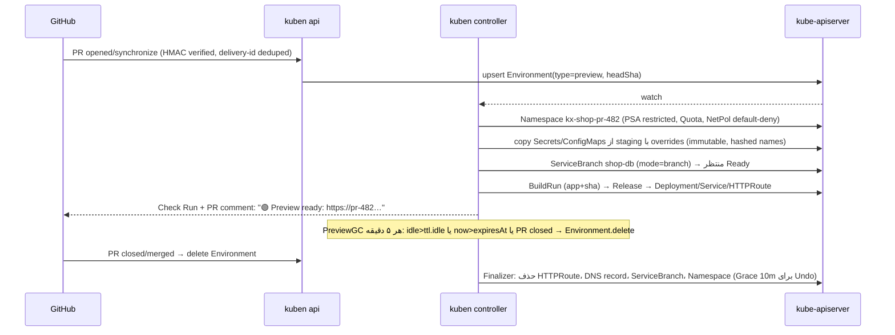

# 🧭 Kuben — سند جامع معماری، تمایز رقابتی و پلن اجرایی (Master Blueprint)

> PaaS نسل بعدی، Kubernetes-Native، تک‌باینری Rust، با هدف برتری فنی بر Coolify، Dokploy، Kubero، Devtron، KubeVela و رقبای تجاری Qovery، Northflank و Porter.

| | |
|---|---|
| **نسخه** | 1.0 |
| **تاریخ** | 2026-09-10 |
| **پیش‌نیاز مطالعه** | [KUBEN-GOLDEN-ARCHITECTURE.md](./KUBEN-GOLDEN-ARCHITECTURE.md) (مبانی) و [KUBEN-ARCHITECTURE-CRITIQUE.md](./KUBEN-ARCHITECTURE-CRITIQUE.md) (اصلاحات v1.1). در تعارض، **این سند** مقدم است |
| **مبنای شواهد** | خوانش مستقیم `kubero-main/` + تحقیق وب (قیمت‌ها و وضعیت اکوسیستم تا سپتامبر ۲۰۲۶؛ منابع در پانوشت هر بخش) |
| **مقصد کد** | `kuben-monorepo/` |

---

## فهرست

- [۰. خلاصه اجرایی](#۰-خلاصه-اجرایی)
- [۱. تحلیل رقابتی و ماتریس برتری فنی](#۱-تحلیل-رقابتی-و-ماتریس-برتری-فنی)
- [۲. کالبدشکافی kubero-main](#۲-کالبدشکافی-kubero-main)
- [۳. بسته فیچرهای Hi-Tech و تمایزبخش](#۳-بسته-فیچرهای-hi-tech-و-تمایزبخش)
- [۴. مشخصات نهایی پشته فنی و ساختار Monorepo](#۴-مشخصات-نهایی-پشته-فنی-و-ساختار-monorepo)
- [۵. پلن اجرایی فازبندی‌شده و فاز ۰ با تمام جزئیات](#۵-پلن-اجرایی-فازبندیشده-و-فاز-۰-با-تمام-جزئیات)
- [پیوست A. منابع](#پیوست-a-منابع)

---

## ۰. خلاصه اجرایی

**Kuben** یک Control Plane تک‌باینری (Rust) است که روی هر Kubernetes (k3s تا EKS) نصب می‌شود، Desired State را در CRD نگه می‌دارد، Identity و Audit را در SQLite/Postgres، و یک SPA مدرن (React 19) را داخل خود Embed می‌کند. هدف: **RSS زیر ۳۰ مگابایت در Idle، یک Pod، بدون Redis/Queue/Operator جداگانه**، و مجموعه‌ای از قابلیت‌ها که امروز فقط در پلتفرم‌های ۹۰۰ تا ۳۰۰۰ دلاری در ماه پیدا می‌شوند.

**سه ادعای قابل‌دفاع (نه شعار):**

1. **سبک‌ترین Control Plane روی Kubernetes:** Coolify چهار Container (Laravel + Postgres + Redis + Soketi) با گزارش کاربری ۱.۳GB Idle دارد؛ Devtron برای CI/CD حداقل ۲ CPU و ۶GB می‌خواهد؛ Kuben یک Process با بودجه‌ی ۳۰MB. (سربار خود k3s جداست و در بخش ۱.۴ صادقانه گفته شده.)
2. **فیچرهای Enterprise به‌صورت Open Source:** Preview Environment با DB Branching، Scale-to-zero، AI Post-mortem، Service Map با eBPF، FinOps Meter و 4-Eyes Approval — همان چیزهایی که Qovery در پلن Business (از ~۲۰۰۰ دلار/ماه) می‌فروشد.
3. **بدون Vendor Lock-in:** همه‌چیز CRD و استاندارد (Gateway API، OCI، OIDC، OpenAPI، OTel). `kubectl` همیشه کار می‌کند؛ اگر Kuben حذف شود، Appها زنده می‌مانند.

---

## ۱. تحلیل رقابتی و ماتریس برتری فنی

### ۱.۱ ماتریس مقایسه‌ی فنی

> «RAM کنترل‌پلین» = فقط اجزای مدیریتی، بدون Workloadهای کاربر و بدون خود Kubernetes. اعداد رقبا از مستندات رسمی یا گزارش‌های کاربری‌اند (منبع در پیوست).

| پارامتر | **Kuben (هدف)** | Kubero (مبدأ) | Coolify | Dokploy | Devtron | KubeVela | Qovery | Northflank | Porter |
|---|---|---|---|---|---|---|---|---|---|
| **مدل اجرا** | K8s-native، تک‌باینری Rust | K8s؛ NestJS UI + Operator (Go/Helm) | Docker + SSH؛ PHP/Laravel + PG + Redis + Soketi | Docker Swarm؛ Node + PG + Traefik | K8s؛ ده‌ها Microservice (Go) | K8s؛ Controller Go + CUE | SaaS Control Plane + Agent در Cluster شما | SaaS Control Plane (+BYOC) | SaaS Control Plane روی EKS/GKE/AKS شما |
| **RAM کنترل‌پلین Idle** | **≤ ۳۰MB** (CI Gate) | چند صد MB (Node.js + node_modules + Operator) | حداقل رسمی ۲GB سرور؛ گزارش کاربری ~۱.۳GB Idle | حداقل رسمی ۲GB سرور | ۶GB (با CI/CD) تا ۱۳GB (>۵ App) | Request 20Mi، توصیه‌ی Small: 1Gi | ناشناخته (SaaS) + Agent | ناشناخته (SaaS) | ناشناخته (SaaS) + Node مانیتورینگ اختصاصی (~$49/mo) |
| **معماری باینری / Microservice** | ۱ Binary، Roleها | ۲ Container | ۴ Container پایه + Proxy + Sentinel | ۳ Container | ده‌ها Deployment | ۱ Controller + Addonها | Managed | Managed | Managed |
| **زمان پاسخ API (Reads)** | p99 < ۵ms سمت Server (Projection در حافظه) | هر List → K8s API | DB Query (PHP) | DB Query (Node) | متوسط | K8s API | شبکه‌ی SaaS | شبکه‌ی SaaS | شبکه‌ی SaaS |
| **HPA / Autoscale** | HPA + KEDA اختیاری + Scale-to-zero داخلی | HPA ساده | ❌ (Scale دستی، Multi-server) | ❌ (Swarm replicas) | ✅ | ✅ | ✅ | ✅ | ✅ |
| **ایزولاسیون Build** | Namespace جدا، بدون SA Token، NetPol، buildkitd Rootless | Build Pod با SA Token و `kubectl` (🔴) | Build روی همان Docker Host تولید | Build روی Host | Job جدا | — (بدون Build داخلی) | Managed Builders | Managed Builders | Managed |
| **امنیت Web Shell** | Authz در Upgrade، Session per-tab، Audit، Recording (Ent) | Room قابل‌حدس، بدون Authz در join (🔴) | WS از طریق Soketi | WS | ✅ RBAC | ❌ (بدون UI Shell) | ✅ | ✅ | ✅ |
| **Preview Env per PR** | ✅ + TTL + DB Branch | ✅ Review Apps (بدون TTL/DB) | ✅ (Preview Deployments) | ✅ | ❌ (Pipeline-محور) | ❌ | ✅ (Ephemeral) | ✅ | ✅ |
| **مدیریت هزینه (FinOps)** | ✅ Meter زنده (OpenCost-spec) | ❌ | ❌ | ❌ | ⚠️ محدود | ❌ | ✅ (Add-on) | ✅ (Billing) | ✅ (Metered) |
| **مالکیت داده** | ۱۰۰٪ در Cluster شما (etcd + SQLite/PG) | ✅ در Cluster | ✅ روی Server شما | ✅ | ✅ | ✅ | ⚠️ Metadata در SaaS Qovery | ⚠️ در SaaS | ⚠️ در SaaS |
| **Networking** | Gateway API (آینده‌دار) | Ingress (ingress-nginx بازنشسته) | Traefik/Caddy | Traefik | Ingress | Ingress/Trait | Managed | Managed | Managed |
| **لایسنس / قیمت** | Open Source (پیشنهاد: Apache-2.0) | GPLv3 | Apache-2.0 + Cloud | Apache-2.0 + Cloud | هسته OSS + Enterprise | Apache-2.0 | از **$899/mo** (Team) تا **$1,999–2,999/mo** (Business) | Usage-based؛ BYOC: $0.01389/vCPU-hr + $0.00139/GB-hr | $13/vCPU-mo + $6/GB-mo |

### ۱.۲ رقبای پولی دقیقاً بابت چه چیزی پول می‌گیرند؟

| قابلیتی که پولش را می‌گیرند | Qovery (Team $899 / Business ~$2K) | Northflank | Porter | **Kuben (Open Source)** |
|---|---|---|---|---|
| **Ephemeral / Preview Environments** | ✅ (سقف ۱۰۰ تا ۲۵۰ Env) | ✅ | ✅ | بخش ۳.۱ — نامحدود، با TTL و Cost Guard |
| **Deployment Minutes** (۵۰۰۰ تا ۱۰٬۰۰۰ دقیقه) | ✅ Metered | Metered | — | Build روی buildkitd خودتان؛ بدون شمارنده |
| **RBAC + Audit Logs** (۷ تا ۳۰ روز) | ✅ | ✅ | ✅ | RBAC کامل + Audit نامحدود (Retention تنظیمی) |
| **SSO (SAML/OIDC)** | فقط Business | ✅ | Enterprise | OIDC در هسته (فاز ۲)، SAML از طریق IdP Bridge |
| **Policy as Code، SLA 99.9%** | Business | Enterprise | Enterprise | Protection Rules + 4-Eyes (بخش ۳.۷)؛ SLA مسئولیت شما |
| **Observability / Monitoring** | Add-on پولی | ✅ | ✅ (Node مانیتورینگ ~$49/mo) | Metrics Lite + eBPF Service Map (بخش ۳.۵) |
| **Cost Optimization** | Add-on | Billing UI | Metered | FinOps Meter (بخش ۳.۶) |
| **AI Skill + MCP Server** | ✅ (AI seats $10/mo) | — | — | AI SRE (بخش ۳.۴) + MCP Server، BYO-LLM یا Ollama محلی |
| **Self-hosted / Air-gapped Control Plane** | فقط Enterprise (Custom) | Enterprise | — | پیش‌فرض |
| **Management Fee روی BYOC** | Flat | برای ۴۰ vCPU/۸۰GB ≈ $486/mo | برای ۴۰ vCPU/۸۰GB ≈ $1,000/mo | صفر |

**نتیجه:** یک تیم ۱۰ نفره با ۴۰ vCPU روی Cloud خودش، سالانه ۱۰ تا ۳۰ هزار دلار «Management Fee» می‌پردازد تا Preview Env، RBAC، Audit و SSO داشته باشد. Kuben همه‌ی این‌ها را به‌صورت Open Source و **داخل Cluster خود کاربر** ارائه می‌دهد؛ مدل درآمدی احتمالی Kuben (در صورت نیاز) فقط Support و Enterprise Add-onها (Session Recording، SAML، Merkle Audit) است، نه قفل کردن فیچرهای پایه.

### ۱.۳ چرا رقبای Open Source فعلی این جایگاه را پر نکرده‌اند؟

| رقیب | نقطه‌ی قوت | چرا Kuben از آن جلو می‌زند |
|---|---|---|
| **Coolify** | UX عالی، Onboarding یک‌خطی، ۸ DB Engine | Docker + SSH: بدون HA واقعی، بدون Scheduler، Build روی همان Host تولید (Contention)، Control Plane چهار-Container با ~۱.۳GB |
| **Dokploy** | ساده، Swarm | Swarm در عمل مرده؛ بدون Ecosystem Operatorها؛ بدون Gateway API/CNPG/KEDA |
| **Kubero** | ایده‌ی Pipeline/Review Apps، ۱۶۰ Template | حفره‌های امنیتی بخش ۲، Operator مبتنی بر Helm، Source of Truth دوپاره |
| **Devtron** | Enterprise-grade، GitOps عمیق | ۶ تا ۱۳GB RAM، پیچیدگی نصب، برای تیم کوچک Overkill |
| **KubeVela** | مدل OAM قدرتمند | Framework است نه محصول؛ بدون Build، بدون UI کامل، منحنی یادگیری CUE |

### ۱.۴ حقیقت صادقانه‌ی Footprint

Kubernetes (حتی k3s) چند صد مگابایت پایه دارد. روی VPS یک‌گیگابایتی، Coolify و Dokploy سبک‌تر می‌مانند. **حداقل سخت‌افزار رسمی Kuben: ۲ vCPU و ۲GB RAM** (همان عددی که Coolify و Dokploy اعلام می‌کنند) — با این تفاوت که همان نصب، تا صدها Node بدون مهاجرت رشد می‌کند. پیام محصول: *«از یک VPS تا صد Node، بدون بازنویسی.»*

---

## ۲. کالبدشکافی kubero-main

> مسیرها نسبت به `kubero-main/`. جزئیات کامل در سند Golden (بخش ۱)؛ اینجا خلاصه‌ی عملیاتی + «چه چیزی را نگه می‌داریم».

### ۲.۱ نقاط قوت قابل‌استخراج

| مفهوم | کجا | چطور در Kuben بازتولید می‌شود |
|---|---|---|
| **Pipeline → Phase → App** (review/test/stage/prod) | `server/src/pipelines/`، `apps/app/app.ts` | `Project → Environment → App` + Promotion Order در `Environment.spec.promotion` |
| **Review Apps** روی PR | `repo/` Webhookها | `Environment.type=preview` + TTL + DB Branch (بخش ۳.۱) |
| **Buildpack/Nixpacks/Dockerfile Strategy** | `deployments/templates/*.yaml.ts`، `config/buildpack/` | `App.spec.source.build.strategy = auto|dockerfile|railpack|image` روی BuildKit Frontendها |
| **Template Catalog (+۱۶۰ سرویس)** با Annotationهای Metadata | `services/*/app.yaml` | Repo جدا `kuben-templates`، Schema اعتبارسنجی‌شده، Secretهای تولیدشده (لایسنس GPL بررسی شود) |
| **Addon Plugins** (Postgres، Redis، MySQL، Mongo، Minio، …) | `addons/plugins/*.ts` | `ServiceClass` CRD (داده، نه کد) + CNPG/Valkey/MariaDB Operatorها |
| **Podsize، Runpack، SecurityContext** پیکربندی‌پذیر | `prisma/schema.prisma` | `KubenConfig.spec.sizes[]`، Runpack → Build Strategy |
| **Multi-Git-Provider** (GitHub، GitLab، Gitea، Gogs، Bitbucket) | `repo/git/*.ts` | Trait `GitProvider` با پیاده‌سازی‌های جدا؛ Webhook + Polling Fallback |
| **Notifications** (Slack/Discord/Webhook) | `notifications/` | Outbox Pattern + Telegram/Email اضافه |
| **Vulnerability Scan (Trivy)، Cron Jobs، Basic Auth** | `kubernetes.service.ts`، CRD Spec | حفظ می‌شوند (فاز ۲) |
| **i18n (en/de/ja/zh/pt)** | `client/src/locale/` | paraglide + RTL |

### ۲.۲ حفره‌های امنیتی و معماری → Invariantهای غیرقابل‌نقض Kuben

| # | حفره | شاهد | Invariant در Kuben (چطور **ساختاراً** غیرممکن می‌شود) |
|---|---|---|---|
| S1 🔴 | **شنود و Hijack ترمینال/لاگ بین کاربران:** `join` بدون Authz، `handleTerminal` ورودی را به هر Room می‌نویسد؛ نام Room قابل‌حدس | `server/src/events/events.gateway.ts:29-36, :57-65`؛ `apps/apps.service.ts:746` | **I-1:** هر Subscription (SSE/WS) = `authz.require(perm, resource)` در همان Handler + Session ID تصادفی ۱۲۸ بیتی متصل به `user_id`. Type System: `LogStream::subscribe(&AuthzProof, ..)` بدون `AuthzProof` Compile نمی‌شود |
| S2 🔴 | **Secret پیش‌فرض JWT در کد** | `auth/auth.service.ts:156-158`، `auth/strategies/jwt.strategy.ts:13-15` | **I-2:** هیچ Secret پیش‌فرضی وجود ندارد؛ کلیدها در اولین Boot تولید و در K8s Secret ذخیره می‌شوند؛ بدون کلید → `exit 1` (Fail-Closed) |
| S3 🟠 | JWT در Cookie قابل‌خواندن با JS و `localStorage`؛ CSP خاموش | `client/src/plugins/index.ts:17`، `loginprompt.vue:165`، `main.ts:37-38` | **I-3:** Session Opaque در Cookie `__Host-` + `HttpOnly; Secure; SameSite=Lax`؛ CSP `default-src 'self'` بدون Inline |
| S4 🟠 | Hash Legacy HMAC-SHA256 + مقایسه‌ی غیر Constant-time | `auth/auth.service.ts:36-51` | **I-4:** فقط Argon2id (OWASP m=19MiB,t=2,p=1) + `subtle::ConstantTimeEq`؛ Import از Kubero → Rehash-on-login |
| S5 🟠 | CORS `*` روی WS، `cors: true`، بدون HSTS | `events.gateway.ts:13-17`، `main.ts:30` | **I-5:** Same-Origin پیش‌فرض؛ Origin Check در WS Upgrade؛ Allowlist صریح |
| S6 🟠 | **PromQL Injection** | `metrics/metrics.service.ts:114, :228` | **I-6:** نام‌ها با Regex DNS-1123 اعتبارسنجی و از Projection خوانده می‌شوند، هرگز از رشته‌ی کاربر |
| S7 🔴 | **Build Pod با SA Token و `bitnami/kubectl:latest`** که خودش CR را Patch می‌کند | `deployments/templates/buildpacks.yaml.ts:31, :48-49` | **I-7:** Build Pod هرگز API Server را نمی‌بیند (`automountServiceAccountToken: false` + NetPol Egress فقط Git/Registry/buildkitd). Controller نتیجه را از Job Status می‌خواند. همه‌ی Imageهای کمکی Digest-pinned |
| S8 🟠 | Broadcast Notification به همه‌ی Socketها؛ Guard فقط روی Message نه Handshake | `events.gateway.ts:47-49` | **I-8:** Authn در Upgrade؛ Topicها مجوزدار |
| S9 🟡 | خروجی Terminal کاربر به `process.stdout` سرور | `kubernetes.service.ts:1184` | **I-9:** محتوای Terminal هرگز Log نمی‌شود؛ فقط Metadata در Audit |
| S10 🟡 | Passwordهای ثابت در Templateها (`password: wordpress`) | `services/wordpress/app.yaml` | **I-10:** Template Parameter Schema با `generate: password` |
| C1 🔴 | **Context مشترک Mutable** (`setCurrentContext` در ۲۸ نقطه) → Race بین Clusterها | `logs/logs.service.ts:70`، `apps/apps.service.ts:163,403,683` | **I-11:** `ClusterRegistry` Immutable؛ هر عملیات `ClusterId` صریح می‌گیرد؛ هیچ Global Mutable |
| C2 🔴 | **نشت Log Stream** (آرایه‌ی فقط-افزایشی، بدون Backpressure، Sleep 300ms) | `logs/logs.service.ts:12, :72-82, :218` | **I-12:** `LogHub` با Ref-count، `broadcast` Bounded، `LinesCodec::new_with_max_length(16KiB)`، Drop-with-marker |
| C3 🟠 | Shell مشترک بین کاربران + Sleep 3s | `apps.service.ts:746-797` | **I-13:** یک Session برای هر تب/کاربر، Idle Timeout |
| C4 🟠 | بدون Informer؛ Cron هر ۱۵s کل Cluster را List می‌کند | `status/status.service.ts:18` | **I-14:** Informer + Projection؛ شمارنده‌ها از حافظه |
| C6 🟡 | Graceful Shutdown خاموش | `main.ts:109` | **I-15:** ترتیب Shutdown کامل (Readiness→Drain→Lease→Flush→Checkpoint) |
| C7 🟡 | `execSync('npx prisma migrate deploy')` در Boot + `PRAGMA foreign_keys=OFF` | `database/database.service.ts:61-63` | **I-16:** `sqlx::migrate!` Embedded با Lock؛ FK همیشه ON |
| A1 | **Source of Truth دوپاره** (SQLite + `Kuberoes` CRD + `config.yaml`) | `config/config.service.ts:70-131, :249-276` | **I-17:** مرز داده‌ی قطعی (بخش ۴.۲)؛ ارجاع SQL→CRD فقط با `uid` + BindingGC |
| A2 | Operator = Helm Render؛ Status/Conditions ضعیف | Operator Go (خارج از Repo) | **I-18:** Builderهای Typed + SSA + Conditions kstatus + `observedGeneration` |

این ۱۸ Invariant به‌عنوان **Checklist اجباری Code Review** در `CONTRIBUTING.md` قرار می‌گیرند و هر کدام حداقل یک **تست منفی E2E** دارند (مثلاً: کاربر Viewer از Org دیگر تلاش می‌کند به Log Stream وصل شود → 403).

---

## ۳. بسته فیچرهای Hi-Tech و تمایزبخش

> برای هر قابلیت: **ارزش**، **معماری**، **سازوکار دقیق**، **محدودیت صادقانه**، **فاز**.

### ۳.۱ Ephemeral Preview Environments per PR (با Auto-TTL)

**ارزش:** همان چیزی که Qovery/Vercel می‌فروشند؛ Kubero Review App دارد ولی بدون TTL، بدون DB جدا و بدون Cost Guard.

**مدل:**

```yaml
apiVersion: kuben.dev/v1alpha1
kind: Environment
metadata:
  name: shop-pr-482
  labels: { kuben.dev/project: shop, kuben.dev/type: preview, kuben.dev/pr: "482" }
spec:
  type: preview
  template: staging                 # Env مبنا: Env/Secret/Service از آن Fork می‌شود
  source: { provider: github, repo: acme/shop, pr: 482, headSha: 9f1c…, baseBranch: main }
  ttl: { idle: 48h, max: 14d }      # حذف پس از ۴۸h بی‌ترافیکی یا حداکثر ۱۴ روز
  budget: { maxMonthlyUsd: 40 }     # Cost Guard (بخش ۳.۶)
  overrides:
    env: [{ name: FEATURE_FLAGS, value: "all" }]
    services:
      - name: shop-db
        mode: branch                # ← بخش ۳.۲ (Instant DB Branching)
  domains: { pattern: "pr-{pr}.{app}.{project}.{base}" }   # pr-482.api.shop.apps.example.com
status:
  phase: Ready
  url: https://pr-482.web.shop.apps.example.com
  expiresAt: 2026-09-24T10:00:00Z
  lastTrafficAt: 2026-09-11T08:12:00Z
```

**جریان:**



**جزئیات مهندسی:**

- **Idle Detection:** `lastTrafficAt` از Activator/Proxy (بخش ۳.۳) یا از Gateway Access Log Metricها؛ اگر هیچ‌کدام نبود، از `HTTPRoute` Metricهای Traefik/Envoy (Prometheus Scrape سبک هر ۶۰s).
- **Secrets Preview:** هرگز Production Secret کپی نمی‌شود؛ فقط `template` (که باید staging یا dev باشد) و `Environment.spec.protection.allowPreviewFrom` آن را مجاز کرده باشد.
- **Cost Guard:** اگر تخمین ماهانه (بخش ۳.۶) از `budget` بگذرد → Scale-to-zero اجباری + Comment روی PR.
- **Concurrency Limit:** `Project.spec.previews.max: 10`؛ بعد از آن، PR جدید در صف می‌ماند و قدیمی‌ترین Idle حذف می‌شود.
- **دامنه و TLS:** Wildcard Cert (`*.shop.apps.example.com`) با DNS-01 اگر پیکربندی شده؛ در غیر این صورت HTTP-01 برای هر Host (به Rate Limit توجه شود — بخش ۴.۴).
- **Bot Comment:** با GitHub App (نه PAT) → Check Run با Status و لینک Logs.
- **حذف ایمن:** Finalizer با Timeout ۱۰ دقیقه؛ اگر ServiceBranch گیر کرد، Namespace حذف می‌شود و Branch به `Orphaned` می‌رود و در UI هشدار می‌دهد (نه اینکه Namespace در `Terminating` بماند).

**محدودیت صادقانه:** Preview برای Appهایی که به سرویس‌های خارجی Stateful (Stripe، S3 Bucket واقعی) وابسته‌اند، بدون Mock/Sandbox Keys کامل نیست؛ Kuben `overrides.env` را برای Sandbox Keys فراهم می‌کند، ولی معجزه نمی‌کند.

**فاز:** ۲ (پس از MVP)؛ Environment CRD و Namespace Lifecycle در فاز ۰ طراحی می‌شوند.

### ۳.۲ Instant DB Branching با Copy-on-Write

**ارزش:** Preview با داده‌ی واقعی (Masked) به‌جای Seed خالی؛ Neon/Supabase این را فقط در Cloud خودشان می‌دهند.

**اصل صادقانه:** «فوری» فقط وقتی ممکن است که Storage زیرین **Copy-on-Write** داشته باشد. Kuben سه Strategy را پشت یک CRD واحد قرار می‌دهد و **بهترین موجود را خودکار انتخاب می‌کند**:

| Strategy | مکانیزم | زمان Branch ۵GB | نیاز | کجا |
|---|---|---|---|---|
| **`csi-clone`** | `VolumeSnapshot` (GA از K8s 1.20) از PVC منبع → PVC جدید از Snapshot → CNPG `bootstrap.recovery.volumeSnapshots` | ثانیه‌ها روی Ceph RBD / Longhorn / OpenEBS Mayastor (thin) / ZFS-LocalPV؛ **دقیقه‌ها** روی EBS/GCE PD (Snapshot به Object Storage می‌رود) | CSI Driver با VolumeSnapshotClass | Managed و On-prem با CSI مناسب |
| **`overlay`** | OverlayFS روی `PGDATA` (همان مکانیزم Container Image Layers): Lower = Base Backup منبع، Upper = Volume خالی Branch؛ Postgres با WAL Crash-Recovery بالا می‌آید. (الگوی pgbranch: ~۱.۹s مستقل از حجم) | **~۲ ثانیه** | `CAP_SYS_ADMIN` برای Mount در Container؛ Node ثابت (`hostPath` یا Local PV) | k3s تک/چند-Node، Dev/Preview |
| **`logical`** | `pg_dump \| pg_restore` با Parallel Jobs + سقف حجم | دقیقه‌ها (خطی با حجم) | هیچ | Fallback همه‌جا؛ Cap پیش‌فرض ۲GB |

**CRD:**

```yaml
apiVersion: kuben.dev/v1alpha1
kind: ServiceBranch
metadata: { name: shop-db-pr-482, namespace: kx-shop-pr-482 }
spec:
  source: { namespace: kx-shop-staging, service: shop-db }   # CNPG Cluster
  strategy: auto                       # auto | csi-clone | overlay | logical
  pointInTime: latest                  # یا timestamp (با WAL Archive)
  masking:                             # PII Scrub قبل از در دسترس قرار گرفتن
    sqlRef: { configMap: shop-db-mask, key: mask.sql }
  ttl: 14d
  size: { cpu: 250m, memory: 512Mi }   # کوچک‌تر از منبع
status:
  strategyUsed: overlay
  phase: Ready
  connection: { secretRef: shop-db-pr-482-app }   # DATABASE_URL تزریق می‌شود
  branchedAt: 2026-09-11T08:10:04Z
  sizeOnDisk: 41Mi                     # فقط Delta
```

**سازوکار `overlay` (پیاده‌سازی Kuben، نه وابستگی خارجی):**

1. Controller یک **Base Layer** برای هر Source نگه می‌دارد: `pg_basebackup` (یا CSI Snapshot اگر ارزان است) روی Local PV Node ذخیره‌شده و هر ۶ ساعت/پس از هر Migration Refresh می‌شود (Read-only، مشترک بین همه‌ی Branchها).
2. برای هر Branch: یک PVC خالی (Upper) + Pod Postgres (Image استاندارد `postgres:17`) با Init Container Kuben (`kuben-overlay-init`، Rust، ~۳MB) که `mount -t overlay` را با `lowerdir=/base,upperdir=/upper/data,workdir=/upper/work` انجام می‌دهد و `PGDATA` را روی Merged View می‌گذارد.
3. Postgres با Crash Recovery بالا می‌آید (مثل Power-cycle). صفحات تغییرکرده در Upper کپی می‌شوند (Copy-up)؛ بقیه از Lower خوانده می‌شوند.
4. `masking.sql` اجرا می‌شود؛ Credential جدید تولید و در Secret قرار می‌گیرد.
5. **امنیت:** Pod با `CAP_SYS_ADMIN` فقط برای Init Container و فقط در Namespaceهای `preview` (PSA `privileged` فقط برای این Namespaceها با Label صریح)؛ Kuben این را در UI به‌عنوان «Preview DB Branching requires privileged init on this cluster» شفاف می‌کند و روی Managed Clusterهای سخت‌گیر (GKE Autopilot) خودکار به `csi-clone` یا `logical` می‌افتد.
6. **حذف:** Upper PVC حذف می‌شود؛ Base Layer با Ref-count و TTL.

**برای MySQL/MariaDB:** `overlay` عیناً کار می‌کند (InnoDB Crash Recovery)؛ `csi-clone` با MariaDB Operator؛ برای Valkey/Redis فقط `logical` (RDB Copy).

**محدودیت صادقانه:** Branch از Primary فعال گرفته می‌شود و **Source را نمی‌خواند** (Isolation کامل)، ولی Base Layer تا ۶ ساعت قدیمی است مگر `pointInTime: latest` که Refresh فوری (چند ثانیه تا دقیقه بسته به حجم) را Trigger می‌کند. Branch برای Production-grade HA نیست.

**فاز:** ۲ (`logical` و `csi-clone`)، ۳ (`overlay`).

### ۳.۳ Sub-Second Scale-to-Zero بدون Knative

**ارزش:** Preview Envها و Appهای کم‌ترافیک هزینه‌ی صفر داشته باشند؛ Kubero «sleep» ساده دارد؛ Coolify هیچ.

**اصل صادقانه درباره‌ی «زیر ۱ ثانیه»:** Cold Start واقعی Kubernetes = Scale (100–300ms) + Schedule (100–500ms) + Container Start (Image Cached: 200ms–2s) + App Boot (Node ~300ms، JVM چند ثانیه). **زیر ۱ ثانیه از Zero فقط برای Imageهای Cache‌شده و Appهای سریع** ممکن است. Kuben دو Mode می‌دهد و صادقانه گزارش می‌کند:

| Mode | مکانیزم | Wake Latency | صرفه‌جویی |
|---|---|---|---|
| **`throttle`** (پیش‌فرض برای Preview) | Pod زنده می‌ماند؛ با **In-place Pod Resize** (K8s ≥1.33، Beta پیش‌فرض فعال) CPU به `10m` و Memory به حداقل کاهش می‌یابد؛ درخواست جدید → Resize برمی‌گردد | **~۰ ms** (Pod در حال اجراست) + ۱۰۰–۳۰۰ms تا CPU برگردد | CPU ~۹۵٪، RAM ~۰٪ (Memory Resize کاهشی محدود است) |
| **`zero`** | Replicas → 0؛ Activator درخواست را نگه می‌دارد؛ Scale به 1؛ Pod Ready → Forward | **۱ تا ۳ ثانیه** (Image Cached) | ۱۰۰٪ |

**معماری Activator (داخل همان Binary، Role `activator`):**

```
Gateway (HTTPRoute host=pr-482.web…)  ──►  Service kuben-activator:8080  ──►  Pod app (وقتی بیدار است)
                                                   │
                                     Rust hyper proxy (~800 LOC):
                                     • per-host state: Awake | Sleeping | Waking(notify)
                                     • request counter → lastTrafficAt (برای Idle Detection)
                                     • Sleeping: hold request (max 30s) + Scale/Resize + wait Pod Ready via informer
                                     • Waking: همه‌ی درخواست‌های هم‌زمان روی همان Notify منتظر می‌مانند (بدون Thundering Herd)
                                     • Awake: Forward مستقیم به Pod IP (Endpoints از Projection) — یک Hop، ~100µs
                                     • Browser: صفحه‌ی "Waking up…" با Refresh (HTML) اگر Accept: text/html و Wake > 2s
```

- **همیشه در مسیر** برای Appهایی که `idle` فعال دارند (Toggle کردن HTTPRoute در هر Sleep/Wake با Propagation ۲ ثانیه‌ای Traefik جمع نمی‌شود). هزینه: یک Hop Rust. Appهای بدون `idle` مستقیم به Service خودشان می‌روند.
- **Idle Detection:** Activator هر ۳۰s `lastTrafficAt` را به Controller گزارش می‌دهد (In-process Channel در `--roles=all`، یا CR Status Patch در HA). بعد از `idle.after` (پیش‌فرض ۱۵ دقیقه) → Sleep.
- **Scale-out:** Activator Concurrency را می‌شمارد و می‌تواند به HPA/KEDA به‌عنوان External Metric بدهد (فاز ۳).
- **HA:** Activator Stateless است؛ N Replica پشت Service؛ Notify بین Replicaها لازم نیست (هر کدام مستقل Pod Ready را Watch می‌کنند).
- **گزینه‌ی جایگزین:** KEDA HTTP Add-on همین کار را با ۳ Component (Operator، Interceptor، Scaler) می‌کند؛ Kuben از آن **استفاده نمی‌کند** چون ۳ Deployment دیگر با Footprint بیشتر است، ولی `InterceptorRoute` را در فاز ۳ به‌عنوان Backend اختیاری پشتیبانی می‌کند.

```yaml
# App.spec.runtime.processes.web.idle
idle:
  mode: throttle          # throttle | zero | off
  after: 15m
  throttle: { cpu: 10m }  # In-place resize target
  wakeTimeout: 30s
  placeholder: true       # صفحه‌ی HTML "Waking up"
```

**محدودیت صادقانه:** WebSocket/SSE طولانی‌مدت روی App خواب‌رفته را نمی‌توان «نگه داشت»؛ Activator آن‌ها را بعد از Wake برقرار می‌کند (Client باید Reconnect کند). In-place Resize روی Clusterهای قدیمی‌تر از 1.33 نیست → خودکار به `zero`.

**فاز:** ۲ (`zero`)، ۳ (`throttle`).

### ۳.۴ AI SRE: Auto Post-Mortem و پیشنهاد اصلاح یک‌کلیکی

**ارزش:** «چرا Pod من Crash کرد؟» رایج‌ترین سؤال کاربران PaaS است؛ Qovery این را به‌عنوان AI Seat می‌فروشد.

**اصل طراحی:** **قوانین Deterministic اول، LLM به‌عنوان توضیح‌دهنده و مشاور، هرگز به‌عنوان مجری خودکار.**

```mermaid
flowchart LR
  EV[K8s Events + Pod Status + Exit Codes] --> DET[Incident Detector<br/>rules: OOMKilled, CrashLoop, ImagePull, Probe fail, Pending]
  DET --> INC[(Incident record)]
  INC --> CTX[Context Pack builder<br/>• last 200 log lines (redacted)<br/>• events 30m<br/>• resources req/limit/usage<br/>• Release diff (env/image/scale)<br/>• metrics window 15m<br/>• probe config]
  CTX --> RULES[Rule Engine → deterministic findings<br/>e.g. OOM: usage≥limit ⇒ suggest +50% memory]
  RULES --> LLM{LLM enabled?}
  LLM -- no --> CARD
  LLM -- yes --> GEN[genai client → provider<br/>Ollama local / OpenAI / Anthropic / Gemini<br/>structured JSON output]
  GEN --> CARD[Post-Mortem Card<br/>root cause · confidence · evidence · actions]
  CARD --> ACT[One-click actions (RBAC-gated)<br/>Rollback · Bump memory · Fix healthcheck path · Restart · Open PR]
```

**سازوکار:**

1. **Detector** (در Controller، از Projection): ترکیب `containerStatuses.lastState.terminated.reason`, `restartCount`, Events (`FailedScheduling`, `Unhealthy`, `BackOff`) → `Incident{kind, app, pod, first_seen, count}`؛ Dedupe در پنجره‌ی ۱۰ دقیقه.
2. **Context Pack** با **Redaction الزامی**: Regexهای Secret (AWS keys, JWT, `password=`, Bearer, PEM), مقادیر همه‌ی Env Varهایی که از Secret آمده‌اند (Replace با `<redacted:NAME>`), IPهای داخلی اختیاری. اندازه‌ی Pack ≤ ۱۶KB.
3. **Rule Engine** (Rust، بدون LLM): ۱۵ تا ۲۰ قانون با Fix پیشنهادی قطعی (OOM → Memory؛ Probe 404 → Path؛ Port Mismatch → Port؛ `CrashLoop` با Exit 1 و لاگ `ECONNREFUSED :5432` → DB Service Down؛ ImagePullBackOff → Registry Auth).
4. **LLM (اختیاری، Opt-in):** Crate `genai` (Multi-provider، Native Protocols، Ollama برای On-prem/Air-gap). Prompt ثابت + Schema خروجی JSON (`root_cause`, `confidence 0–1`, `evidence[]`, `actions[] {type, params, risk}`). Timeout ۲۰s، Cost Cap روزانه، Cache روی Hash Context (Incident تکراری = بدون Call).
5. **Actions:** هر Action یک Mutation موجود در API است (Rollback به Release قبلی، Patch `App.spec.runtime.processes.web.size`, Patch `healthCheck.path`) → همان RBAC و Audit. **هیچ Action خودکار اجرا نمی‌شود** مگر `Environment.spec.autoRemediation` صریحاً برای قوانین Deterministic خاص (مثلاً Rollback خودکار وقتی Release جدید در ۵ دقیقه‌ی اول CrashLoop می‌شود — که اصلاً LLM نمی‌خواهد).
6. **Post-Mortem Doc:** برای Incidentهای Production، یک Markdown خودکار (Timeline، Impact، Root Cause، Action Items) در Audit ذخیره و به Slack/Telegram ارسال می‌شود.
7. **MCP Server داخلی** (`rmcp`): Toolهای `get_incident`, `get_logs`, `rollback` تا Agentهای خارجی (Cursor، IDE extensions، CLI) هم بتوانند Debug کنند — با همان Token و RBAC.

**Privacy/Compliance:** پیش‌فرض LLM خاموش؛ Provider و Model در `KubenConfig`؛ گزینه‌ی «Local only (Ollama)»؛ Log کامل هر Prompt/Response در Audit (Redacted).

**فاز:** ۲ (Detector + Rules + Card بدون LLM)، ۳ (LLM + MCP).

### ۳.۵ Observability با eBPF: Service Map زنده بدون دستکاری کد

**ارزش:** نقشه‌ی سرویس‌ها، Latency و Error Rate برای هر App بدون SDK — Northflank/Qovery این را به‌عنوان Monitoring Add-on می‌فروشند.

**تصمیم کلیدی:** **Kuben کد eBPF نمی‌نویسد.** پروژه‌ی **OpenTelemetry eBPF Instrumentation (OBI)** — که Grafana Beyla را به OpenTelemetry اهدا کرده و اولین Release آن نوامبر ۲۰۲۵ منتشر شد — دقیقاً همین کار را می‌کند: RED Metrics و Trace برای HTTP/S، HTTP/2، gRPC، SQL، Redis، Kafka، MongoDB، بدون تغییر کد، خارج از Process. Kuben آن را به‌عنوان **Addon اختیاری** نصب و **داده‌اش را داخل خودش هضم می‌کند**.

```
[OBI DaemonSet]  ──OTLP/HTTP (protobuf)──►  [kuben api: /otlp/v1/metrics, /otlp/v1/traces]  (feature "otlp")
   • discovery: namespaces با label kuben.dev/managed                    │
   • kernel ≥ 5.8 + BTF (k3s/Ubuntu 22.04+ OK)                           ▼
                                                            [In-memory aggregator]
                                                            • per (src_app → dst_app) edge: RPS, p50/p95/p99, error%  (ring buffer 1h، 15s buckets)
                                                            • per app: RED
                                                            • sampled traces: 100 آخر برای هر App (برای "Slow request" drill-down)
                                                                    │
                                                                    ▼
                                                            SSE delta → React Flow Service Map + uPlot sparklines
```

- **Fallback‌ها:** اگر Cilium نصب است، Hubble Relay (gRPC) به‌عنوان Source جایگزین؛ اگر هیچ eBPF ممکن نیست (Kernel قدیمی، Managed محدود)، Service Map از **NetworkPolicy + Gateway Access Logs** به‌صورت L4 (بدون Latency) ساخته می‌شود.
- **Budget:** Aggregator با سقف ۵۰ App × ۲۰ Edge × ۲۴۰ Bucket × ۳۲B ≈ ۸MB؛ بیشتر از آن → Downsample. Traceها فقط Sampled (Tail-based ساده: خطاها + کندترین ۱٪).
- **Export:** همان OTLP به Prometheus/VictoriaMetrics/Grafana Tempo کاربر Forward می‌شود (Kuben Long-term Storage نیست).
- **Overhead:** OBI برای هر Node ~۵۰ تا ۱۵۰MB RAM (خارج از Control Plane Kuben، به‌عنوان Addon شفاف در UI نمایش داده می‌شود).
- **امنیت:** OBI Privileged است (eBPF)؛ فقط توسط Cluster Admin فعال می‌شود؛ Kuben هیچ Payload HTTP را ذخیره نمی‌کند (فقط Metadata: Method, Route Template, Status, Duration).

**فاز:** ۳.

### ۳.۶ Live FinOps Meter (کنتور شفاف هزینه به دلار)

**ارزش:** «این Preview Env چقدر برایمان آب می‌خورد؟» — بدون OpenCost/Kubecost کامل.

**مدل (سازگار با OpenCost Specification):**

```
cost(container, window) = Σ_resource max(request, usage) × duration_h × unit_price
  CPU:     max(req_cores, avg_usage_cores) × h × $/core-h
  Memory:  max(req_GB,    avg_usage_GB)    × h × $/GB-h
  Storage: pvc_GB × h × $/GB-h (by StorageClass)
  LB/IP:   per Gateway/LoadBalancer × $/h
  Egress:  bytes × $/GB (اگر Metric موجود)
Idle cost = Node cost − Σ workload cost  (نمایش جدا؛ Share اختیاری)
```

**منابع قیمت (به ترتیب اولویت):**
1. **OpenCost موجود در Cluster** → فقط Query به `/allocation` (Kuben محاسبه نمی‌کند).
2. **Cloud Provider Auto-detect** از Label `node.kubernetes.io/instance-type` + Region → جدول قیمت On-demand Embedded (AWS/GCP/Azure/Hetzner/DigitalOcean؛ ~۲۰۰KB JSON فشرده، به‌روزرسانی با هر Release یا Fetch اختیاری).
3. **Custom Pricing** در `KubenConfig.spec.pricing` (`cpuHour`, `gbHour`, `storageGbMonth`, `lbMonth`, `currency`) برای On-prem — Kuben پیشنهاد اولیه بر اساس «قیمت Node ÷ ظرفیت» می‌دهد.

**پیاده‌سازی:** همان Poller metrics-server (هر ۱۵s) که Metrics Lite دارد، Usage را می‌دهد؛ Request از Projection؛ Ring Buffer ساعتی → Roll-up روزانه در SQL (`cost_rollups(app_uid, day, cpu_usd, mem_usd, storage_usd)`) → نمایش: Live ($/h)، Month-to-date، Forecast (Linear)، برای هر Pod/App/Environment/Project/Team؛ Budget Alerts (Outbox → Slack/Telegram)؛ Cost Guard برای Preview (بخش ۳.۱).

**محدودیت صادقانه:** بدون Billing API واقعی، این «تخمین بر اساس قیمت List» است، نه صورت‌حساب؛ UI این را با برچسب «Estimated» می‌گوید. Spot/Reserved Discountها فقط با Custom Pricing.

**فاز:** ۲ (Meter پایه)، ۳ (Budget/Forecast/Team).

### ۳.۷ 4-Eyes Approval Gate برای Production (Telegram/Slack/UI)

**ارزش:** SOC2/ISO الزام Separation of Duties دارند؛ Qovery این را در «Policy as Code» پلن Business می‌فروشد.

**مدل:**

```yaml
# Environment.spec.protection
protection:
  requireApprovals: 2                 # تأییدکنندگان متمایز، غیر از Requester
  approverRoles: [owner, admin, release-manager]
  channels: [ui, telegram, slack]
  timeout: 4h
  breakGlass: { enabled: true, requireReason: true, notify: [security-channel] }
  window: { allow: "Mon-Fri 08:00-18:00 Europe/Berlin", elseRequireApprovals: 3 }
```

**جریان:**

1. `POST /releases/{id}/promote?to=prod` → اگر Protection فعال است، `Approval{id, release, requester, required=2, expires}` در SQL ساخته می‌شود (نه CRD؛ داده‌ی Workflow انسانی است) و Release در `status.phase: AwaitingApproval` می‌ماند.
2. **Outbox** پیام را به کانال‌ها می‌فرستد:
   - **Telegram** (`teloxide`): پیام با Diff خلاصه (Image Digest، Env تغییرکرده، Scaling) + Inline Keyboard `[✅ Approve] [❌ Reject] [🔍 Open in Kuben]`. `callback_data = "apr:<approval_id>:<nonce>"` (بدون داده‌ی حساس). در Callback: `from.id` Telegram → جدول `identity_links(provider=telegram, subject=<id>, user_id)` (Link با کد یک‌بارمصرف از پروفایل کاربر) → بررسی Role و تمایز از Requester → ثبت رأی → ویرایش پیام به «1/2 approved by @alice». Bot در حالت **Webhook** (نه Long-polling) پشت همان API با Secret Token Header.
   - **Slack:** Block Kit با Interactive Buttons؛ Signing Secret Verify؛ `user.id` → `identity_links(provider=slack)`.
   - **UI/CLI:** `kuben approve <id>`.
3. با رسیدن به `required`، Controller Promotion را انجام می‌دهد؛ Audit شامل همه‌ی رأی‌ها (کاربر، کانال، IP/Telegram ID، زمان) است.
4. **Break-glass:** Owner می‌تواند با Reason الزامی Bypass کند → Alert فوری به Security Channel + Post-mortem خودکار (بخش ۳.۴).
5. **ضد-دور زدن:** Approver نمی‌تواند Requester باشد؛ یک User با دو Identity (Telegram + Slack) یک رأی دارد؛ Approval به `release.digest` قفل است — اگر Digest عوض شود، Approval باطل می‌شود.

**فاز:** ۲ (UI)، ۳ (Telegram/Slack/Window/Break-glass).

---

## ۴. مشخصات نهایی پشته فنی و ساختار Monorepo

### ۴.۱ Backend

| مؤلفه | انتخاب | نسخه (سپتامبر ۲۰۲۶) | یادداشت |
|---|---|---|---|
| زبان | Rust, Edition 2024 | MSRV **1.94** (الزام sqlx 0.9) | `rust-toolchain.toml` |
| HTTP | `axum` | 0.8.x | + `axum-extra` (Cookie, TypedHeader) |
| Runtime | `tokio` (یک Runtime؛ Bulkhead پشت Config) | 1.x | `worker_threads = min(4, cpus)`, `max_blocking_threads = 16` |
| Middleware | `tower`, `tower-http` (trace, timeout, limit, compression, request-id, cors, set-header) | 0.5 / 0.6 | |
| Kubernetes | `kube` (runtime, derive, ws, rustls-tls), `k8s-openapi` | **kube 4.0** (ژوئن ۲۰۲۶) | Streaming Lists، Retry Policy پیش‌فرض، WS Keepalive |
| CRD Schema | `schemars` | 1.x | CEL در `x-kubernetes-validations` |
| DB | `sqlx` (sqlite, postgres, runtime-tokio, tls-rustls, migrate, uuid) | **0.9** (مه ۲۰۲۶) | `sqlx.toml` Multi-DB، `SqlSafeStr` |
| Query Builder | `sea-query` + `sea-query-binder` | آخرین سازگار با sqlx 0.9 | برای Queryهای پویا |
| OpenAPI | `utoipa`, `utoipa-axum`, `utoipa-scalar` | 5.5 / 0.2 | OpenAPI 3.1 |
| Auth | `argon2`, `subtle`, `openidconnect`, `totp-rs`, `webauthn-rs` | | Session Opaque؛ JWT فقط داخلی |
| Crypto | `sha2`, `hmac`, `chacha20poly1305`, `rand`, `secrecy`, `zeroize` | | |
| Cache/Concurrency | `moka`, `papaya`/`dashmap`, `arc-swap`, `parking_lot` | | |
| Config/CLI | `figment`, `clap` | | |
| Observability | `tracing`, `tracing-subscriber` (json), `metrics`, `metrics-exporter-prometheus`; `opentelemetry-otlp` پشت Feature `otel` | | |
| Retry/Backoff | `backon` | 1.x | |
| Git | `octocrab` (GitHub), `reqwest` (بقیه), `gix` (ls-remote) | | |
| LLM | `genai` | 0.6/0.7 | پشت Feature `ai` |
| Telegram | `teloxide` (webhook mode) | | پشت Feature `telegram` |
| MCP | `rmcp` | | پشت Feature `mcp` |
| Assets | `rust-embed` (+ Brotli از پیش فشرده) | 8.x | |
| Allocator | `mimalloc` (Purge کوتاه) — Benchmark در Spike-A | | |
| IDs/Time | `uuid` (v7), `jiff` | | |
| Errors | `thiserror` (libs), `anyhow` (bin) | 2 / 1 | RFC 9457 در API |
| Test | `cargo-nextest`, `insta`, `rstest`, `testcontainers`, `wiremock`, `proptest` | | |

### ۴.۲ مرز داده (قطعی)

| داده | مالک | ارجاع |
|---|---|---|
| Project, Environment, App, Release, BuildRun, Domain, Service, ServiceBranch, KubenConfig | **CRD (etcd)** | SQL فقط با `uid` ارجاع می‌دهد؛ `BindingGC` Bindingهای یتیم را با تأخیر ۱ ساعت حذف می‌کند |
| Org, User, Identity, Membership, RoleBinding, Session, ApiToken, Audit, Approval, Outbox, CostRollup, IdempotencyKey | **SQL** (SQLite WAL تک‌Replica / Postgres HA) | Org روی CR با Label `kuben.dev/org` |
| Build Logs, Backups | **فایل روی PVC** یا `object_store` | SQL: Metadata + Hash |
| Metrics کوتاه‌مدت, Projectionها, Service Map | **حافظه** (Bounded) | بازسازی از Watch پس از Restart |

### ۴.۳ Frontend

| مؤلفه | انتخاب | نسخه |
|---|---|---|
| Build | **Vite 8** (Rolldown + Oxc) | 8.x |
| UI | **React 19** + React Compiler | 19.x |
| Routing | `@tanstack/react-router` (file-based, `defaultPreload: 'intent'`) | 1.x stable (v2 وقتی Stable شد) |
| Server State | `@tanstack/react-query` | 5.x |
| API Client | `openapi-typescript` + `openapi-fetch` + `openapi-react-query` (تولید از `utoipa`) | |
| Styling | **Tailwind CSS v4** (`@tailwindcss/vite`) + **shadcn/ui روی Base UI** | 4.x |
| RTL/فارسی | Logical Properties (`ms-`, `pe-`, `start`, `end`), `dir` پویا، فونت Self-hosted **Vazirmatn** + Inter Variable، `paraglide-js` برای i18n Compile-time | |
| Terminal/Logs | `@xterm/xterm` + fit, web-links, webgl, search, unicode11 | 5.x |
| Charts | `uplot` | |
| Graph (Service Map, Pipeline) | `@xyflow/react` | 12.x |
| Editor | CodeMirror 6 (YAML) — **نه Monaco** | |
| Forms | `react-hook-form` + `zod` | |
| Tooling | `@biomejs/biome`, `vitest`, `@playwright/test`, `msw`, `size-limit`, `knip` | |
| TypeScript | ^5.9 (TS 6 پس از پایداری Ecosystem) | |

### ۴.۴ Build، Network، TLS

- **Build:** `buildkitd` Rootless (StatefulSet، PVC Cache ۲۰Gi، GC داخلی) در Namespace `kuben-builds` (PSA `baseline`؛ `seccompProfile: Unconfined` + AppArmor `unconfined` فقط برای این Pod — الزام BuildKit Rootless) + Job سبک `buildctl` برای هر Build (بدون SA Token). Frontendها: `dockerfile.v0`، `gateway.v0` با `ghcr.io/railwayapp/railpack-frontend@<digest>` (پس از `railpack prepare` در Init Container برای تولید `railpack-plan.json`). Deploy بر اساس **Digest**. Registry خارجی در MVP؛ Zot داخلی در فاز ۲ فقط با دامنه‌ی عمومی + ACME.
- **Networking:** **Gateway API** (`HTTPRoute`). پیاده‌سازی پیش‌فرض:
  - روی **k3s**: Traefik Bundled خود k3s با `providers.kubernetesGateway.enabled=true` (بدون Component اضافه؛ Zero-Ops واقعی).
  - روی Clusterهای دیگر: **Envoy Gateway** (استاندارد CNCF) یا Traefik 3 — انتخاب در Installer؛ Kuben فقط `HTTPRoute` و `Gateway` استاندارد می‌نویسد و به هیچ Annotation اختصاصی وابسته نیست. ⚠️ Benchmarkهای مستقل نشان می‌دهند Traefik با چند Gateway هم‌زمان و هزاران Route مشکل دارد و Envoy Gateway در Churn شدید Route نشت حافظه داشته؛ برای نصب‌های بزرگ (>۵۰۰ Route) Istio Gateway یا kgateway در مستندات پیشنهاد می‌شود.
- **TLS:** cert-manager با `config.enableGatewayAPI: true` (HTTP-01 از طریق HTTPRoute موقت روی Listener پورت ۸۰؛ DNS-01 برای Wildcard).
- **دامنه‌ی پیش‌فرض بدون DNS کاربر:** `<ip>.sslip.io`. ⚠️ **ریسک واقعی:** Let's Encrypt سقف «گواهی برای هر Registered Domain» را روی `sslip.io` اعمال می‌کند؛ با وجود افزایش‌های مکرر (تا ۲۰۰ هزار در هفته)، در فوریه ۲۰۲۶ باز هم Exhaust شد. **راهبرد Kuben:** (۱) ترجیح **IP Certificate** مستقیم از Let's Encrypt (پشتیبانی رسمی؛ Rate Limit بر اساس همان IP، نه sslip.io) وقتی Kuben روی IP عمومی است؛ (۲) Fallback به `nip.io`؛ (۳) Fallback به ZeroSSL (ACME EAB)؛ (۴) پیام واضح در Wizard: «برای Production دامنه‌ی خودتان را متصل کنید». Wildcard روی sslip.io هرگز (نیازمند DNS-01 روی دامنه‌ای که مال ما نیست).

### ۴.۵ ساختار `kuben-monorepo`

```
kuben-monorepo/
├── Cargo.toml                      # [workspace] + [workspace.dependencies] + lints + profiles
├── Cargo.lock
├── rust-toolchain.toml
├── deny.toml                       # cargo-deny: licenses, advisories, bans
├── clippy.toml
├── .cargo/config.toml              # target-cpu, linker (mold/lld), musl targets
├── justfile                        # نقطه‌ی ورود واحد
├── package.json                    # pnpm root (private)
├── pnpm-workspace.yaml             # packages + catalog
├── biome.json
├── .npmrc
├── .github/workflows/{ci.yml,release.yml,budgets.yml}
├── crates/
│   ├── kuben-crd/                  # CRD types (kube-derive + schemars + CEL) + bin crdgen — بدون tokio/axum
│   ├── kuben-core/                 # domain types, ids, errors, config, traits (Store, PolicyEngine, IdentityProvider, LeaderElector, BlobStore, MetricsSource)
│   ├── kuben-store/                # sqlx + sea-query, repositories, migrations/{sqlite,postgres}, sqlx.toml
│   ├── kuben-platform/             # ClusterRegistry, informers → projections, LogHub, exec, controllers, build, activator, incidents
│   ├── kuben-api/                  # axum routers, OpenAPI (utoipa), auth middleware, SSE/WS, web assets embed, bin openapi
│   └── kuben/                      # bin «kuben»: serve (roles), migrate, backup, restore, doctor, reset-admin, import
├── apps/
│   └── web/                        # Vite 8 + React 19 SPA (→ dist/ embedded)
├── packages/
│   └── api-client/                 # openapi.json + schema.d.ts (generated, committed)
├── charts/kuben/                   # Helm chart (OCI); crds/ تولیدشده
├── deploy/
│   ├── install.sh                  # k3s + Gateway + cert-manager + kuben
│   └── manifests/                  # kubectl apply -k
├── docs/adr/                       # ADR-001 … ADR-022
├── scripts/                        # budget checks, e2e helpers
└── CONTRIBUTING.md                 # 18 Invariant به‌عنوان Review Checklist
```

**معیار Split کردن Crate جدید:** فقط وقتی (الف) Compile Time یک Crate > ۶۰s در Incremental، (ب) Crate مستقلاً منتشر شود (`kuben-client` برای CLI/SDK در فاز ۲)، یا (ج) مرز Team.

---

## ۵. پلن اجرایی فازبندی‌شده و فاز ۰ با تمام جزئیات

### ۵.۱ نقشه‌ی راه (تیم ۳ نفره‌ی Rust-fluent)

| فاز | مدت | خروجی | Exit Criteria |
|---|---|---|---|
| **۰ — Skeleton** | ۶ هفته | Monorepo، ۶ Crate، Auth Local + Session، Store دو-DB، CRD v1alpha1 + Self-apply، OpenAPI→TS Pipeline، UI Shell (Login، Layout، Command Palette، RTL)، Informer + Projection پایه، Health/Shutdown، CI با Budget Gateها، `install.sh` اولیه | `kuben serve` روی kind: Login → لیست Projects (خالی) → ایجاد Project/Environment → Namespace ساخته می‌شود؛ Image < ۳۰MB؛ RSS Idle < ۳۰MB؛ CI سبز |
| **۱ — MVP** | ۶ هفته | App از Image + از Git (Dockerfile/Railpack روی buildkitd)، Release/Rollback، HTTPRoute + TLS (sslip.io/IP cert)، LogHub + SSE per tab، Terminal WS + Ephemeral Debug، GitHub Webhook + Polling، `kuben doctor`، `backup/restore` | Git push → URL با TLS در < ۵ دقیقه از VPS خالی؛ Soak Test ۱h لاگ بدون رشد حافظه؛ ۵ کاربر Alpha خارجی |
| **۲ — Parity+** | ۱۶ تا ۲۰ هفته | Preview Env + TTL (۳.۱)، DB Branching `logical`/`csi-clone` (۳.۲)، Scale-to-zero `zero` (۳.۳)، Incident Rules + Card (۳.۴)، FinOps Meter (۳.۶)، Approval UI (۳.۷)، Git Providerها، CNPG/Valkey/MariaDB، Cron، Trivy، Notifications (Outbox)، Custom Domains، Template Catalog + Importer Kubero، CLI (`kuben-client`)، Helm، Zot اختیاری، `db migrate`، Docs (Astro)، i18n (fa/en/de) | مهاجرت یک نصب واقعی Kubero بدون از دست رفتن داده؛ Public Beta |
| **۳ — Enterprise** | ۱۲ تا ۱۶ هفته | OIDC/Passkeys/Scoped RBAC، HA (Postgres + Leader + N API)، Multi-cluster، Quota/NetPol/PSA کامل، DB Branching `overlay`، Scale-to-zero `throttle`، AI SRE با LLM + MCP، eBPF Service Map (۳.۵)، Telegram/Slack Approvals + Break-glass، Air-gap، OTel، Session Recording، Merkle Audit Anchor، Self-upgrade | Chaos Suite سبز (Kill API Server، 410 Gone، Kill Leader، Disk Full)؛ Restore آزمایش‌شده؛ **v1.0** |
| **۴ — Differentiators** | ادامه‌دار | Compose Import، Terraform Provider، GitHub Action، GitOps دوطرفه، Cedar Policies، KEDA Integration | — |

**سه Spike قبل از فاز ۰ (هر کدام ۲ تا ۳ روز):** (A) RSS با kube 4 + axum + sqlx + rustls + Projection ۲۰۰ Pod روی kind با ۳ Allocator؛ (B) buildkitd Rootless روی k3s و GKE Autopilot؛ (C) Backpressure ترمینال با `yes` و Browser Throttled.

### ۵.۲ فاز ۰ — Breakdown هفتگی

| هفته | Track A (Platform/Rust) | Track B (API/Store/Auth) | Track C (Frontend/DX) | Acceptance |
|---|---|---|---|---|
| **۱** | Scaffold Monorepo، `kuben-core` (types، config، errors)، `kuben-crd` (Project/Environment/App/Release/BuildRun + crdgen)، CI (fmt/clippy/nextest/deny) | `kuben-store`: sqlite+postgres Pool، `sqlx.toml`، Migration 0001 (orgs/users/sessions/tokens/role_bindings/audit)، Repository Traits + Matrix Test | Vite 8 + React 19 + TanStack + Tailwind v4 + shadcn (Base UI) + RTL Tokens + Biome؛ MSW Mock از OpenAPI Stub | `just ci` سبز؛ `crdgen` YAML معتبر (`kubectl apply --dry-run=server`) |
| **۲** | `kuben` bin: `serve --roles`, signals, Supervisor, Health (`/livez`,`/readyz`), Graceful Shutdown, Config (figment), tracing JSON | `kuben-api`: axum + utoipa Router، Problem+JSON، Request-ID، Body Limit، Rate Limit، `POST /auth/login` (Argon2 + Session Cookie)، `GET /me`، `openapi` bin | Login صفحه، Layout، Theme (Dark)، Command Palette، Router Guards (`beforeLoad`)، 401 Handling سراسری | Login واقعی از UI؛ Cookie `__Host-`؛ CSP بدون Violation |
| **۳** | `ClusterRegistry` (in-cluster/kubeconfig)، Informer Projection برای Namespace/Deployment/Pod با Label Selector، Sequence سراسری، Delta Bus (`broadcast`) | RBAC Engine (Static Roles، moka Cache، Version Counter)، `AuthzProof` Type، API Tokens (`kbn_pat_…`)، Audit Writer + Request Context | SSE Client (`Last-Event-ID`، Snapshot+Delta با `setQueryData` + rAF Batching)، Projects/Environments Pages | `kubectl create -f app.yaml` → UI در < ۱s تغییر را نشان می‌دهد |
| **۴** | CRD Self-apply در Boot (SSA)، Controller Project/Environment → Namespace (PSA/Quota/NetPol)، Conditions + `observedGeneration`، Events Recorder، Error Policy + Backoff per-object، Soft-delete (Grace 7d) | CRUD API برای Project/Environment/App (Validation garde + CEL)، `If-Match`/ETag، Idempotency-Key، Cursor Pagination | فرم‌های Project/Environment/App (react-hook-form + zod از Schema)، YAML Viewer (CodeMirror) | ایجاد Environment از UI → Namespace با Labels/Quota؛ حذف → Terminating با Countdown |
| **۵** | `rust-embed` + Brotli Precompressed + SPA Fallback + Cache Headers؛ Dockerfile (cargo-chef + zigbuild + distroless/static:nonroot)؛ Budget Gates (Binary/Image/RSS/JS) | Backup/Restore (SQLite `VACUUM INTO` + CRD Export)، `reset-admin`، `doctor` (Preflight: RWO StorageClass، Gateway Class، cert-manager، metrics-server، PSA) | `size-limit` per-route، Playwright E2E (Login → Create Project)، Lighthouse a11y | Image ≤ ۳۰MB؛ RSS Idle ≤ ۳۰MB روی kind با Fixture ۵۰ App/۲۰۰ Pod |
| **۶** | `install.sh` (k3s + Traefik Gateway API + cert-manager + kuben)، Helm Chart Skeleton، Bootstrap Order، Polling Fallback Stub | OpenAPI Drift Check در CI، Threat Model Doc، ADR 001–022 نهایی | Docs Site حداقلی (README + docs/)، Storybook اختیاری | نصب روی VPS خالی با یک دستور → Login از `https://<ip>.sslip.io` (یا IP Cert) |

### ۵.۳ فایل‌های ریشه‌ی Monorepo

#### `Cargo.toml` (Workspace)

```toml
[workspace]
resolver = "3"
members = ["crates/*"]
default-members = ["crates/kuben"]

[workspace.package]
version = "0.1.0"
edition = "2024"
rust-version = "1.94"
license = "Apache-2.0"
repository = "https://github.com/kuben-dev/kuben"
authors = ["Kuben Contributors"]

[workspace.dependencies]
# --- internal ---
kuben-core     = { path = "crates/kuben-core" }
kuben-crd      = { path = "crates/kuben-crd" }
kuben-store    = { path = "crates/kuben-store" }
kuben-platform = { path = "crates/kuben-platform" }
kuben-api      = { path = "crates/kuben-api" }

# --- runtime / http ---
tokio        = { version = "1", features = ["rt-multi-thread", "macros", "signal", "sync", "time", "io-util", "net", "fs"] }
tokio-util   = { version = "0.7", features = ["codec", "compat", "rt"] }
tokio-stream = { version = "0.1", features = ["sync"] }
futures      = "0.3"
async-stream = "0.3"
axum         = { version = "0.8", features = ["ws", "macros", "json", "query", "tokio", "http1", "http2"] }
axum-extra   = { version = "0.12", features = ["cookie", "typed-header"] }
tower        = { version = "0.5", features = ["limit", "load-shed", "timeout", "util"] }
tower-http   = { version = "0.6", features = ["trace", "timeout", "limit", "compression-br", "compression-gzip", "request-id", "set-header", "cors", "sensitive-headers", "normalize-path"] }
hyper        = { version = "1", features = ["http1", "http2", "client", "server"] }
hyper-util   = { version = "0.1", features = ["client-legacy", "tokio", "server"] }
http         = "1"
bytes        = "1"
reqwest      = { version = "0.12", default-features = false, features = ["rustls-tls", "json", "stream", "http2"] }

# --- kubernetes ---
kube         = { version = "4", default-features = false, features = ["client", "runtime", "derive", "ws", "rustls-tls", "gzip"] }
k8s-openapi  = { version = "0.27", features = ["v1_32"] }   # ← پایین‌ترین K8s پشتیبانی‌شده؛ در زمان scaffold بررسی شود
schemars     = { version = "1", features = ["chrono04"] }

# --- data ---
sqlx             = { version = "0.9", default-features = false, features = ["runtime-tokio", "tls-rustls", "sqlite", "postgres", "migrate", "uuid", "macros", "json"] }
sea-query        = { version = "0.32", features = ["backend-sqlite", "backend-postgres", "derive"] }   # ← نسخه‌ی سازگار با sqlx 0.9 را در scaffold پین کنید
sea-query-binder = { version = "0.7", features = ["sqlx-sqlite", "sqlx-postgres", "with-uuid", "with-json"] }
serde            = { version = "1", features = ["derive", "rc"] }
serde_json       = { version = "1", features = ["raw_value"] }
serde_yaml_ng    = "0.10"
uuid             = { version = "1", features = ["v7", "serde"] }
jiff             = { version = "0.2", features = ["serde"] }
compact_str      = { version = "0.9", features = ["serde"] }
smallvec         = "1"

# --- concurrency / cache ---
papaya      = "0.2"
dashmap     = "6"
arc-swap    = "1"
parking_lot = "0.12"
moka        = { version = "0.12", features = ["future"] }

# --- auth / crypto ---
argon2           = { version = "0.5", features = ["std"] }
password-hash    = "0.5"
subtle           = "2"
sha2             = "0.10"
hmac             = "0.12"
chacha20poly1305 = "0.10"
rand             = "0.9"
secrecy          = { version = "0.10", features = ["serde"] }
zeroize          = "1"
base64           = "0.22"
openidconnect    = { version = "4", features = ["reqwest", "rustls-tls"] }
totp-rs          = { version = "5", features = ["gen_secret", "otpauth"] }

# --- api docs / validation ---
utoipa         = { version = "5", features = ["axum_extras", "uuid", "chrono", "url", "preserve_order"] }
utoipa-axum    = "0.2"
utoipa-scalar  = { version = "0.3", features = ["axum"] }
garde          = { version = "0.22", features = ["derive", "serde"] }

# --- config / cli / errors / observability ---
figment    = { version = "0.10", features = ["toml", "env"] }
clap       = { version = "4", features = ["derive", "env"] }
thiserror  = "2"
anyhow     = "1"
tracing    = "0.1"
tracing-subscriber = { version = "0.3", features = ["env-filter", "json", "fmt"] }
metrics    = "0.24"
metrics-exporter-prometheus = { version = "0.17", default-features = false, features = ["http-listener"] }
backon     = "1"
rust-embed = { version = "8", features = ["compression", "include-exclude"] }
mime_guess = "2"
mimalloc   = "0.1"

# --- optional integrations (feature-gated in crates) ---
genai    = "0.6"
teloxide = { version = "0.17", features = ["webhooks-axum", "macros"] }
rmcp     = { version = "0.6", features = ["server", "transport-streamable-http-server"] }
opentelemetry      = "0.30"
opentelemetry-otlp = { version = "0.30", features = ["http-proto", "reqwest-rustls"] }
tracing-opentelemetry = "0.31"
object_store = { version = "0.12", features = ["aws", "gcp", "azure"] }

# --- test ---
insta          = { version = "1", features = ["yaml", "json", "redactions"] }
rstest         = "0.25"
proptest       = "1"
wiremock       = "0.6"
testcontainers = "0.24"
testcontainers-modules = { version = "0.12", features = ["postgres"] }
tokio-test     = "0.4"

[workspace.lints.rust]
unsafe_code = "forbid"
missing_debug_implementations = "warn"
unused_must_use = "deny"

[workspace.lints.clippy]
all = { level = "warn", priority = -1 }
pedantic = { level = "warn", priority = -1 }
await_holding_lock = "deny"
unwrap_used = "deny"
expect_used = "warn"
dbg_macro = "deny"
todo = "warn"
module_name_repetitions = "allow"
must_use_candidate = "allow"
missing_errors_doc = "allow"

[profile.release]
opt-level = 3
lto = "fat"
codegen-units = 1
strip = true
panic = "unwind"            # Supervisor باید panic را بگیرد
debug = "line-tables-only"

[profile.dev]
opt-level = 0
debug = 1

[profile.dev.package."*"]
opt-level = 2               # dependencies بهینه در dev برای سرعت اجرا

[profile.ci]
inherits = "release"
lto = "thin"
codegen-units = 16
```

> ⚠️ **نسخه‌ها:** اعداد بالا بر اساس آخرین Releaseهای شناخته‌شده تا سپتامبر ۲۰۲۶ (kube 4.0، axum 0.8.9، sqlx 0.9.0، utoipa 5.5) هستند. Crateهای کم‌اهمیت‌تر (sea-query، rmcp، teloxide، opentelemetry، testcontainers) را در روز Scaffold با `cargo add` پین کنید و Renovate را فعال کنید. `k8s-openapi` را روی **پایین‌ترین نسخه‌ی Kubernetes پشتیبانی‌شده** پین کنید (پیشنهاد: 1.32 = k3s پایدار ۲۰۲۶).

#### `rust-toolchain.toml`

```toml
[toolchain]
channel = "1.94"
components = ["rustfmt", "clippy", "rust-src"]
targets = ["x86_64-unknown-linux-musl", "aarch64-unknown-linux-musl"]
profile = "minimal"
```

#### `.cargo/config.toml`

```toml
[build]
rustflags = ["-C", "target-cpu=x86-64-v2"]

[target.x86_64-unknown-linux-gnu]
linker = "clang"
rustflags = ["-C", "link-arg=-fuse-ld=mold"]

[target.x86_64-unknown-linux-musl]
rustflags = ["-C", "target-feature=+crt-static", "-C", "link-self-contained=yes"]

[target.aarch64-unknown-linux-musl]
rustflags = ["-C", "target-feature=+crt-static", "-C", "link-self-contained=yes"]

[alias]
xtask = "run -p kuben --"
```

#### `deny.toml` (خلاصه)

```toml
[licenses]
allow = ["MIT", "Apache-2.0", "Apache-2.0 WITH LLVM-exception", "BSD-2-Clause", "BSD-3-Clause", "ISC", "Unicode-3.0", "Zlib", "MPL-2.0", "CC0-1.0", "OpenSSL"]
confidence-threshold = 0.9

[bans]
multiple-versions = "warn"
deny = [
  { name = "openssl-sys", reason = "rustls only" },
  { name = "serde_yaml", reason = "unmaintained; use serde_yaml_ng" },
]

[advisories]
yanked = "deny"
unmaintained = "workspace"

[sources]
unknown-registry = "deny"
unknown-git = "deny"
```

#### `pnpm-workspace.yaml`

```yaml
packages:
  - apps/*
  - packages/*

catalog:
  react: ^19.1.0
  react-dom: ^19.1.0
  "@types/react": ^19.1.0
  "@types/react-dom": ^19.1.0
  typescript: ^5.9.0
  vite: ^8.0.0
  "@vitejs/plugin-react": ^5.0.0
  babel-plugin-react-compiler: ^19.1.0
  "@tanstack/react-router": ^1.130.0
  "@tanstack/router-plugin": ^1.130.0
  "@tanstack/react-router-devtools": ^1.130.0
  "@tanstack/react-query": ^5.80.0
  "@tanstack/react-query-devtools": ^5.80.0
  "@tanstack/react-table": ^8.21.0
  "@tanstack/react-virtual": ^3.13.0
  tailwindcss: ^4.1.0
  "@tailwindcss/vite": ^4.1.0
  "@base-ui-components/react": ^1.0.0
  class-variance-authority: ^0.7.1
  tailwind-merge: ^3.3.0
  clsx: ^2.1.1
  lucide-react: ^0.540.0
  sonner: ^2.0.0
  cmdk: ^1.1.0
  react-hook-form: ^7.60.0
  zod: ^4.0.0
  "@hookform/resolvers": ^5.1.0
  openapi-fetch: ^0.14.0
  openapi-typescript: ^7.8.0
  openapi-react-query: ^0.5.0
  "@xterm/xterm": ^5.5.0
  "@xterm/addon-fit": ^0.10.0
  "@xterm/addon-web-links": ^0.11.0
  "@xterm/addon-webgl": ^0.18.0
  "@xterm/addon-search": ^0.15.0
  "@xterm/addon-unicode11": ^0.8.0
  uplot: ^1.6.32
  "@xyflow/react": ^12.8.0
  "@uiw/react-codemirror": ^4.23.0
  "@codemirror/lang-yaml": ^6.1.0
  "@inlang/paraglide-js": ^2.0.0
  "@fontsource-variable/inter": ^5.2.0
  date-fns: ^4.1.0
  "@biomejs/biome": ^2.1.0
  vitest: ^3.2.0
  "@testing-library/react": ^16.3.0
  "@playwright/test": ^1.55.0
  msw: ^2.10.0
  size-limit: ^11.2.0
  "@size-limit/file": ^11.2.0
  knip: ^5.60.0

catalogMode: strict
```

#### `package.json` (root)

```json
{
  "name": "kuben-monorepo",
  "private": true,
  "packageManager": "pnpm@10.15.0",
  "engines": { "node": ">=22.12", "pnpm": ">=10" },
  "scripts": {
    "gen": "pnpm -F @kuben/api-client generate",
    "dev": "pnpm -F @kuben/web dev",
    "build": "pnpm -F @kuben/web build",
    "typecheck": "pnpm -r typecheck",
    "lint": "biome check .",
    "lint:fix": "biome check --write .",
    "test": "pnpm -r test",
    "e2e": "pnpm -F @kuben/web e2e"
  }
}
```

#### `apps/web/package.json`

```json
{
  "name": "@kuben/web",
  "private": true,
  "type": "module",
  "scripts": {
    "dev": "vite --port 5173",
    "build": "tsc -b && vite build",
    "preview": "vite preview",
    "typecheck": "tsc -b --noEmit",
    "test": "vitest run",
    "e2e": "playwright test",
    "size": "size-limit"
  },
  "dependencies": {
    "react": "catalog:", "react-dom": "catalog:",
    "@tanstack/react-router": "catalog:", "@tanstack/react-query": "catalog:",
    "@tanstack/react-table": "catalog:", "@tanstack/react-virtual": "catalog:",
    "@base-ui-components/react": "catalog:", "class-variance-authority": "catalog:",
    "tailwind-merge": "catalog:", "clsx": "catalog:", "lucide-react": "catalog:",
    "sonner": "catalog:", "cmdk": "catalog:",
    "react-hook-form": "catalog:", "zod": "catalog:", "@hookform/resolvers": "catalog:",
    "openapi-fetch": "catalog:", "openapi-react-query": "catalog:",
    "@kuben/api-client": "workspace:*",
    "@xterm/xterm": "catalog:", "@xterm/addon-fit": "catalog:", "@xterm/addon-web-links": "catalog:",
    "@xterm/addon-webgl": "catalog:", "@xterm/addon-search": "catalog:", "@xterm/addon-unicode11": "catalog:",
    "uplot": "catalog:", "@xyflow/react": "catalog:",
    "@uiw/react-codemirror": "catalog:", "@codemirror/lang-yaml": "catalog:",
    "@inlang/paraglide-js": "catalog:", "@fontsource-variable/inter": "catalog:", "date-fns": "catalog:"
  },
  "devDependencies": {
    "@types/react": "catalog:", "@types/react-dom": "catalog:", "typescript": "catalog:",
    "vite": "catalog:", "@vitejs/plugin-react": "catalog:", "babel-plugin-react-compiler": "catalog:",
    "@tanstack/router-plugin": "catalog:", "@tanstack/react-router-devtools": "catalog:",
    "@tanstack/react-query-devtools": "catalog:",
    "tailwindcss": "catalog:", "@tailwindcss/vite": "catalog:",
    "vitest": "catalog:", "@testing-library/react": "catalog:", "@playwright/test": "catalog:", "msw": "catalog:",
    "size-limit": "catalog:", "@size-limit/file": "catalog:"
  },
  "size-limit": [
    { "name": "shell", "path": "dist/assets/index-*.js", "limit": "200 KB", "brotli": true },
    { "name": "terminal-route", "path": "dist/assets/terminal-*.js", "limit": "180 KB", "brotli": true }
  ]
}
```

#### `apps/web/vite.config.ts`

```ts
import { defineConfig } from 'vite'
import react from '@vitejs/plugin-react'
import tailwindcss from '@tailwindcss/vite'
import { tanstackRouter } from '@tanstack/router-plugin/vite'
import { paraglideVitePlugin } from '@inlang/paraglide-js'

export default defineConfig({
  plugins: [
    tanstackRouter({ target: 'react', autoCodeSplitting: true }),
    react({ babel: { plugins: ['babel-plugin-react-compiler'] } }),
    tailwindcss(),
    paraglideVitePlugin({ project: './project.inlang', outdir: './src/paraglide' }),
  ],
  server: {
    proxy: { '/api': { target: 'http://127.0.0.1:8080', ws: true, changeOrigin: false } },
  },
  build: {
    target: 'es2022',
    sourcemap: false,
    rollupOptions: { output: { manualChunks: { xterm: ['@xterm/xterm', '@xterm/addon-fit', '@xterm/addon-webgl'] } } },
  },
})
```

#### `packages/api-client/package.json`

```json
{
  "name": "@kuben/api-client",
  "private": true,
  "type": "module",
  "exports": { ".": "./src/index.ts", "./schema": "./src/schema.d.ts" },
  "scripts": {
    "generate": "openapi-typescript ./openapi.json -o ./src/schema.d.ts --export-type --immutable",
    "typecheck": "tsc --noEmit"
  },
  "dependencies": { "openapi-fetch": "catalog:" },
  "devDependencies": { "openapi-typescript": "catalog:", "typescript": "catalog:" }
}
```

```ts
// packages/api-client/src/index.ts
import createClient from 'openapi-fetch'
import type { paths } from './schema'

export const api = createClient<paths>({
  baseUrl: '/api/v1',
  credentials: 'same-origin',
  headers: { 'X-Kuben-Client': 'web' },   // CSRF: هدر سفارشی الزامی برای mutationها
})
export type { paths, components } from './schema'
```

#### `justfile`

```make
set shell := ["bash", "-euo", "pipefail", "-c"]
export DATABASE_URL := env_var_or_default("DATABASE_URL", "sqlite://./.dev/kuben.db")

default: ci

setup:
    rustup show
    cargo install cargo-nextest cargo-deny cargo-llvm-cov cargo-chef cargo-zigbuild --locked
    pnpm install --frozen-lockfile
    mkdir -p .dev

gen:
    cargo run -q -p kuben-api --bin openapi > packages/api-client/openapi.json
    pnpm gen
    cargo run -q -p kuben-crd --bin crdgen > charts/kuben/crds/kuben.dev_all.yaml

fmt:
    cargo fmt --all
    biome check --write .

lint:
    cargo fmt --all --check
    cargo clippy --workspace --all-targets --all-features -- -D warnings
    biome check .
    pnpm -r typecheck

test:
    cargo nextest run --workspace --all-features
    pnpm -r test

test-db-matrix:
    KUBEN_TEST_DB=sqlite   cargo nextest run -p kuben-store
    KUBEN_TEST_DB=postgres cargo nextest run -p kuben-store   # testcontainers

web:
    pnpm build

build: web
    cargo build -p kuben --release --features embed-ui

build-musl target="x86_64-unknown-linux-musl": web
    cargo zigbuild -p kuben --release --target {{target}} --features embed-ui

dev:
    just -j2 dev-api dev-web

dev-api:
    bacon run -- -p kuben -- serve --roles=all --dev

dev-web:
    pnpm dev

kind-up:
    kind create cluster --name kuben --config deploy/kind.yaml || true
    kubectl apply -f charts/kuben/crds/

e2e: kind-up
    cargo run -p kuben -- serve --roles=all --dev &
    pnpm e2e

budgets:
    scripts/check-budgets.sh   # binary ≤25MB, image ≤30MB, RSS idle ≤30MB, JS shell ≤200KB

drift: gen
    git diff --exit-code packages/api-client/openapi.json packages/api-client/src/schema.d.ts charts/kuben/crds/

ci: lint test drift
    cargo deny check

image tag="dev":
    docker buildx build --platform linux/amd64,linux/arm64 -t ghcr.io/kuben-dev/kuben:{{tag}} .
```

#### `Dockerfile`

```dockerfile
# syntax=docker/dockerfile:1.7
FROM node:22-alpine AS web
RUN corepack enable
WORKDIR /src
COPY pnpm-lock.yaml pnpm-workspace.yaml package.json .npmrc ./
COPY apps/web/package.json apps/web/
COPY packages/api-client/package.json packages/api-client/
RUN --mount=type=cache,target=/root/.local/share/pnpm/store pnpm install --frozen-lockfile
COPY apps/web apps/web
COPY packages/api-client packages/api-client
RUN pnpm -F @kuben/web build

FROM rust:1.94-bookworm AS chef
RUN cargo install cargo-chef cargo-zigbuild --locked \
 && pip3 install --break-system-packages ziglang \
 && rustup target add x86_64-unknown-linux-musl aarch64-unknown-linux-musl
WORKDIR /src

FROM chef AS plan
COPY . .
RUN cargo chef prepare --recipe-path recipe.json

FROM chef AS build
ARG TARGETARCH
RUN case "$TARGETARCH" in amd64) echo x86_64-unknown-linux-musl > /target ;; arm64) echo aarch64-unknown-linux-musl > /target ;; esac
COPY --from=plan /src/recipe.json .
RUN cargo chef cook --release --zigbuild --target "$(cat /target)" --recipe-path recipe.json
COPY . .
COPY --from=web /src/apps/web/dist apps/web/dist
RUN cargo zigbuild -p kuben --release --target "$(cat /target)" --features embed-ui \
 && cp "target/$(cat /target)/release/kuben" /kuben

FROM gcr.io/distroless/static-debian12:nonroot
COPY --from=build /kuben /kuben
USER nonroot:nonroot
EXPOSE 8080 9090
ENTRYPOINT ["/kuben"]
CMD ["serve", "--roles=all"]
```

### ۵.۴ Crateها — `Cargo.toml` و اسکلت کد

#### `crates/kuben-crd/Cargo.toml`

```toml
[package]
name = "kuben-crd"
version.workspace = true
edition.workspace = true
rust-version.workspace = true
license.workspace = true
description = "Kuben CustomResourceDefinitions (kuben.dev/v1alpha1)"

[lib]
path = "src/lib.rs"

[[bin]]
name = "crdgen"
path = "src/bin/crdgen.rs"

[dependencies]
kube = { workspace = true, default-features = false, features = ["derive"] }
k8s-openapi.workspace = true
schemars.workspace = true
serde.workspace = true
serde_json.workspace = true
serde_yaml_ng.workspace = true

[lints]
workspace = true
```

```rust
// crates/kuben-crd/src/lib.rs
//! CRD types. این crate عمداً tokio/axum ندارد تا توسط CLI و ابزارهای شخص ثالث قابل استفاده باشد.
pub mod v1alpha1;
pub use v1alpha1::*;

pub const GROUP: &str = "kuben.dev";
pub const MANAGED_BY: &str = "app.kubernetes.io/managed-by";
pub const MANAGER: &str = "kuben";
pub const LABEL_ORG: &str = "kuben.dev/org";
pub const LABEL_PROJECT: &str = "kuben.dev/project";
pub const LABEL_ENV: &str = "kuben.dev/environment";
pub const LABEL_APP: &str = "kuben.dev/app";
```

```rust
// crates/kuben-crd/src/v1alpha1/app.rs (خلاصه)
use kube::CustomResource;
use schemars::JsonSchema;
use serde::{Deserialize, Serialize};

#[derive(CustomResource, Clone, Debug, Serialize, Deserialize, JsonSchema)]
#[kube(
    group = "kuben.dev", version = "v1alpha1", kind = "App", namespaced,
    status = "AppStatus", shortname = "kapp",
    printcolumn = r#"{"name":"Ready","type":"string","jsonPath":".status.conditions[?(@.type==\"Ready\")].status"}"#,
    printcolumn = r#"{"name":"URL","type":"string","jsonPath":".status.url"}"#,
    printcolumn = r#"{"name":"Release","type":"string","jsonPath":".status.currentRelease"}"#,
    rule = Rule::new("self.runtime.processes.all(p, p.replicas.min <= p.replicas.max)").message("replicas.min must be <= replicas.max"),
    rule = Rule::new("size(self.domains) <= 20").message("at most 20 domains"),
)]
#[serde(rename_all = "camelCase")]
pub struct AppSpec {
    pub source: Source,
    pub runtime: Runtime,
    #[serde(default)] pub env: Vec<EnvVar>,
    #[serde(default)] pub domains: Vec<Domain>,
    /// Escape hatch: strategic-merge patch روی Deployment تولیدشده
    #[serde(default, skip_serializing_if = "Option::is_none")]
